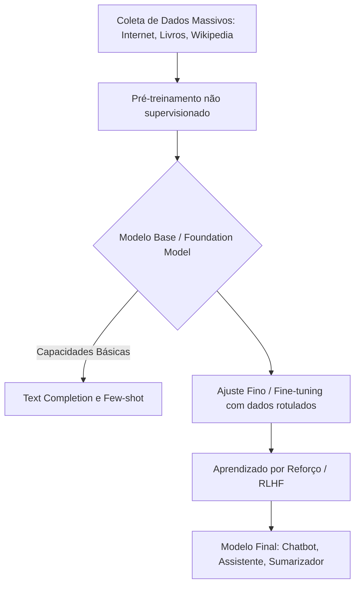

# Introdução à IA Generativa: Histórico e Evolução

## TL;DR / Resumo Executivo
A Inteligência Artificial Generativa representa uma mudança de paradigma na computação, evoluindo de sistemas baseados em regras rígidas para modelos que aprendem padrões complexos a partir de grandes massas de dados. Enquanto a IA clássica focava em resolver problemas delimitados (micromundos), a IA Generativa moderna, impulsionada por avanços em hardware (GPUs) e arquiteturas como Transformers, é capaz de criar conteúdos originais em texto, imagem e áudio. Esta evolução é fundamental para o desenvolvimento de agentes autônomos e sistemas que mimetizam a inteligência humana em escala global.

## Conceitos Fundamentais
*   **Inteligência Artificial (IA):** Sistemas computacionais que buscam exibir comportamentos inteligentes e se comportar como humanos.
*   **Aprendizado de Máquina (Machine Learning):** Área da IA focada em algoritmos que aprendem regras e padrões diretamente dos dados, em vez de serem explicitamente programados.
*   **Aprendizado Profundo (Deep Learning):** Subconjunto do aprendizado de máquina que utiliza redes neurais artificiais com múltiplas camadas (DNNs) para processar grandes volumes de informações.
*   **IA Generativa (GenAI):** Uma forma de IA treinada em vastas quantidades de dados para criar novos conteúdos, como textos, vídeos e imagens.
*   **Modelos de Linguagem de Larga Escala (LLM):** Subconjunto da IA Generativa focado especificamente na compreensão e geração de texto com aparência humana.
*   **Retropropagação (Back-propagation):** Mecanismo surgido em 1986 que permite o ajuste dos pesos de uma rede neural com base no erro da saída, sendo o motor do treinamento moderno.

## Matriz de Comparação: Evolução das Abordagens em IA

| Abordagem | Definição | Exemplo Técnico | Quando usar | Pontos Positivos | Pontos Negativos |
| :--- | :--- | :--- | :--- | :--- | :--- |
| **IA Simbólica / Especialista** | Baseada em regras lógicas, heurísticas e manipulação sintática. | ELIZA (psicólogo virtual). | Sistemas de decisão restritos e domínios fechados. | Previsível e exige pouco poder computacional. | Extremamente limitada; não aprende sozinha e esbarra na complexidade exponencial. |
| **Aprendizado de Máquina Clássico** | Modelos estatísticos treinados em dados anotados. | SVM, Random Forest, Naive Bayes. | Classificação de dados estruturados e regressões simples. | Eficiente para tarefas específicas e bem documentadas. | Requer engenharia de atributos manual e dados bem rotulados. |
| **Deep Learning / LLMs** | Redes neurais profundas que aprendem representações em camadas. | GPT-4, Gemini, Llama 3. | Geração de conteúdo, tradução, visão computacional e agentes. | Alta capacidade de generalização e criatividade. | Custo computacional altíssimo; consome muita energia e recursos. |

## Diagrama de Fluxo Lógico (Pipeline de Treinamento de uma LLM)

O processo de criação de uma LLM moderna segue uma sequência de estágios que transformam dados brutos em uma inteligência funcional:

