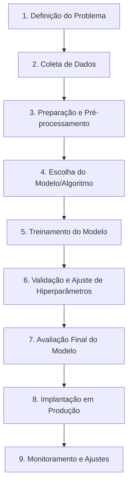

# Conceitos Básicos de Aprendizado de Máquina

## TL;DR / Resumo Executivo
O **Aprendizado de Máquina (Machine Learning)** é a capacidade de um computador agir, predizer, recomendar e gerar informações a partir de dados, sem ser explicitamente programado para cada tarefa específica. Diferente da IA simbólica baseada em regras rígidas, o ML utiliza algoritmos para criar modelos que aprendem padrões diretamente dos dados, tornando-se a base fundamental para as tecnologias atuais de **IA Generativa e LLMs**. Sua viabilidade atual deve-se à imensa disponibilidade de dados e ao aumento do poder de processamento paralelo via **GPUs**.

## Conceitos Fundamentais
*   **Aprendizado de Máquina:** Sistemas que aprendem e melhoram seu comportamento a partir de dados em vez de regras pré-programadas.
*   **Modelo:** O resultado final gerado por um algoritmo após o processamento e aprendizado a partir de um conjunto de dados.
*   **Classificação:** Tarefa de prever valores categóricos ou discretos (ex: "gato" ou "cachorro").
*   **Regressão:** Predição de variáveis dependentes com valores contínuos (ex: pressão arterial, custos médicos).
*   **Clusterização (Agrupamento):** Processo de identificar padrões e agrupar dados complexos com base em semelhanças, sem o uso de rótulos prévios.
*   **Hiperparâmetros:** Parâmetros definidos *antes* do treinamento (ex: número de neurônios) que orientam como o modelo deve aprender.

## Matriz de Comparação: Tipos de Treinamento

| Metodologia | Definição | Exemplo | Quando usar | Pontos Positivos | Pontos Negativos |
| :--- | :--- | :--- | :--- | :--- | :--- |
| **Supervisionado** | Aprende a partir de dados previamente rotulados (entrada + resposta correta). | Detecção de Spam, diagnóstico de tumores. | Quando se tem rótulos claros e deseja-se alta precisão em tarefas específicas. | Resultados muito precisos e fáceis de avaliar. | Rotulagem manual é cara e demorada. |
| **Não Supervisionado** | Encontra padrões e estruturas em dados sem rótulos. | Segmentação de clientes por comportamento. | Descoberta de insights e agrupamento de grandes volumes de dados brutos. | Não exige rótulos; descobre padrões ocultos. | Difícil de validar a "correção" do agrupamento. |
| **Semi-supervisionado** | Combina poucos dados rotulados com uma grande massa de dados não rotulados. | Classificação de imagens com pseudo-rotulagem. | Quando rotular tudo é inviável, mas há alguns dados identificados. | Economiza tempo e custo; aproveita dados abundantes. | Pode propagar erros da etapa de pseudo-rotulagem. |
| **Por Reforço** | Aprende por tentativa e erro, recebendo recompensas ou punições. | Treinamento de robôs, jogos e ajuste de chat (RLHF). | Tomada de decisão sequencial em ambientes dinâmicos. | Otimiza o comportamento para maximizar recompensas a longo prazo. | Requer muitas interações para convergir; design de recompensas é complexo. |
| **Auto-supervisionado** | O algoritmo gera seus próprios rótulos a partir dos dados (Tarefas de Pretexto). | Prever a próxima palavra ou reconstruir partes de uma imagem. | Base para o treinamento massivo de LLMs e IA Generativa. | Reduz drasticamente a dependência de humanos; melhora a generalização. | Exige poder computacional massivo para processar os dados. |

## Diagrama de Fluxo Lógico (Pipeline de Aprendizado Supervisionado)

O processo padrão para desenvolver um modelo supervisionado segue estes 9 passos essenciais:

