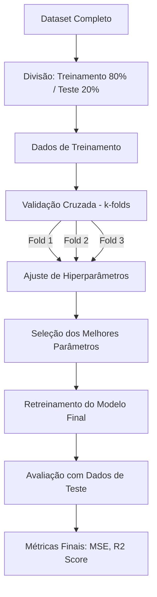

# Redes Neurais Artificiais e Aprendizado Profundo

## TL;DR / Resumo Executivo
As **Redes Neurais Artificiais (RNAs)** são algoritmos inspirados de forma reducionista no funcionamento dos neurônios biológicos, focando na essência matemática necessária para o aprendizado de máquina. Elas são a base do **Aprendizado Profundo (Deep Learning)**, que utiliza múltiplas camadas para aprender representações complexas de dados. Sua importância reside na capacidade de resolver problemas que envolvem grandes volumes de dados não estruturados, como reconhecimento facial, tradução automática e IA generativa.

## Conceitos Fundamentais
*   **Neurônio Artificial:** Um algoritmo que recebe entradas ponderadas por **pesos**, soma-as com um **viés (bias)** e passa o resultado por uma **função de ativação**.
*   **Camadas (Layers):** Estruturas que organizam os neurônios em camadas de entrada (features), camadas escondidas (processamento) e camadas de saída (predição).
*   **Função de Ativação:** Define se um neurônio será ativado ou não com base no sinal recebido (ex: ReLU, Sigmoide, Tanh).
*   **Hiperparâmetros:** Parâmetros definidos pelo programador antes do treinamento, como a **taxa de aprendizado**, **tamanho do lote (batch size)** e **número de épocas**.
*   **Overfitting (Sobreajuste):** Quando o modelo se ajusta excessivamente aos dados de treinamento, perdendo a capacidade de generalizar para dados novos.
*   **Transfer Learning:** Técnica de reutilizar o conhecimento de um modelo pré-treinado em um novo problema, economizando tempo e recursos computacionais.

## Matriz de Comparação: Arquiteturas de Redes Neurais

| Metodologia | Definição | Exemplo Técnico | Quando usar | Pontos Positivos | Pontos Negativos |
| :--- | :--- | :--- | :--- | :--- | :--- |
| **MLP (Multilayer Perceptron)** | Redes neurais simples com camadas totalmente conectadas. | Regressão de dados tabulares (ex: previsão de chuva). | Problemas de classificação e regressão com dados estruturados. | Simplicidade de implementação e eficácia em dados tabulares. | Dificuldade em lidar com dependências espaciais ou temporais complexas. |
| **CNN (Convolutional Neural Network)** | Redes projetadas para processar dados com estrutura de grade espacial. | VGG16, Reconhecimento facial. | Visão computacional e processamento de imagens. | Extração automática de características hierárquicas através de filtros. | Exige alto poder computacional e grandes datasets de imagens. |
| **RNN (Recurrent Neural Network)** | Redes com loops de feedback que possuem "memória" de entradas anteriores. | LSTM, GRU, tradução de texto. | Processamento de dados sequenciais (texto, áudio, séries temporais). | Considera o contexto de informações passadas para predições futuras. | Problemas com sequências longas (gradiente explodindo/desvanecendo). |

## Diagrama de Fluxo Lógico (Validação Cruzada e Treinamento)

O processo de treinamento com ajuste de hiperparâmetros garante que o modelo escolha a melhor configuração antes da avaliação final:

