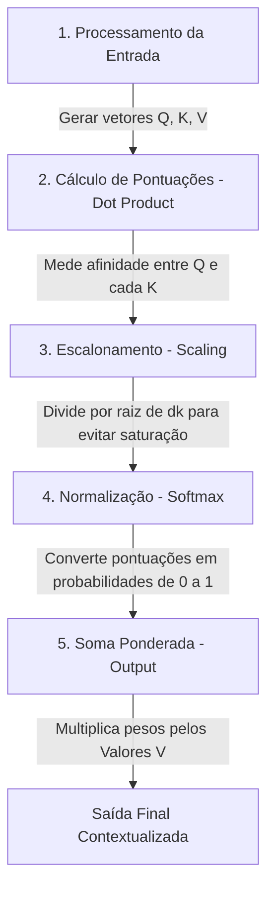

# Mecanismos de Atenção e a Revolução dos Transformers

## TL;DR / Resumo Executivo
O objetivo central desta seção é apresentar o **mecanismo de autoatenção (self-attention)** como o núcleo fundamental da arquitetura Transformer, que substituiu o estado da arte anterior baseado em redes recorrentes (RNNs) e convolucionais (CNNs). Sua importância reside na capacidade de processar sequências de dados de forma **paralelizada**, permitindo que o modelo capture dependências globais e contextos complexos entre palavras (tokens) independentemente de sua distância na frase, o que viabilizou o surgimento das modernas LLMs.

### Arquiteturas Antigas vs. Transformers

| Característica | RNN / LSTM | CNN | Transformers |
| :--- | :--- | :--- | :--- |
| **Processamento** | Sequencial (um por um). | Local/Hierárquico (filtros). | Paralelo (toda a sequência). |
| **Dependência de Longo Prazo** | Difícil (gradiente some). | Exige muitas camadas. | Excelente (distância constante). |
| **Complexidade por Camada** | $O(n \cdot d^2)$. | $O(k \cdot n \cdot d^2)$. | $O(n^2 \cdot d)$. |
| **Custo de Treinamento** | Alto (lento pela serialização). | Moderado. | Baixo (rápido via GPUs). |

## Conceitos Fundamentais
*   **Autoatenção (Self-attention):** Um método que determina a importância de cada componente (palavra ou token) em uma sequência em relação aos outros componentes da mesma sequência.
*   **Query (Q):** Vetor que representa a palavra atual para a qual se busca contexto; funciona como uma "pergunta" (ex: "Quais outras palavras são relevantes?").
*   **Key (K):** Vetor que representa o "rótulo" ou identidade de todos os tokens na frase, servindo como uma "etiqueta" para o casamento com a Query.
*   **Value (V):** Vetor que contém a informação semântica real de cada palavra, que será somada para formar o novo contexto final.
*   **Multi-Head Attention:** Execução de diversas camadas de atenção em paralelo, permitindo que o modelo foque em diferentes aspectos das relações entre as palavras simultaneamente.

### Exemplo Prático: Desambiguação de Contexto
**Frase:** *"O gato comeu o peixe porque ele estava com fome."*

1.  **Representações:** Ao processar o token **"ele"**, a **Query (Q)** de "ele" pergunta: *"A quem 'ele' se refere?"*. As **Keys (K)** de "gato" e "peixe" contêm etiquetas que indicam sujeitos prováveis.
2.  **Cálculo Matricial:** O modelo utiliza o **Scaled Dot-Product Attention**:
    $$Attention(Q, K, V) = \text{softmax}\left(\frac{QK^T}{\sqrt{d_k}}\right)V$$
    O produto escalar ($Q \cdot K^T$) entre a Query de "ele" e a Key de "gato" gera uma pontuação (score) significativamente maior do que com a Key de "peixe".
3.  **Resultado Final:** Após a função **Softmax**, o peso de atenção para "gato" pode ser de **0.90**, enquanto para "peixe" é apenas **0.02**. O **Value (V)** de "gato" é então multiplicado por esse peso alto, resultando em uma **saída contextualizada** onde o vetor numérico de "ele" agora carrega a informação semântica de "gato".

## Diagrama de Fluxo Lógico (Scaled Dot-Product Attention)

O processo de atenção transforma a entrada bruta em representações ricas em contexto seguindo este fluxo:

## Matriz de Comparação: Encoder-Decoder vs. Decoder-Only

As arquiteturas **Encoder-Decoder** e **Decoder-Only** são variações fundamentais do modelo Transformer, cada uma com objetivos e fluxos de processamento distintos para lidar com a linguagem.

Abaixo está uma explicação simplificada e o fluxo lógico de cada uma:

### 1. Arquitetura Encoder-Decoder
Esta é a estrutura original proposta no artigo *"Attention Is All You Need"*. Ela divide o trabalho em dois blocos principais que se comunicam.

*   **Explicação:** O **Encoder** processa a sequência de entrada de uma só vez (bidirecionalmente) para extrair o significado e o contexto (gerando vetores densos). O **Decoder** gera a saída, um token por vez, consultando as informações do Encoder através de um mecanismo chamado **Cross-Attention** (Atenção Cruzada).
*   **Ideal para:** Tarefas de transformação estrita, como tradução de idiomas e sumarização precisa.

**Fluxo Simplificado:**
1.  **Entrada:** O texto original é convertido em tokens e embeddings.
2.  **Encoder:** Processa todos os tokens em paralelo para criar um "mapa de contexto" semântico.
3.  **Conexão (Cross-Attention):** O Decoder "presta atenção" nas partes relevantes do mapa de contexto gerado pelo Encoder.
4.  **Decoder:** Gera o próximo token da resposta baseando-se no contexto do Encoder e nos tokens que ele mesmo já gerou anteriormente.
5.  **Saída:** Resultado final (ex: a frase traduzida).

---

### 2. Arquitetura Decoder-Only
Esta arquitetura simplificada tornou-se o padrão para os grandes modelos de linguagem (LLMs) modernos, como GPT-4, Llama e Gemini.

*   **Explicação:** Nesta estrutura, o bloco do Encoder e o mecanismo de Cross-Attention são removidos. O modelo utiliza apenas o Decoder empilhado dezenas de vezes. Ele funde a entrada (prompt) e a saída em uma única fita contínua de texto, tratando o comando do usuário como o início de uma frase que ele precisa completar.
*   **Ideal para:** Geração de texto criativo, assistentes de conversação (chatbots) e raciocínio fluido.

**Fluxo Simplificado:**
1.  **Prompt (Entrada):** O usuário envia uma pergunta ou instrução.
2.  **Fusão:** O modelo trata esse prompt como se fosse o início de sua própria geração.
3.  **Autoatenção Mascarada:** O modelo lê o texto da esquerda para a direita, focando apenas no que já passou para prever o que vem a seguir.
4.  **Predição:** O sistema calcula a probabilidade de todos os tokens possíveis e escolhe o próximo.
5.  **Loop Autorregressivo:** O novo token é adicionado à sequência e o modelo lê tudo de novo (prompt + tokens gerados) para prever o próximo, até terminar a resposta.

### Resumo Comparativo

| Característica | Encoder-Decoder (ex: T5, BART) | Decoder-Only (ex: GPT, Gemini) |
| :--- | :--- | :--- |
| **Estrutura** | Dois blocos distintos que conversam. | Um único bloco contínuo de geração. |
| **Visão do Texto** | Entrada e saída são entidades separadas. | Prompt e resposta são uma única fita de texto. |
| **Atenção** | Bidirecional + Mascarada + Cruzada. | Apenas Mascarada (unidirecional). |
| **Ponto Forte** | Tradução e fidelidade ao original. | Criatividade, flexibilidade e escala. |

