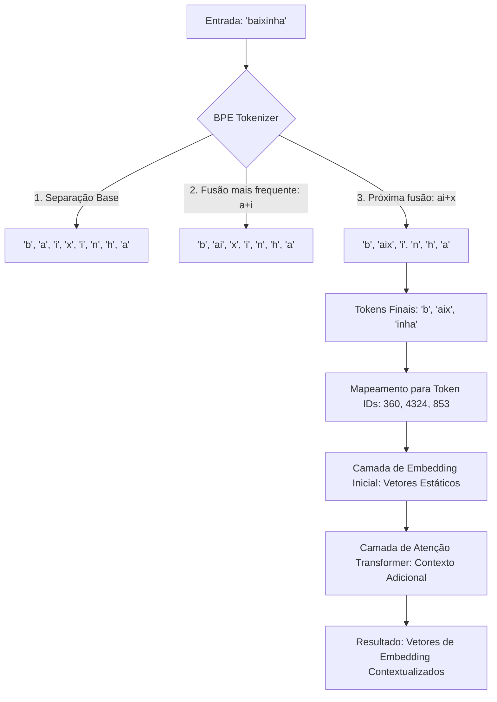

# Tokens e Embeddings: A Ponte entre Linguagem e Matemática

## TL;DR / Resumo Executivo
Os modelos de linguagem não processam palavras, imagens ou vídeos diretamente, mas sim **representações numéricas** (binárias em última instância). O objetivo central desta seção é detalhar como a **tokenização** quebra o texto em unidades processáveis e como os **embeddings** transformam essas unidades em vetores matemáticos que capturam o significado semântico. Esse processo é vital para que os mecanismos de **Transformers** ajustem pesos e entendam o contexto para gerar novas palavras.

## Conceitos Fundamentais
*   **Tokenização:** Processo de transformar uma entrada de texto em peças menores denominadas tokens.
*   **Token:** A forma como o modelo "vê" a entrada e gera a saída, um por vez.
*   **Token IDs:** Identificadores numéricos únicos (chaves) para cada token, servindo como ponte para os vetores.
*   **Embeddings:** Vetorização numérica que representa o significado de uma palavra em matrizes e vetores.
*   **Vocabulário:** Conjunto fixo de tokens que o modelo aprendeu a reconhecer durante seu treinamento.
*   **Tokens Especiais:** Marcadores técnicos como `[CLS]` (início/classificação), `[SEP]` (separador), `[PAD]` (preenchimento), `[UNK]` (desconhecido) e `[MASK]` (ocultação).

## Matriz de Comparação ou Tabela

### 1. Primeiros Tokenizadores
| Metodologia | Definição | Benefícios | Limitações |
| :--- | :--- | :--- | :--- |
| **Word Tokens** | Cada palavra inteira é um token. | Simplicidade e uso histórico (Word2Vec). | Problemas com palavras fora do vocabulário (OOV) e vocabulários gigantescos. |
| **Character Tokens** | Cada letra bruta é um token. | Lida com qualquer palavra nova. | Modelagem complexa e perda de semântica em unidades mínimas. |
| **Subword Tokens** | Mistura palavras inteiras e parciais. | **Equilíbrio ideal**: expressividade e capacidade de decompor palavras novas. | Requer treinamento prévio do tokenizador em um corpus específico. |

### 2. Tokenizadores Modernos: BERT vs. LLMs
| Tokenizador | Definição | Benefícios | Limitações |
| :--- | :--- | :--- | :--- |
| **BERT (WordPiece)** | Método focado em codificação para compreensão (Encoder). | Excelente para extração de contexto bidirecional. | Vocabulário menor (~30k tokens) e regras de design mais rígidas. |
| **LLMs Modernas (BPE)** | Codificação de Pares de Bytes, usada em GPT, Gemini e Llama. | Alta flexibilidade para múltiplos idiomas e eficiente com prefixos/sufixos. | Requer volumes massivos de dados para treinar fusões de bytes eficazes. |

### 3. Embeddings: Estáticos vs. Dinâmicos
| Tipo de Embedding | Definição | Benefícios | Limitações |
| :--- | :--- | :--- | :--- |
| **Embeddings Estáticos (ex: Word2Vec)** | Atribui um vetor fixo para cada palavra, independente do contexto. | Baixo custo computacional e captura de relações básicas (Rei - Homem + Mulher = Rainha). | Não lida com polissemia (uma palavra, vários sentidos). |
| **Embeddings Dinâmicos (Transformers)** | Ajusta a representação numérica baseada nas palavras vizinhas (Atenção). | Representação ultra-precisa; resolve ambiguidades (ex: "manga" fruta vs. camisa). | Custo computacional elevado e dependência da arquitetura Transformer. |

**Atual State-of-the-Art (SOTA):** A combinação de **tokenização por subpalavras (BPE)** com **embeddings dinâmicos contextuais** (gerados por camadas de atenção de Transformers) representa o estado da arte atual para processamento de linguagem natural.

## Diagrama de Fluxo Lógico (Do Texto ao Vetor Contextual)

O exemplo abaixo utiliza o algoritmo **BPE** com uma base simplificada ("baixo", "baixa", "caixa") para ilustrar a geração de IDs e vetores:

### Explicação do Fluxo:
1.  **Geração de Tokens:** O algoritmo BPE identifica que "ai" e "aix" são fusões frequentes no seu treinamento inicial e quebra "baixinha" em partes que ele conhece.
2.  **Token IDs:** Cada pedaço recebe um número identificador único do vocabulário do modelo.
3.  **Embeddings Iniciais:** O modelo busca em uma tabela o vetor correspondente a cada ID.
4.  **Contextualização:** O mecanismo de **atenção** do Transformer analisa a frase inteira e ajusta esses vetores iniciais para que o significado final incorpore o contexto de toda a sentença.