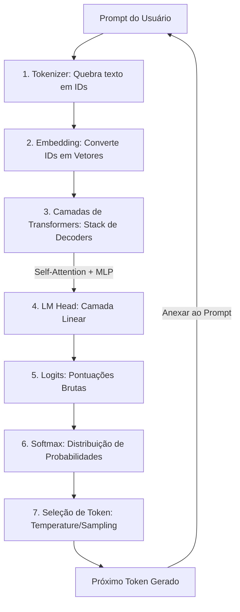

# Arquiteturas e Funcionamento Interno dos LLMs

## TL;DR / Resumo Executivo
O objetivo central desta seção é detalhar o funcionamento interno dos **Grandes Modelos de Linguagem (LLMs)**, focando em como a arquitetura **Transformer** processa informações para gerar texto de forma **autorregressiva**. Compreender essa estrutura é fundamental para entender a evolução desde os modelos clássicos (RNNs/LSTMs) até as modernas arquiteturas **Decoder-Only**, que utilizam componentes como o **LM Head** e melhorias de escalabilidade como o **KV-cache**, **RoPE** e **MoE** para alcançar alta performance e fluência.

## Conceitos Fundamentais
*   **Modelos Autorregressivos:** Sistemas que geram um token por vez, utilizando cada novo token como entrada para prever o próximo em um loop sequencial.
*   **Tokenizador:** Componente que transforma o texto de entrada em unidades menores (tokens), que podem ser pedaços de palavras ou caracteres.
*   **LM Head (Language Model Head):** Camada final que transforma os resultados dos blocos Transformers em uma distribuição de probabilidades sobre todo o vocabulário.
*   **Logits:** Pontuações brutas geradas pelo modelo para cada token antes da normalização.
*   **Softmax:** Função de ativação que converte os *logits* em probabilidades que somam 100%, indicando a chance de cada palavra ser a próxima.
*   **Atenção Mascarada (Masked Self-Attention):** Técnica usada em decodificadores onde o modelo olha apenas para os tokens anteriores para prever o próximo, garantindo a ordem lógica da geração.

## Matriz de Comparação de Arquiteturas

| Arquitetura | Definição / Exemplo | Arquitetura Técnica | Benefícios | Limitações | Casos de Uso |
| :--- | :--- | :--- | :--- | :--- | :--- |
| **Autorregressivos Clássicos** | **RNNs e LSTMs**. | Processamento sequencial da esquerda para a direita. | Mantêm informações por mais tempo que RNNs puras. | Dificuldade em "lembrar" contextos muito longos; pouco paralelizáveis. | Tradução automática antiga e séries temporais. |
| **Não Autorregressivos (MLM)** | **BERT e RoBERTa**. | **Encoder-Only** com bidirecionalidade (máscaras). | Excelentes para entender o sentido total da frase; rápidos para análise. | Ruins para gerar textos longos ou manter diálogos. | Classificação, busca e análise de sentimento. |
| **Pre-trained Transformers** | **GPT e Gemini**. | **Decoder-Only** em larga escala. | Alta criatividade, fluência e capacidades de *few-shot learning*. | Custo computacional elevado para modelos gigantescos. | Chatbots, escrita criativa e raciocínio complexo. |

## Diagrama de Fluxo Lógico: A Jornada do Prompt

O processo de transformação de uma entrada do usuário em uma saída gerada segue este fluxo:

### Detalhes Técnicos do Fluxo
1.  **Processamento Interno:** Dentro dos blocos de Transformers, a **Atenção** combina informações relevantes de posições anteriores para enriquecer o contexto.
2.  **Importância dos Parâmetros (Temperature):** Para tornar o texto menos robótico, não se deve usar apenas a estratégia "gulosa" (*argmax*), que pega sempre a maior probabilidade. O uso de **grau de aleatoriedade** (como a *Temperature*) permite sorteios baseados em probabilidades, gerando textos mais naturais e variados.

### Eficiência e Escalabilidade na Arquitetura Atual
*   **Arquitetura Decoder-Only:** Atualmente indispensável, pois simplifica o modelo ao remover o *Encoder*, tratando o prompt como o início de uma frase inacabada que o modelo "autocompleta" organicamente. Isso torna o sistema mais leve e eficiente para processar volumes massivos de dados.
*   **KV-cache:** É fundamental para a escalabilidade, pois armazena cálculos de chaves (Keys) e valores (Values) de tokens anteriores, evitando o reprocessamento redundante a cada novo token gerado.
*   **RoPE (Rotary Positional Embedding):** Uma melhoria que foca na distância relativa entre as palavras em vez de suas posições exatas, permitindo que o modelo lide com janelas de contexto muito maiores (extensibilidade).
*   **MoE (Mixture of Experts):** Técnica que divide o modelo em "mini-especialistas". Para cada palavra, apenas uma pequena parte da rede é ativada, entregando a inteligência de um modelo gigante com o custo computacional de um modelo menor.