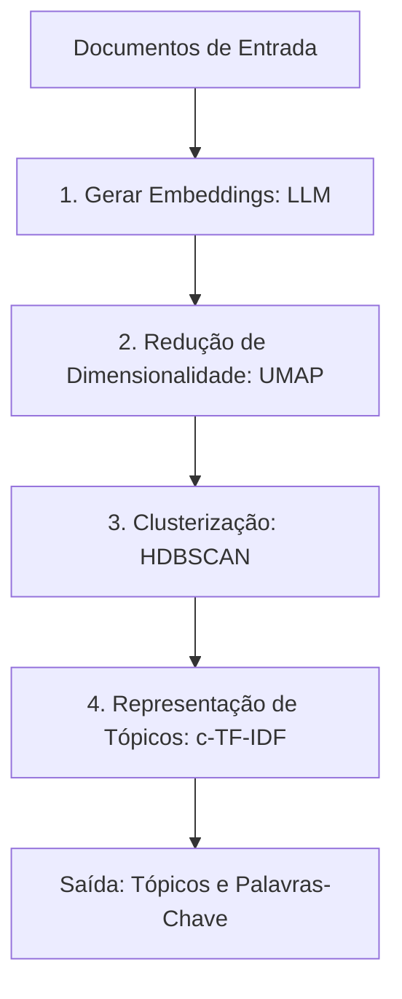

# Práticas de Uso de Modelos de Linguagem Pré-treinados

## TL;DR / Resumo Executivo
Os modelos de linguagem de grande escala (LLMs) são ferramentas extremamente adaptáveis que vão muito além da construção de chatbots. O objetivo central desta seção é explorar as práticas de reaproveitamento de modelos pré-treinados para tarefas específicas como extração de informações, análise de sentimentos e classificação. A importância reside na versatilidade desses modelos, que podem atuar como classificadores diretos ou como extratores de características (embeddings) para alimentar sistemas inteligentes e arquiteturas multiagentes.

## Conceitos Fundamentais
*   **Agentes Especializados:** Uso de LLMs ajustadas para funções específicas dentro de um fluxo de trabalho (ex: pesquisa, criação de conteúdo ou atendimento).
*   **Análise de Sentimento:** Processo de determinar a polaridade emocional de um texto (positivo, negativo ou neutro).
*   **Classificação de Texto:** Categorização automática de documentos em tópicos ou classes predefinidas (ex: spam vs. não spam).
*   **Modelo de Base (Foundation Model):** Um modelo de propósito geral (ex: BERT, GPT) que serve como ponto de partida para tarefas específicas.
*   **Fine-tuning (Ajuste Fino):** Processo de treinar um modelo de base em um conjunto de dados específico para otimizar seu desempenho em uma tarefa.
*   **Clusterização (Agrupamento):** Descoberta de grupos semanticamente semelhantes em conjuntos de dados não anotados.
*   **Modelagem de Tópicos:** Extensão da clusterização que identifica e nomeia os temas centrais de cada grupo através de palavras-chave.

## Matriz de Comparação: Estratégias de Classificação

Abaixo, comparamos duas abordagens principais para a tarefa de classificação de sentimentos em críticas de cinema (dataset *Rotten Tomatoes*).

| Característica | Task-specific Model (Classificação Direta) | Embedding Model + Train Classifier (Extrator de Features) |
| :--- | :--- | :--- |
| **Definição** | Uso de uma LLM que já passou por ajuste fino para uma tarefa de classificação específica. | Uso de uma LLM "congelada" para gerar vetores numéricos, seguida por um classificador de ML tradicional. |
| **Arquitetura** | Entrada -> LLM Ajustada -> Classe Final (ex: 0 ou 1). | Entrada -> LLM (Frozen) -> Vetor (Embedding) -> Classificador (ex: Regressão Logística) -> Classe Final. |
| **Benefícios** | Simplicidade de pipeline; aproveita o conhecimento específico do ajuste fino prévio. | Frequentemente apresenta melhor acurácia; permite testar vários classificadores rápidos (Regressão Logística, Naive Bayes). |
| **Limitações** | Desempenho pode ser inferior se o domínio de treino (ex: Twitter) for muito diferente do alvo (ex: Cinema). | Requer o gerenciamento de dois modelos; exige escolha e ajuste de hiperparâmetros do classificador externo. |
| **Casos de Uso** | Quando já existe um modelo de prateleira otimizado para a tarefa exata. | Quando se busca máxima performance ou quando os dados são limitados para um fine-tuning completo. |

*No exemplo prático das fontes, a abordagem de **Embeddings + Regressão Logística** obteve uma acurácia de **0.85**, superando os **0.77** do modelo **RoBERTa** ajustado para tweets.*

## Diagrama de Fluxo Lógico: Pipeline de Modelagem de Tópicos (BERTopic)

O processo de agrupar grandes massas de dados e extrair temas centrais utilizando LLMs segue estas quatro etapas principais:

### Resumo das Etapas usando BERTopic:
1.  **Gerar Embeddings:** Converte o texto em vetores numéricos densos (ex: 384 ou 768 dimensões) que capturam o significado semântico.
2.  **Redução de Dimensionalidade:** Diminui a quantidade de dimensões (ex: para 5) para melhorar o desempenho e a precisão do agrupamento, evitando a "maldição da dimensionalidade".
3.  **Clusterização:** Identifica grupos de documentos semelhantes com base em sua densidade no espaço vetorial, sendo robusta a ruídos e identificando automaticamente o número de grupos.
4.  **Representação de Tópicos:** Calcula a frequência das palavras por cluster (c-TF-IDF) para extrair as palavras-chave que melhor descrevem o assunto de cada grupo.