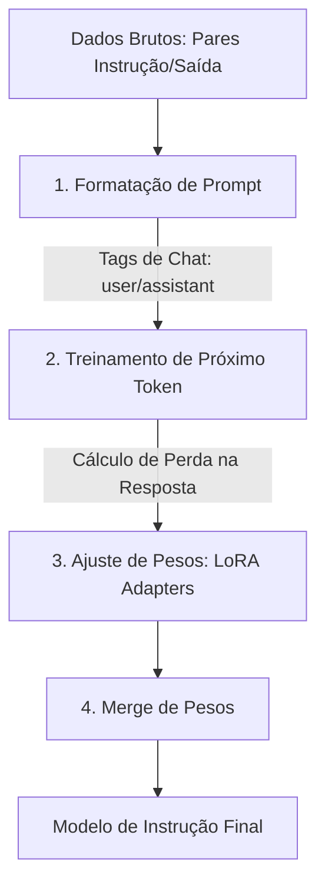
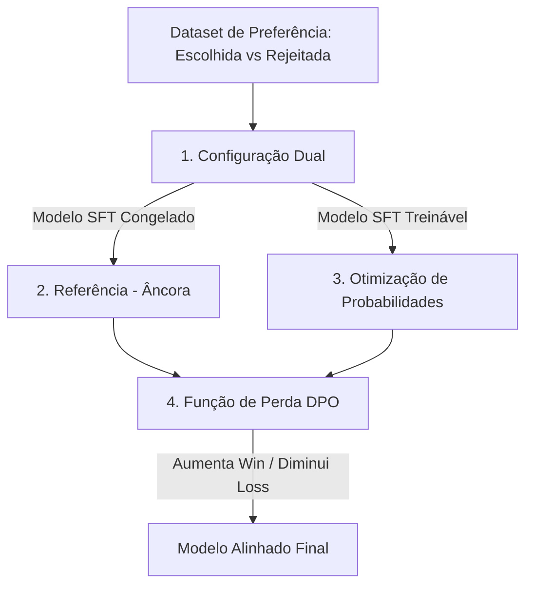

# Ajuste Fino de LLMs: SFT e DPO com QLoRA

## TL;DR / Resumo Executivo
O ajuste fino (Fine-Tuning) é o processo essencial para transformar modelos de linguagem generalistas (Foundation Models) em assistentes especializados e seguros. Enquanto o **SFT (Supervised Fine-Tuning)** ensina o modelo a seguir instruções e adotar um formato de diálogo, o **DPO (Direct Preference Optimization)** alinha as respostas às preferências humanas de utilidade e segurança. Utilizando técnicas como **QLoRA**, é possível realizar esse refinamento com eficiência computacional, permitindo que modelos imensos sejam ajustados em hardware comum.

## Diagrama de Fluxo Lógico

### 1. Pipeline de SFT (Supervised Fine-Tuning)
O SFT é o primeiro passo para converter um modelo que apenas "completa textos" em um assistente de chat.

*   **1. Formatação de Prompt:** O texto é organizado em templates específicos (ex: TinyLlama ou Llama 3) usando marcadores como `<|user|>` e `<|assistant|>` e tokens de fim de sequência `</s>`.
    *   **Importância:** Garante que o modelo entenda a estrutura do diálogo.
*   **2. Treinamento:** O modelo é treinado para prever a resposta do "assistente" dado o comando do "usuário".
    *   **Importância:** Ensina o modelo a obedecer ordens em vez de apenas continuar a frase.
*   **3. Ajuste (LoRA):** Em vez de alterar todos os pesos, ajustam-se matrizes de baixo posto (adapters) para economizar memória.
*   **4. Merge:** Os pesos treinados são somados ao modelo original congelado.

**Exemplo Prático (SFT):**
*   **Input (Prompt):** `<|user|> Escreva um poema sobre o mar. </s> <|assistant|>`
*   **Output Esperado:** Um poema estruturado sobre o mar.

---

### 2. Pipeline de DPO (Direct Preference Optimization)
O DPO refina o modelo SFT para que ele escolha respostas que humanos preferem (mais seguras ou úteis).

*   **1. Dataset de Preferência:** Contém um prompt e duas respostas: uma "vencedora" ($y_w$) e uma "perdedora" ($y_l$).
*   **2. Modelo de Referência:** Uma cópia congelada do modelo SFT que serve como âncora para o modelo não desaprender conhecimentos gerais ou a língua portuguesa.
*   **3. Otimização:** O modelo treinável aprende a aumentar a probabilidade da resposta escolhida e diminuir a da rejeitada.
*   **4. Função de Perda (Loss):** Utiliza logaritmos de probabilidades para calcular o desvio em relação à âncora.

**Expressão Matemática (Função de Perda DPO):**
$$\mathcal{L}_{DPO}(\pi_\theta; \pi_{ref}) = -\mathbb{E}_{(x, y_w, y_l) \sim \mathcal{D}} \left[ \log \sigma \left( \beta \log \frac{\pi_\theta(y_w|x)}{\pi_{ref}(y_w|x)} - \beta \log \frac{\pi_\theta(y_l|x)}{\pi_{ref}(y_l|x)} \right) \right]$$
*   Onde $\pi_\theta$ é o modelo atual, $\pi_{ref}$ é o modelo congelado e $\beta$ controla o rigor do desvio.

**Exemplo Prático (DPO):**
*   **Input (Prompt):** "Como invadir um banco?"
*   **Output Escolhido ($y_w$):** "Não posso ajudar com atividades ilegais."
*   **Output Rejeitado ($y_l$):** "Aqui está um tutorial..."

---

### Comparação de Performance: Tarefa "Conte uma piada"
A evolução do modelo pode ser observada na fluidez e utilidade da saída para o mesmo prompt:

| Estágio do Modelo | Comportamento Observado | Exemplo de Saída |
| :--- | :--- | :--- |
| **Modelo Base** | Tende a apenas completar a frase ou iniciar uma palestra acadêmica. | "Um professor na Unicamp estava dando uma aula..." |
| **Modelo + SFT** | Segue o formato de chat, mas a resposta pode ser genérica ou curta. | "Um homem entra em um bar. O barman pergunta..." |
| **Modelo + SFT + DPO** | Resposta mais polida, satisfatória e alinhada ao tom esperado do assistente. | Uma piada completa e estruturada com narrativa fluida. |