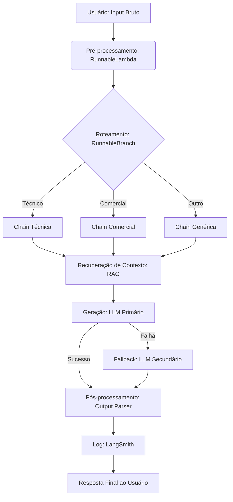

# Construções de Pipelines com LangChain

## TL;DR / Resumo Executivo
O objetivo central desta seção é capacitar o desenvolvedor a construir **pipelines robustos e modulares** utilizando o framework LangChain, indo além de simples chamadas isoladas de API. A construção de pipelines é essencial para superar limitações das LLMs, como o **contexto finito**, a falta de acesso a dados externos e a imprevisibilidade do formato de saída. Através da linguagem declarativa **LCEL (LangChain Expression Language)**, é possível criar sistemas com responsabilidades claras, facilitando o teste, a depuração e a escalabilidade em ambientes de produção.

## Conceitos Fundamentais
*   **Pipeline:** Conjunto de operações modulares executadas em sequência ou paralelo, com entradas e saídas bem definidas para cada etapa.
*   **LCEL (LangChain Expression Language):** Linguagem que utiliza o operador **pipe (`|`)** para encadear componentes, onde a saída de um elo torna-se a entrada do próximo.
*   **Runnable:** Interface unificada do LangChain (contendo métodos como `.invoke()`, `.stream()` e `.batch()`) que permite que qualquer componente seja parte de uma chain.
*   **Chain (Cadeia):** Um encadeamento lógico de componentes que realiza uma tarefa específica, como resumir um texto ou classificar sentimentos.
*   **Fallback:** Estratégia de redundância que define modelos ou caminhos alternativos caso o componente principal falhe.
*   **RAG (Retrieval-Augmented Generation):** Técnica de recuperação de informações relevantes em um corpus externo antes da geração da resposta para reduzir alucinações e custos de tokens.

## Matrizes de Comparação e Tabelas

### 1. Tipos de Output Parsers (Pós-processamento)
| Parser | Saída | Quando Usar | Pontos Positivos | Pontos Negativos |
| :--- | :--- | :--- | :--- | :--- |
| **StrOutputParser** | `str` | Respostas em texto livre. | Simplicidade; extrai apenas o texto da `AIMessage`. | Não permite extração de dados estruturados. |
| **JsonOutputParser** | `dict` | Integração com APIs e sistemas de software. | Facilita o consumo por código. | Pode falhar se o LLM não gerar um JSON válido. |
| **PydanticOutputParser** | Objeto Tipado | Validação rigorosa de esquemas (schemas). | Garante tipos de dados e presença de campos obrigatórios. | Maior complexidade de implementação. |

### 2. Topologias de Pipeline
| Topologia | Funcionamento | Componente LangChain | Ideal Para |
| :--- | :--- | :--- | :--- |
| **Sequencial** | Cada etapa depende da saída da anterior. | Operador Pipe do LCEL| Fluxos lógicos diretos (ex: Resumo -> Sentimento). |
| **Paralela** | Etapas independentes processam o mesmo input ao mesmo tempo. | `RunnableParallel` | Extrair múltiplas informações simultâneas de um texto. |
| **Condicional** | O fluxo é desviado com base no conteúdo (Roteamento). | `RunnableBranch` | Chatbots com diferentes personas ou suporte técnico vs. comercial. |
| **Com Memória** | Acumula o contexto histórico entre interações. | `RunnableWithMessageHistory` | Assistentes de chat persistentes. |

### 3. Principais Erros e Tratamento (Produção)
| Tipo de Erro | Causa Comum | Tratamento Recomendado |
| :--- | :--- | :--- |
| **RateLimitError** | Cota de API excedida ou picos de tráfego. | **Retry** com backoff exponencial. |
| **APITimeoutError** | Instabilidade na rede ou servidor lento. | Aumento do timeout e implementação de **Retry**. |
| **OutputParserException** | Resposta do LLM fora do formato (ex: JSON corrompido). | **Fallback** para outro modelo ou re-prompt com instrução de correção. |
| **ValidationError** | Saída não segue o esquema Pydantic definido. | **Retry** automático com o erro detalhado no prompt para correção automática. |

### 4. Boas Práticas: Modularização e Reutilização
| Prática | Descrição | Por que seguir? |
| :--- | :--- | :--- |
| **Responsabilidade Única** | Cada chain deve fazer apenas uma coisa bem feita (ex: apenas limpar texto). | Evita chains monolíticas complexas (> 6 etapas) e facilita a manutenção. |
| **Testabilidade Isolada** | Cada etapa deve ser capaz de rodar individualmente via `.invoke()`. | Permite a criação de testes unitários para partes específicas do pipeline. |
| **Configurabilidade** | Modelos e hiperparâmetros devem ser argumentos, não fixos no código (*hardcoded*). | Facilita a troca de modelos (ex: trocar GPT-4 por Llama 3) sem alterar a lógica. |
| **Uso de Fallbacks** | Configurar redundância entre provedores (ex: OpenAI -> Groq). | Garante que o sistema não pare de funcionar se um provedor cair. |

## Diagrama de Fluxo Lógico (Pipeline Típico)

O fluxo abaixo demonstra a integração dos componentes principais do LangChain em uma pipeline completa de **atendimento automatizado**:

1.  **Entrada (Input):** String bruta do usuário.
2.  **Pré-processamento (`RunnableLambda`):** Limpeza de texto, normalização para *lowercase* e validação de tamanho.
3.  **Roteamento (`RunnableBranch`):** Identifica a intenção (Técnico, Comercial ou Geral) para escolher a Chain específica.
4.  **Recuperação (`Retrieval`):** Busca trechos relevantes em um banco vetorial para enriquecer o contexto.
5.  **Geração (`LLM`):** Chama o modelo principal (ex: GPT-4o) com o prompt contextualizado.
    *   *Mecanismo de Segurança:* Se falhar, aciona o **`.with_fallbacks()`** para um modelo secundário ou provedor diferente.
6.  **Pós-processamento (`Parser`):** Transforma a `AIMessage` em um formato estruturado (JSON ou String limpa).
7.  **Saída Final (Output):** Resposta lapidada entregue ao usuário ou sistema.

**Dica de Componente:** Use o **`RunnablePassthrough.assign()`** se precisar que os dados originais (como a pergunta do usuário) "sobrevivam" através das etapas da chain para serem usados no estágio final de formatação.