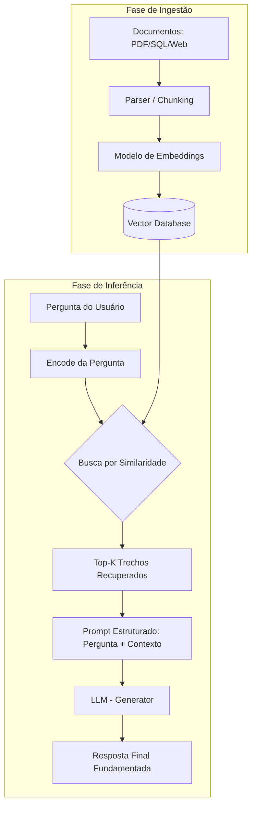

# RAG: Retrieval-Augmented Generation - Conceitos e Arquitetura

## TL;DR / Resumo Executivo
O **RAG (Retrieval-Augmented Generation)** é um framework que resolve o problema do "isolamento" dos LLMs, permitindo que eles consultem documentos externos e privados antes de gerar uma resposta. Em vez de confiar apenas na memória do treinamento (conhecimento paramétrico), o sistema recupera trechos relevantes de uma base de dados (conhecimento não-paramétrico) para fundamentar a saída da IA, o que reduz drasticamente as alucinações e elimina a necessidade de retreinamentos constantes.

## Conceitos Fundamentais
*   **LLM Isolado:** Modelo que opera apenas com os dados do seu treinamento original, sofrendo com datas de corte (*knowledge cutoff*) e falta de acesso a dados privados.
*   **RAG (Retrieval-Augmented Generation):** Arquitetura que condiciona a geração do texto a documentos recuperados dinamicamente de uma base externa.
*   **Retriever (Recuperador):** Componente responsável por encontrar os trechos de informação mais relevantes em uma base de conhecimento para uma dada pergunta.
*   **Generator (Gerador):** O modelo de linguagem (LLM) que recebe os trechos recuperados e "raciocina" sobre eles para formular a resposta final.
*   **Embeddings:** Representações vetoriais de textos que permitem ao sistema realizar buscas por similaridade semântica.
*   **Chunking:** Processo de fragmentar documentos extensos em pequenos pedaços (chunks) para que apenas as partes relevantes sejam inseridas no contexto do LLM.
*   **Vector Database (Base Vetorial):** Banco de dados especializado em armazenar e buscar vetores (embeddings) de forma eficiente.

## Matrizes de Comparação

### 1. Cenários de Uso: Quando Implementar RAG

| Cenário | Descrição / Exemplo | Prós (Por que usar) | Contras (Por que evitar) |
| :--- | :--- | :--- | :--- |
| **Dados Privados** | Manuais internos, políticas de RH ou histórico de clientes. | Segurança e exclusividade; o modelo conhece a empresa sem sair da infraestrutura. | Exige gestão de infraestrutura de dados e segurança da base vetorial. |
| **Conhecimento Dinâmico** | Preços de e-commerce, legislação atualizada ou notícias. | Atualização em tempo real sem custo de retreino; basta atualizar a base vetorial. | Adiciona latência (100-400ms extras) devido à etapa de busca. |
| **Alta Precisão** | Setores jurídico, médico e financeiro. | Redução de alucinações e fonte citável/rastreável. | A qualidade da saída depende totalmente da qualidade da base de documentos (*garbage in, garbage out*). |
| **Conhecimento Geral** | Fatos históricos amplos ou conceitos de programação pública. | Desnecessário; o modelo já sabe e a busca apenas atrasa a resposta. | Aumenta o custo e a latência sem ganho de utilidade. |
| **Raciocínio Puro** | Lógica matemática complexa ou escrita de código isolada. | O problema não é de recuperação de informação, mas de computação. | O RAG não melhora a capacidade lógica intrínseca do modelo. |

### 2. RAG vs. Fine-tuning

| Característica | RAG (Retrieval-Augmented Generation) | Fine-tuning (Ajuste Fino) |
| :--- | :--- | :--- |
| **Conhecimento** | Externo, dinâmico e facilmente atualizável. | Interno (pesos do modelo); difícil de atualizar após o treino. |
| **Custo** | Proporcional ao número de consultas (queries). | Alto; US$ 500-2.000 por rodada de treinamento em modelos 7B. |
| **Alucinações** | Baixas; ancoradas em evidência verificável. | Médias/Altas; o modelo ainda pode "adivinhar" se o treino for vago. |
| **Rastreabilidade** | Alta; cita a fonte exata (página, cláusula, arquivo). | Nula; as respostas vêm de uma "mistura opaca" de neurônios. |
| **Dados** | Ideal para grandes volumes de documentos. | Ideal para aprender novos tons de voz ou domínios de linguagem específicos. |

### Por que não usar "prompts gigantes"?

O fenômeno **"Lost in the Middle"** refere-se à tendência de os modelos de linguagem de grande escala (LLMs) demonstrarem uma **degradação de performance e perda de atenção** em informações localizadas no **meio de contextos muito longos**.

Esse comportamento apresenta as seguintes características:

*   **Priorização das Extremidades:** Os modelos tendem a dar uma importância significativamente maior ao conteúdo que aparece no **início** e no **fim** do prompt.
*   **Esquecimento Central:** As informações que ficam "diluídas" na parte intermediária do contexto sofrem uma redução de importância, resultando em um efeito de **esquecimento** por parte da IA.
*   **Impacto em Prompts Gigantes:** Esse fenômeno é um dos principais problemas ao tentar utilizar "prompts gigantes" (como colar um manual de 200 páginas diretamente na consulta), pois, além do custo elevado e da limitação de janelas de contexto, a qualidade da resposta cai drasticamente.

Em suma, o "Lost in the Middle" demonstra que simplesmente aumentar o tamanho do prompt com documentos massivos não é uma estratégia eficaz, pois o modelo não consegue processar todas as partes do texto com o mesmo nível de precisão. Por essa razão, arquiteturas como o **RAG** são preferíveis, pois recuperam apenas os trechos específicos e relevantes, evitando que a informação necessária se perca no meio de um contexto excessivo.

## Diagrama de Fluxo Lógico (Pipeline RAG Completo)

O processo do RAG é dividido em duas fases principais: a **Ingestão** (preparação dos dados) e a **Inferência** (momento da pergunta).

### Fluxo de Ingestão e Inferência (Step-by-Step)

1.  **Carregamento:** Documentos adicionais (PDF, SQL, APIs) são coletados.
2.  **Fragmentação (Chunking):** O texto é picotado em trechos menores para caber na janela de contexto.
3.  **Codificação (Embedding):** Um modelo de embedding transforma o texto em vetores numéricos.
4.  **Indexação:** Os vetores são armazenados e organizados em uma **Vector Database**.
5.  **Consulta do Usuário (Query):** O usuário faz uma pergunta (ex: "Qual o prazo de entrega?").
6.  **Busca por Similaridade:** A pergunta é convertida em vetor e o sistema busca os trechos mais similares no banco.
7.  **Aumento do Prompt:** Os trechos recuperados são injetados no prompt junto com a pergunta original.
8.  **Geração:** O LLM lê o contexto e gera a resposta fundamentada.

