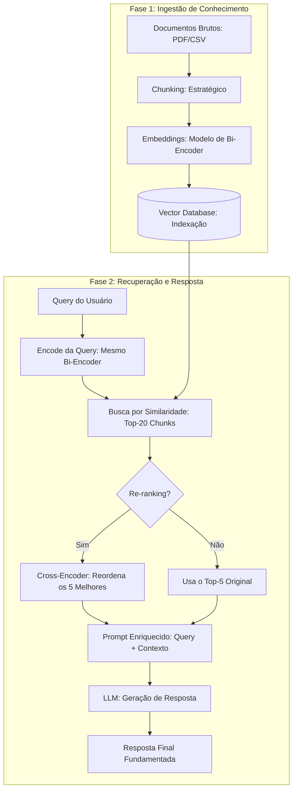

# Arquiteturas RAG e Engenharia de Retrieval

## TL;DR / Resumo Executivo
O objetivo central desta aula é apresentar o **RAG (Retrieval-Augmented Generation)** não como uma fórmula estática, mas como um **espaço de design com parâmetros ajustáveis**. A importância reside em identificar as decisões críticas no pipeline — como estratégias de segmentação, escolha de modelos de representação semântica e técnicas de refinamento — para equilibrar **qualidade, custo e latência** em sistemas de produção.

## Conceitos Fundamentais
*   **Chunking:** Processo de dividir documentos longos em fragmentos menores (chunks) para indexação e recuperação independente.
*   **Embeddings:** Representações numéricas de texto em espaços de alta dimensão onde a proximidade geométrica indica **similaridade semântica**.
*   **Recall@k:** Métrica que avalia a qualidade do embedding calculando a fração de consultas onde o chunk correto está entre os top-k recuperados.
*   **Retrieval (Top-k):** Estratégia que recupera os *k* documentos com maior similaridade vetorial em relação à consulta do usuário.
*   **Re-ranking:** Etapa opcional de refinamento que utiliza modelos mais precisos (Cross-encoders) para reordenar os chunks recuperados inicialmente.
*   **Cosine Similarity:** Métrica padrão que mede o ângulo entre vetores para determinar relevância, ignorando a magnitude do texto.

## Matrizes de Comparação e Decisões de Design

### 1. Estratégias de Chunking
| Estratégia | Parâmetros/Descrição | Melhor Para | Limitação |
| :--- | :--- | :--- | :--- |
| **Tamanho Fixo** | Divide a cada N tokens ou caracteres. | Textos não estruturados; protótipos. | Pode cortar frases/ideias ao meio. |
| **Sobreposição (Overlap)** | Janela deslizante entre chunks (ex: 50 tokens). | Produção geral (garante contexto). | Redundância e maior custo de indexação. |
| **Baseado em Estrutura** | Respeita parágrafos, seções ou headers. | Documentos estruturados (Markdown/HTML). | Gera chunks de tamanhos variáveis. |
| **Semântico** | Agrupa por similaridade semântica. | Textos narrativos complexos. | Lento; exige embedding na indexação. |
| **Recursivo** | Tenta separadores em cascata (\n\n -> \n -> espaço). | **Uso geral e recomendado.** | Poucas limitações críticas. |

### 2. Avaliação de Embeddings e Retrieval
| Métrica/Parâmetro | Impacto no Sistema | Recomendação / Valor Alvo |
| :--- | :--- | :--- |
| **Recall@5** | Define o "teto" de qualidade do sistema. | **Recall@5 ≥ 0.80** (Aceitável para produção). |
| **Top-k = 3** | Rápido, prompt enxuto. | Queries simples e diretas. |
| **Top-k = 5** | **Equilíbrio ideal** entre recall e ruído. | Padrão recomendado de produção. |
| **Top-k = 20+** | Máximo recall, mas gera *ruído* e *Lost in the Middle*. | Usar apenas se houver **Re-ranking** posterior. |

### 3. Desafios de Similaridade e Otimização
| Desafio | Causa | Como Otimizar |
| :--- | :--- | :--- |
| **Vocabulário Divergente** | "Prazo de entrega" vs "SLA de expedição". | Usar **RAG Híbrido** (Vetorial + BM25). |
| **Query Curta** | Termo isolado (ex: "reembolso?"). | Expansão de query ou modelos de embedding específicos. |
| **Domínio Técnico** | Termos jurídicos ou médicos complexos. | Fine-tuning de embedding ou modelos especializados. |

### 4. Comparativo de Arquiteturas RAG
| Modelo | Definição | Pontos Positivos | Pontos Negativos |
| :--- | :--- | :--- | :--- |
| **RAG Simples** | $Query \rightarrow Embedding \rightarrow Top-k \rightarrow LLM$. | Mínima latência; fácil de implementar. | Sensível à qualidade do embedding e valor de k. |
| **RAG com Re-ranking** | Adiciona Cross-encoder após o Top-k. | **Precisão muito maior**; compensa embeddings ruins. | Latência adicional (+100-600ms). |
| **RAG Híbrido** | Combina Busca Vetorial + BM25 (keyword). | Robusto para termos técnicos e siglas. | Requer sistema de busca adicional (ElasticSearch/Solr). |

### 5. Recomendações de Banco Vetorial
| Opção | Recomendação de Uso | Vantagem Principal |
| :--- | :--- | :--- |
| **Chroma** | Prototipagem e desenvolvimento inicial. | Zero configuração e facilidade de uso. |
| **pgvector** | Produção em empresas que já usam PostgreSQL. | Aproveita infraestrutura existente sem novos silos. |
| **Pinecone / Qdrant** | Produção escalável em nuvem. | Soluções "Zero Ops" e alta disponibilidade. |
| **FAISS** | Volumes massivos de dados localmente. | Alta performance com gerenciamento de metadados externo. |

## Diagrama de Fluxo Lógico (Pipeline RAG Detalhado)

O pipeline completo envolve a preparação dos dados (ingestão) e a resposta em tempo real (inferência).

**Passo a passo do processo:**
1.  **Fragmentação:** Documentos são divididos em chunks (preferencialmente recursivos com overlap).
2.  **Vetorização:** Chunks são convertidos em vetores e armazenados no banco vetorial.
3.  **Recuperação (Retrieval):** A query do usuário busca no banco os *k* trechos semanticamente mais próximos.
4.  **Refinamento (Opcional):** Um modelo de re-ranking avalia cada par (query, chunk) para garantir que os 5 melhores trechos subam para o topo da lista.
5.  **Aumento e Geração:** O LLM recebe os chunks selecionados como contexto para gerar uma resposta precisa e sem alucinações.