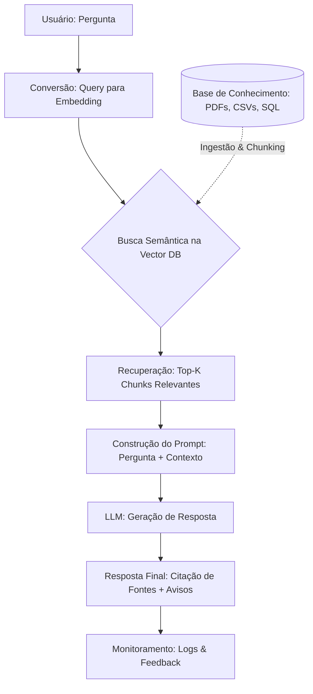

# Casos de Uso de RAG: Estratégias e Implementação por Domínio

## TL;DR / Resumo Executivo
O **RAG (Retrieval-Augmented Generation)** é adotado por empresas para garantir respostas confiáveis, fundamentadas em dados internos e constantemente atualizadas, superando as limitações de conhecimento estático das LLMs. Sua importância reside na capacidade de adaptar o comportamento do modelo a contextos críticos — como jurídico, saúde e suporte técnico — onde a precisão, a rastreabilidade e a integração com fontes heterogêneas de dados são diferenciais competitivos fundamentais.

## Conceitos Fundamentais
*   **Embeddings:** Conjunto numérico que representa o significado semântico de uma query ou documento para permitir comparações.
*   **Chunking Estruturado:** Divisão de documentos respeitando a hierarquia lógica (como artigos, capítulos ou sessões) para preservar o contexto legal ou técnico.
*   **Vector Store:** Base de dados que armazena os embeddings e permite a recuperação eficiente dos fragmentos de texto mais relevantes (Top-K).
*   **Retriever:** Componente responsável por buscar na base de conhecimento os trechos que melhor respondem à dúvida do usuário.
*   **Citação de Fonte (Proveniência):** Mecanismo que obriga o modelo a indicar de qual documento, página ou artigo a informação foi extraída, garantindo transparência.
*   **Temperatura Zero:** Configuração do modelo que busca respostas determinísticas e minimiza a criatividade, essencial para áreas de alta precisão como a saúde.

## Matrizes de Comparação e Monitoramento

### 1. RAG por Domínio de Aplicação
| Domínio | Diferencial Crítico | Alerta Específico | Soluções Recomendadas |
| :--- | :--- | :--- | :--- |
| **Chatbot Corporativo** | Filtro de acesso por departamento ou perfil de usuário. | Risco de exposição de dados privados; requer nuvem controlada. | Uso de metadados para filtrar políticas de RH, manuais e guias operacionais. |
| **Suporte Técnico** | Integração de múltiplas fontes heterogêneas (PDF, CSV, SQL). | Necessidade de manter a base de tickets históricos sempre atualizada. | Chunking baseado em headers (Markdown) e par pergunta/resposta para FAQs. |
| **Jurídico** | RAG Híbrido com citação obrigatória de fontes (Artigos/Páginas). | Alucinações sem citação têm alto custo legal e reputacional. | Metadados ricos (tribunal, data, processo) e chunking que respeite a lei (parágrafos/incisos). |
| **Saúde** | Apoio à decisão com temperatura = 0 para máxima precisão. | O sistema apoia, mas nunca substitui o profissional de saúde. | Inclusão de *disclaimers* obrigatórios e priorização de guidelines recentes (AHA/ANVISA). |
| **E-commerce** | Busca semântica baseada na intenção técnica do cliente (ex: vídeo 4K). | Catálogo ou preços desatualizados geram prejuízo e frustração. | Integração de estoque em tempo real via API e filtros de disponibilidade no retriever. |
| **Educação** | Prompt pedagógico focado em estímulo ao raciocínio, não apenas respostas. | Restringir o modelo estritamente ao material do curso para evitar divergências. | Citação de aula/slide específico e encerramento com perguntas reflexivas. |

### 2. Métricas e Indicadores de Monitoramento em Produção
| Indicador | Descrição | O que investigar se estiver ruim |
| :--- | :--- | :--- |
| **Taxa de "Não Encontrado"** | Frequência com que o sistema não localiza informações na base. | Indica lacunas na base de documentos ou embeddings ineficientes. |
| **Feedback Negativo** | Avaliações diretas dos usuários sobre as respostas. | Pode sinalizar alucinações, falta de contexto ou modelo mal instruído. |
| **Uso de Documentos** | Monitoramento de quais arquivos são mais consultados. | Ajuda a identificar as necessidades reais de informação dos funcionários ou clientes. |
| **Latência do Retriever** | Tempo levado para buscar chunks na base vetorial. | Pode exigir otimização no banco de dados ou redução do valor de K. |
| **Custo por Chamado** | Comparação entre atendimento humano e automatizado via RAG. | Fundamental para provar o ROI do projeto (ex: economia de US$ 14,50 por ticket). |

## Diagrama de Fluxo Lógico (Arquitetura RAG Detalhada)

O processo de um sistema RAG completo integra a fase de ingestão de conhecimento com a inferência em tempo real, conforme o fluxo abaixo:

1.  **Usuário/Cliente:** Inicia o processo com uma pergunta em linguagem natural.
2.  **Modelo de Embeddings:** Converte a pergunta do usuário em um vetor numérico.
3.  **Vector Database (Base Vetorial):** Compara o vetor da pergunta com os milhares de vetores dos documentos.
4.  **Recuperação (Top-K):** O sistema seleciona os "K" pedaços (chunks) de documentos mais similares semanticamente.
5.  **Aumento de Prompt:** Os chunks recuperados são inseridos no prompt da LLM como "contexto".
6.  **Geração Contextualizada:** A LLM processa a pergunta + o contexto e gera a resposta, preferencialmente citando a fonte extraída.
7.  **Entrega Final:** O sistema retorna a resposta ao usuário, incluindo avisos obrigatórios ou metadados de confiança quando necessário.

