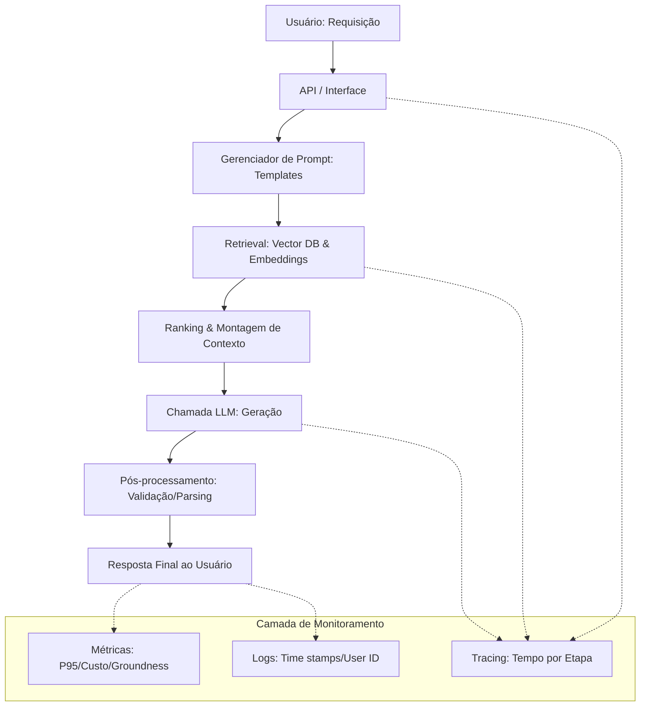

# Observabilidade e Monitoramento de LLMs em Produção

## TL;DR / Resumo Executivo
A transição de modelos testados em notebooks para sistemas reais em produção introduz desafios complexos, como degradação silenciosa da qualidade, custos inesperados e latência variável. A **observabilidade** é o diferencial técnico que permite transformar componentes isolados em sistemas rastreáveis, utilizando logs, métricas e tracing para identificar se uma falha reside no prompt, na recuperação de dados (retrieval) ou no próprio modelo de linguagem.

## Conceitos Fundamentais
*   **Observabilidade:** Capacidade de investigar cada etapa do pipeline (prompt enviado, documentos recuperados, tempo por etapa) para entender falhas e comportamentos.
*   **Logs:** Registros temporais de eventos que documentam o que ocorreu no sistema (ex: ID do usuário, tokens consumidos, versão do modelo).
*   **Métricas:** Valores numéricos agregados (latência, custo por 1000 requisições, taxa de erro) que indicam a saúde do sistema ao longo do tempo.
*   **Tracing:** Rastreio do fluxo completo de uma única requisição, permitindo visualizar o tempo gasto em cada "caixinha" do sistema.
*   **P95 Latency:** Indicador de que 95% das requisições respondem abaixo de um tempo determinado (ex: < 3s), sendo vital para a experiência do usuário.
*   **Groundness:** Grau em que a resposta da IA está fundamentada exclusivamente no contexto recuperado, evitando alucinações baseadas em conhecimento prévio do modelo.
*   **Faithfulness:** Conceito similar ao groundness, focado na fidelidade da resposta em relação aos documentos fornecidos.
*   **NLI (Natural Language Inference):** Uso de modelos classificadores especialistas para detectar contradições entre a resposta gerada e o contexto.

## Matrizes de Comparação

### 1. Tipos de Drift (Degradação de Sistema)
| Tipo de Drift | Definição | Exemplo de Impacto |
| :--- | :--- | :--- |
| **Data Drift** | Mudança no perfil ou tópico das perguntas dos usuários. | Usuários começam a perguntar sobre filosofia em um bot de e-commerce. |
| **Concept Drift** | Mudança no significado de conceitos de negócio ao longo do tempo. | O critério do que é considerado "urgente" para o suporte técnico muda. |
| **Model Drift** | Atualização silenciosa do modelo pelo provedor da API. | Uma nova versão do GPT-4o começa a dar respostas piores para o seu contexto específico. |
| **Document Drift** | Mudanças na reindexação que geram chunks diferentes. | A base vetorial é atualizada e a fragmentação dos textos prejudica a recuperação. |

### 2. Comparativo de Ferramentas de Observabilidade
| Ferramenta | Foco Principal | Diferencial |
| :--- | :--- | :--- |
| **LangSmith** | Ecossistema LangChain | Integração nativa para quem já usa LangChain/LangGraph. |
| **LangFuse** | Monitoramento Geral | Ideal para rastrear latência e precisão em tempo real. |
| **Weights & Biases** | Experimentos e ML | Focado em versionamento e acompanhamento de performance de modelos. |
| **Arize Phoenix** | Avaliação e RAG | Especializada em encontrar problemas em bancos vetoriais e embeddings. |

## Diagrama de Fluxo Lógico (Pipeline de Requisição Observável)

O diagrama abaixo detalha o caminho de uma requisição em um sistema real, destacando os pontos de falha que a observabilidade deve monitorar:

1.  **Entrada do Usuário:** Requisição via API/Interface.
2.  **Gerenciador de Prompts:** Encaixe em templates e variáveis.
3.  **Retrieval (RAG):** Busca semântica e geração de embeddings (possível gargalo de latência).
4.  **Ranking/Contexto:** Ordenação e montagem do prompt enriquecido (risco de chunks mal desenhados).
5.  **Chamada LLM:** Geração da resposta (risco de custo alto ou tempo de resposta longo).
6.  **Pós-processamento:** Parsing, validação e formatação da saída.
7.  **Saída Final:** Resposta entregue ao usuário com coleta de feedback (Thumbs Up/Down).

**Checklist de Produção:** Antes de considerar o sistema pronto, verifique se a latência P95 está sob controle, se o custo por 1000 requisições é sustentável e se a taxa de alucinação é inferior a 5%.