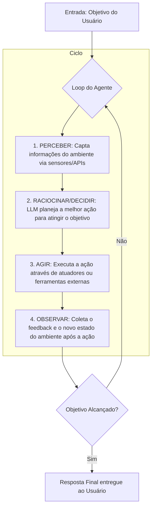

# Introdução aos Agentes Inteligentes com LLMs

## TL;DR / Resumo Executivo
O objetivo central deste bloco é apresentar a transição da Inteligência Artificial baseada em regras estáticas para o paradigma de **agentes inteligentes**, especialmente aqueles potencializados por **Grandes Modelos de Linguagem (LLMs)**. Diferente de uma LLM pura, que apenas responde a perguntas, um agente é um sistema completo capaz de **raciocinar, planejar e executar ações** de forma autônoma em um ambiente para atingir objetivos específicos definidos pelo usuário.

## Conceitos Fundamentais
*   **Agente:** É definido tecnicamente como uma **entidade de software que percebe seu ambiente através de sensores e age sobre esse ambiente através de atuadores**. O que torna um software um agente é essa capacidade de interação contínua (percepção-ação) em vez de apenas processar entradas isoladas.
*   **Requisitos de um Agente:** Para ser considerado um agente inteligente, o sistema deve possuir quatro propriedades principais:
    *   **Autonomia:** Capacidade de operar e tomar decisões por conta própria, sem a necessidade de intervenção humana constante.
    *   **Reatividade:** Habilidade de perceber mudanças no ambiente e responder a elas de maneira oportuna.
    *   **Proatividade:** Capacidade de não apenas reagir ao ambiente, mas de tomar iniciativa e agir de forma orientada a metas e objetivos pré-estabelecidos.
    *   **Sociabilidade:** Habilidade de interagir, colaborar ou coordenar tarefas com outros agentes ou seres humanos dentro de seu ambiente.

## Matriz de Comparação: Evolução e Tipos de Agentes

| Tipo de Agente | Definição Técnica | Casos de Uso | Benefícios | Limitações |
| :--- | :--- | :--- | :--- | :--- |
| **Sistemas Especialistas (IA Clássica)** | Baseados em regras rígidas (*if-then*) e conhecimento de especialistas humanos. | Diagnóstico médico (MYCIN) e análise química. | Eficientes em domínios restritos e conhecidos. | Difícil manutenção, escala e falta de adaptação a novas situações. |
| **Reativos Simples** | Atuam baseados apenas na percepção atual, seguindo regras diretas. | Aspirador de pó robótico básico. | Simplicidade e rapidez de resposta. | Não possuem memória; inteligência limitada ao contexto imediato. |
| **Baseados em Objetivos / Utilidade** | Selecionam ações que maximizam uma medida de desempenho ou atingem uma meta. | Sistemas de planejamento de rotas e logística. | Busca ativa pelo sucesso; flexibilidade para escolher caminhos. | Podem ser computacionalmente caros para planejar estados futuros. |
| **Agentes com Aprendizagem** | Melhoram seu desempenho ao longo do tempo com base no feedback do ambiente. | Sistemas de recomendação e jogos adaptáveis. | Capacidade de evolução e correção de comportamento padrão. | Exigem grande volume de dados e ciclos de feedback para aprender. |
| **Agentes LLM** | Usam LLMs como o "cérebro" para raciocinar, planejar e orquestrar ferramentas. | Assistentes de pesquisa complexa, automação de fluxos de trabalho. | Compreensão de linguagem natural e resolução de tarefas complexas e multimodais. | Alto custo de inferência, latência e risco de alucinações ou lógica falha em tarefas profundas. |

## Diagrama de Fluxo Lógico: O Loop do Agente

O funcionamento de um agente inteligente (especialmente agentes LLM) não é linear, mas sim um **ciclo contínuo de iteração** com o ambiente.

Este fluxo demonstra que o agente utiliza o **feedback do ambiente** (passo 4) como uma nova **percepção** (passo 1) para a próxima iteração, permitindo que ele se ajuste e continue trabalhando até que a tarefa complexa seja concluída.