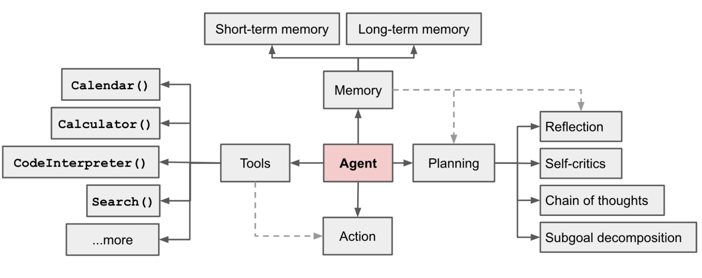

# Componentes dos Agentes Inteligentes com LLMs

## TL;DR / Resumo Executivo
O objetivo central deste bloco é detalhar a arquitetura interna que transforma um modelo de linguagem (LLM) em um **agente inteligente autônomo**. Enquanto a LLM atua como o "cérebro" responsável pelo raciocínio, o agente é o sistema completo que integra **planejamento, memória e ferramentas** para interagir com o ambiente e executar tarefas complexas de forma independente.

## Conceitos Fundamentais

### 1. Planning
*   **Definição Técnica:** Processo pelo qual o agente organiza e estrutura suas ações antes ou durante a execução, garantindo que tarefas complexas sejam divididas em etapas lógicas.
*   **Micro-componentes:**
    *   **Decomposição de Objetivos (Subgoal Decomposition):** Divisão de uma tarefa grande em partes menores e gerenciáveis.
    *   **Reflexão e Autocrítica (Self-critics):** Análise de ações passadas para aprender com erros e refinar planos futuros.
    *   **Cadeia de Pensamento (Chain of Thought):** Sequenciamento lógico para evitar respostas incoerentes.
*   **Exemplo Prático:** Ao planejar uma viagem, o agente decompõe o objetivo em: buscar voos, reservar hotéis e calcular o orçamento total.

### 2. Tools
*   **Definição Técnica:** Recursos externos (APIs, funções, scripts) que o agente invoca para expandir suas capacidades além da geração de texto, permitindo interação com o mundo real.
*   **Micro-componentes:**
    *   **APIs Externas:** Acesso a dados em tempo real (ex: clima, finanças).
    *   **Interpretadores de Código:** Execução de scripts Python para cálculos precisos.
    *   **Bases de Dados e Documentos:** Consulta a informações estruturadas ou arquivos (PDFs, planilhas).
*   **Exemplo Prático:** O uso de uma API do Google Maps para encontrar a pizzaria mais próxima em vez de fornecer uma resposta genérica.

### 3. Action
*   **Definição Técnica:** Fase de execução onde o agente transforma decisões cognitivas em efeitos concretos no ambiente, seja por texto ou uso de ferramentas.
*   **Micro-componentes:**
    *   **Ação Direta:** Resposta gerada apenas pelo modelo de linguagem.
    *   **Ação Baseada em Ferramenta:** Execução de comandos em sistemas externos.
    *   **Ação Adaptativa:** Ajuste de respostas com base no feedback de interações anteriores.
*   **Exemplo Prático:** A entrega final de um itinerário formatado ao usuário após a coleta e processamento de todos os dados de viagem.

### 4. Memory
*   **Definição Técnica:** Mecanismo de armazenamento de informações de interações, fatos e experiências que permite ao agente manter o contexto e aprender com o tempo.
*   **Micro-componentes:**
    *   **Curto Prazo:** Informações imediatas retidas na janela de contexto (como um *cache*).
    *   **Longo Prazo:** Armazenamento persistente para recuperação de fatos via RAG.
    *   **Estado Interno:** Representação atual do agente sobre si e sobre o mundo.
*   **Exemplo Prático:** Lembrar que o usuário possui um orçamento restrito de R$ 6.000 ao filtrar opções de hotéis.

## Matriz de Comparação

### 1. Tipos de Memória
| Tipo de Memória | Definição | Exemplo Prático | Pontos Positivos | Pontos Negativos |
| :--- | :--- | :--- | :--- | :--- |
| **Episódica** | Armazena eventos passados específicos. | Lembrar de uma interação anterior com o usuário. | Personalização e continuidade. | Custo de recuperação e latência. |
| **Semântica** | Conhecimento geral sobre fatos e conceitos. | Saber a definição técnica de "passaporte". | Base de conhecimento sólida e factual. | Pode se tornar obsoleta sem atualização. |
| **Procedural** | Regras sobre como realizar tarefas (skills/código). | Sequência fixa para realizar uma reserva. | Eficiência em tarefas repetitivas. | Rigidez se o ambiente mudar drasticamente. |

### 2. Tools vs Skills
| Atributo | Tool (Ferramenta) | Skill (Habilidade) |
| :--- | :--- | :--- |
| **Definição** | Executa uma ação específica via API. | Orquestra várias ferramentas para uma tarefa. |
| **Granularidade** | Baixa (específica). | Alta (especializada). |
| **Exemplo** | Google Maps API. | Planejamento de Viagem completo. |
| **Uso** | Chamada direta para um serviço. | Combina raciocínio, conhecimento e ferramentas. |

### 3. Modelo LLM vs Agente Completo
| Critério | Modelo LLM | Agente Inteligente Completo |
| :--- | :--- | :--- |
| **Função** | É o "cérebro": processa e gera texto. | É o sistema: percebe, raciocina e age. |
| **Execução** | **Não executa**; apenas decide o que deve ser feito. | **Executa** tarefas no ambiente via atuadores. |
| **Componentes** | Pesos treinados e janela de contexto. | LLM + Planejamento + Memória + Ferramentas. |
| **Natureza** | Stateless (sem memória inerente). | Stateful (mantém estado e aprende). |

## Diagrama: Componentes de um Agente

