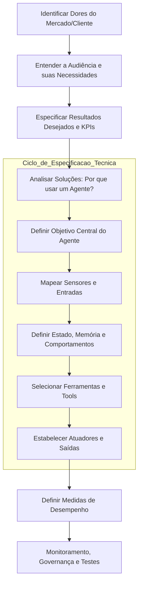

# Especificação de Agentes Inteligentes

## TL;DR / Resumo Executivo
A especificação de agentes é o processo fundamental de definir o escopo, as responsabilidades e os limites de operação de uma IA antes de sua implementação técnica. O objetivo central é evitar a criação de sistemas pouco confiáveis, ambíguos ou imprevisíveis, garantindo que o agente seja **seguro, escalável e possua um propósito claro** para o negócio ou aplicação. Especificar um agente é análogo a escrever uma **descrição de cargo** para um funcionário, detalhando sua missão, recursos e como seu sucesso será medido.

## Conceitos Fundamentais (Especificações)
Para modelar um agente de forma eficaz, é necessário definir os seguintes elementos técnicos:

*   **Objetivo:** Define a função principal e a razão de existência do agente no sistema.
    *   **Importância:** Garante que o esforço de desenvolvimento esteja alinhado a uma necessidade real, evitando funções vagas.
    *   **Exemplo:** "Responder dúvidas frequentes automaticamente para reduzir o tempo de espera em 50%".
*   **Ambiente:** O contexto ou plataforma onde o agente atua.
    *   **Importância:** Define os limites de atuação e quais sistemas externos serão impactados.
    *   **Exemplo:** Uma plataforma virtual de e-commerce e seus respectivos clientes.
*   **Sensores / Entradas:** Os mecanismos e tipos de dados que o agente percebe do mundo.
    *   **Importância:** Determina como a informação chega ao agente para ser processada.
    *   **Exemplo:** Interface de chat, documentos PDF, mensagens de voz ou APIs.
*   **Estado (State):** O conhecimento e as variáveis que o agente possui em um dado momento.
    *   **Importância:** Permite que o agente mantenha o contexto necessário para completar uma tarefa.
    *   **Exemplo:** Destino da viagem, orçamento disponível e número de dias planejado.
*   **Comportamentos / Skills:** As capacidades lógicas e operacionais que o agente deve possuir.
    *   **Importância:** Define o que o agente é capaz de processar e decidir.
    *   **Exemplo:** Pesquisar hotéis, consultar o clima ou transcrever uma consulta médica.
*   **Ferramentas (Tools):** Recursos externos que o agente invoca para executar tarefas.
    *   **Importância:** Expande as capacidades do agente além de sua base de conhecimento interna.
    *   **Exemplo:** Google Search, calculadoras aritméticas ou acesso a bancos de dados.
*   **Atuadores / Saídas:** O resultado final ou a ação produzida pelo agente.
    *   **Importância:** Define como o agente encerra seu ciclo de trabalho ou interage com o usuário.
    *   **Exemplo:** Um relatório textual, um e-mail enviado ou uma reserva confirmada em sistema.
*   **Medida de Desempenho:** Critérios objetivos para avaliar se o agente cumpriu seu objetivo.
    *   **Importância:** Permite o monitoramento, a governança e a melhoria contínua do sistema.
    *   **Exemplo:** Precisão da resposta, satisfação do usuário e tempo de execução.
*   **Autonomia e Comunicação:** Define o nível de independência do agente e como ele colabora com outros.
    *   **Importância:** Essencial para sistemas multiagentes e para definir o "humano no loop" em tarefas críticas.
    *   **Exemplo:** Um agente que precisa de aprovação humana para transações acima de um certo valor.

## Matriz de Comparação: Aplicações de Agentes no Mundo Real

A tabela abaixo compara diferentes implementações de agentes com base em casos reais citados nas fontes:

| Categoria | Objetivo | Principais Diferenciais | Benefícios / ROI | Desafios / Requisitos |
| :--- | :--- | :--- | :--- | :--- |
| **Assistente Virtual (ex: Wiley)** | Suporte ao cliente em picos de demanda. | Integração com CRM e FAQs dinâmicas. | Alta escalabilidade e redução de tempo de espera. | Evitar ambiguidades e entender consultas complexas. |
| **Clinical AI Agent (Oracle)** | Automatizar documentação médica. | Interface de voz multimodal e inteligência clínica. | Redução de 41% no tempo de documentação e combate ao burnout. | Alta precisão, privacidade e conformidade regulatória. |
| **The AI Scientist** | Descoberta científica autônoma. | Workflow completo: da hipótese à redação do artigo. | Democratização da pesquisa e baixo custo (<$15 por artigo). | Necessidade de revisão automatizada e rigor metodológico. |
| **NPCs em Games** | Personagens não jogáveis dinâmicos. | Respostas contextuais em vez de árvores rígidas. | Imersão realista e diálogos envolventes. | Equilíbrio entre autonomia e a narrativa do jogo. |

## Diagrama de Fluxo Lógico: Processo de Especificação

O processo de criação de um agente segue um fluxo estratégico que vai da dor do negócio à métrica de sucesso.

Este fluxo garante que a construção técnica esteja sempre ancorada na resolução de um problema real, promovendo eficiência e reduzindo falhas no sistema.