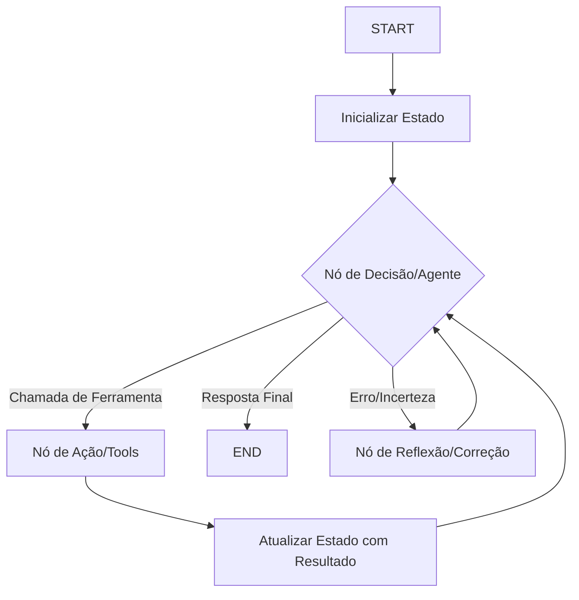

# Introdução ao LangGraph: Orquestração de Agentes Inteligentes

## TL;DR / Resumo Executivo
O **LangGraph** é uma biblioteca projetada para construir aplicações multi-agente e estados complexos usando LLMs, modelando o fluxo de trabalho como um **grafo de execução**. Diferente de pipelines lineares tradicionais, o LangGraph permite a criação de **ciclos (loops)**, permitindo que agentes reflitam sobre suas ações, corrijam erros e realizem replanejamentos iterativos, o que é fundamental para a autonomia e robustez em sistemas inteligentes.

## Conceitos Fundamentais
Abaixo estão as definições técnicas dos componentes principais do LangGraph:

*   **Grafo de execução:** É a representação do funcionamento de um agente através de uma estrutura de grafo, onde a execução pode seguir caminhos não-lineares e dinâmicos baseados no estado atual.
*   **Elementos do grafo:**
    *   **Estado (State):** Uma estrutura de dados compartilhada (como um `TypedDict` ou classe Pydantic) que atua como a "memória de trabalho" do agente. Ele estabelece um contrato entre todos os nós, persistindo informações que evoluem ao longo da execução.
    *   **Transições (Edges/Arestas):** Definem a lógica de roteamento entre os nós. Podem ser **simples** (passagem direta e incondicional) ou **condicionais** (decidem o próximo passo com base em uma função que analisa o estado).
    *   **Nós (Nodes):** Funções Python que representam unidades de trabalho ou "operações cognitivas". Um nó recebe o estado, executa uma lógica (chamada de LLM, ferramenta ou regra de negócio) e retorna atualizações para o estado.
    *   **Reducers:** Funções específicas que determinam como as atualizações enviadas pelos nós são aplicadas a chaves específicas do Estado. Por exemplo, podem ser usados para acumular mensagens em uma lista (usando `operator.add` ou `add_messages`) em vez de simplesmente sobrescrevê-las.

## Matriz de Comparação

### LangChain vs. LangGraph
O LangGraph não substitui o LangChain, mas o complementa para casos onde a linearidade é uma barreira.

| Aspecto | LangChain | LangGraph | Quando usar? |
| :--- | :--- | :--- | :--- |
| **Modelo** | Pipeline / Cadeias rígidas | Grafo de execução | **LangChain:** RAG simples, fluxos determinísticos. |
| **Fluxo** | Linear e sequencial | Dinâmico e ramificado | **LangGraph:** Agentes autônomos e sistemas multi-agente. |
| **Ciclos (Loops)** | Difícil implementação | Nativo e explícito | Use grafos quando precisar de **replanejamento** ou **reflexão**. |
| **Estado** | Limitado/Implícito | Central e compartilhado | Use grafos para gerenciar memórias complexas entre múltiplos passos. |
| **Controle** | Implícito | Explícito | Use grafos para depuração e visualização clara do raciocínio. |

### Ciclos e Controles de Execução
Agentes inteligentes raramente resolvem problemas de forma linear; eles precisam de iteração.

| Mecanismo | Definição | Objetivo Principal |
| :--- | :--- | :--- |
| **Reflexão** | Um nó gera uma resposta e outro a avalia, voltando ao início se a qualidade for insatisfatória. | Melhorar a precisão e a qualidade da saída final. |
| **Replanejamento** | O agente atualiza seus passos futuros com base nos resultados intermediários obtidos. | Adaptar-se a novos cenários ou erros durante a execução. |
| **Retry (Tentativa)** | Configuração de políticas de repetição para nós que falham (ex: erro de API). | Garantir tolerância a falhas em operações instáveis. |
| **Controle de Recursão** | Limite máximo de "super-steps" (padrão 1000) para evitar loops infinitos. | Segurança do sistema e controle de custos/recursos. |

## Diagrama de Fluxo Lógico
O fluxo típico de um agente no LangGraph segue este ciclo iterativo:

**Passo a passo do processo:**
1.  **Entrada:** O processo começa no ponto de entrada explícito (`START`).
2.  **Processamento:** Um nó (como um modelo de linguagem) lê o estado compartilhado e decide qual ação tomar.
3.  **Atualização:** O nó retorna uma atualização para o estado (usando **Reducers** para mesclar dados se necessário).
4.  **Roteamento:** Uma **aresta condicional** avalia o novo estado e decide se o fluxo deve ir para outro nó de trabalho, repetir o ciclo (loop) ou finalizar.
5.  **Término:** O grafo para quando atinge o nó especial `END` ou o limite de recursão.