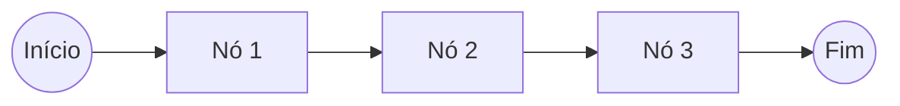
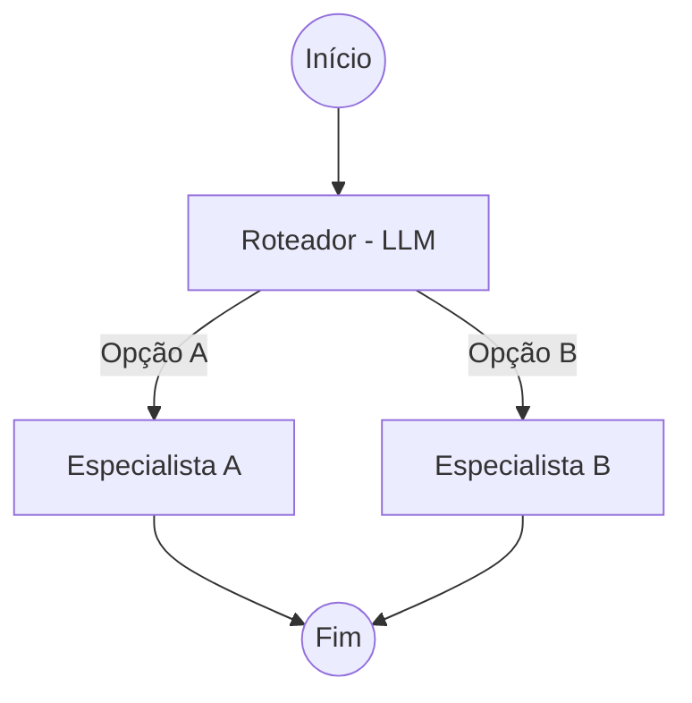
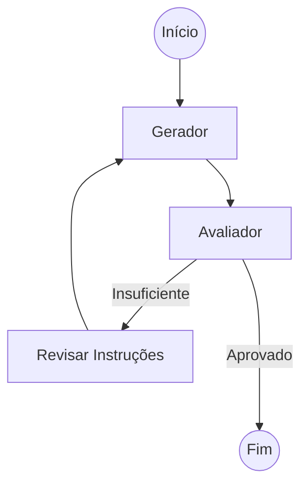
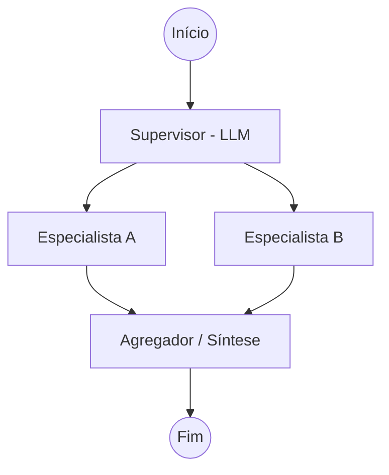

# Workflows e Orquestração Agêntica com LangGraph

## TL;DR / Resumo Executivo
Um LLM isolado não constitui um agente; agentes são sistemas complexos formados por múltiplos componentes coordenados onde o LLM atua como um elemento central. O **LangGraph** permite a transição da simples engenharia de prompts para a engenharia de workflows e agentes, utilizando estruturas de grafos para gerenciar estados complexos, permitir ciclos de feedback (loops) e garantir que tarefas de alta complexidade sejam decompostas em passos controláveis e reutilizáveis.

## Conceitos Fundamentais

*   **LLM vs Agente:** Enquanto o LLM é um componente que gera respostas ou toma decisões pontuais, o **Agente** é a arquitetura completa que coordena raciocínio, ferramentas e memória para resolver problemas. Conforme a complexidade aumenta, depender apenas de prompts únicos torna o sistema difícil de manter e degrada o raciocínio do modelo.
*   **Workflow e Componentes:** Um workflow no LangGraph é modelado como um grafo composto por **Nós (Nodes)**, que são funções que executam a lógica (como chamadas de LLM ou ferramentas), e **Arestas (Edges)**, que definem o fluxo de controle e o roteamento entre os nós.
*   **Estado Conversacional:** É a "memória compartilhada" ou uma "mochila" de dados que evolui durante a execução do grafo. Ele armazena o histórico de mensagens, resultados intermediários e observações, permitindo que todos os nós mantenham o contexto necessário para operar.

## Matriz de Comparação

### Evolução da Engenharia de IA
A evolução permite lidar com complexidade crescente, garantindo controle e modularidade.

| Nível | Foco Principal | Características |
| :--- | :--- | :--- |
| **01. Prompt** | Instrução direta | Única chamada ao modelo; tarefas simplificadas. |
| **02. Workflow** | Orquestração | Sequências e pipelines de dados bem definidos. |
| **03. Agente** | Autonomia | Sistemas com ciclos (loops) e tomada de decisão dinâmica. |
| **04. Multiagente** | Colaboração | Múltiplos agentes negociando e colaborando em ambiente comum. |

### Padrões de Arquitetura
A escolha do padrão depende do grau de controle e da necessidade de revisão da tarefa.

| Padrão | Racional | Quando usar / Pontos Positivos |
| :--- | :--- | :--- |
| **Pipeline** | Etapas fixas | Tarefas lineares e previsíveis; simples implementação. |
| **Roteador** | Caminhos dinâmicos | Múltiplos tipos de demanda; LLM escolhe a melhor rota via estado. |
| **Reflexivo** | Ciclo de revisão | Qualidade crítica; inclui nós de geração e avaliação para refinamento. |
| **Supervisor** | Coordenação central | Tarefas compostas; um nó mestre gerencia especialistas e sintetiza resultados. |

## Diagrama de Fluxo Lógico

Abaixo, a representação dos quatro padrões fundamentais de orquestração:

### 1. Pipeline (Fluxo Linear)

### 2. Roteador (Decisão Condicional)

### 3. Reflexivo (Loop de Qualidade)

### 4. Supervisor (Multiagente)

### Exemplo de Fluxo Completo (Geração de Relatório)
Baseado na implementação de um agente autônomo:
1.  **Entrada:** Usuário define o objetivo do relatório.
2.  **Planejamento:** O nó `planejador` define as etapas necessárias.
3.  **Geração:** O nó `gerador` produz o conteúdo inicial.
4.  **Revisão:** O nó `revisor` avalia a qualidade e fornece feedback.
5.  **Roteamento (Loop):** Se o feedback for "aprovado", o fluxo encerra (`END`); caso contrário, retorna ao `gerador` para ajustes com base no feedback.