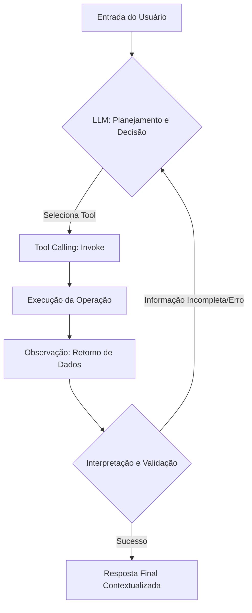

# Tools e Integrações com Agentes

## TL;DR / Resumo Executivo
As **ferramentas (tools)** funcionam como extensões das capacidades de um LLM, permitindo que o agente interaja com o mundo real, acesse dados atualizados e execute operações em sistemas externos. Elas representam uma **abstração arquitetural** que separa a intenção do agente da implementação técnica, transformando o raciocínio textual em ações operacionais concretas e controladas.

## Conceitos Fundamentais

*   **Definição de Tool:** Uma ferramenta é uma capacidade reutilizável do sistema que encapsula uma habilidade específica (como consultar um banco de dados ou enviar um e-mail) sob uma interface uniforme. 
*   **Tools Inteligentes:** São ferramentas que ocultam fluxos complexos, podendo ser implementadas como workflows, agentes especializados ou chamadas para múltiplos serviços remotos, mantendo a simplicidade para o agente principal.
*   **Definindo Boas Tools:** Devem possuir **alta coesão** (resolvem um único problema) e **baixo acoplamento** (mínima dependência de outros componentes), além de uma interface simples e estável.
*   **Anatomia de uma Ferramenta:**
    *   **Identificação (Registry):** Composta por um nome exclusivo e uma descrição detalhada que o modelo usa para decidir quando invocá-la. O **Tool Registry** funciona como um catálogo ou "cardápio" de metadados para o agente.
    *   **Interface (Calling/Bind):** Define esquemas de dados rígidos (*schemas*) para entradas e saídas, contratos operacionais e documentação com exemplos práticos.
    *   **Operação (Runtime):** O código lógico que executa a ação, incluindo tratamento de erros para autocorreção e métricas de observabilidade (latência, custo, auditoria).
*   **Diferenças Cruciais:**
    *   **Tool:** Componente passivo que expõe uma interface e executa uma capacidade específica quando chamado.
    *   **Agente:** A entidade "cognitiva" que raciocina, planeja e toma a decisão de qual ferramenta usar.
    *   **Workflow:** Uma sequência pré-definida de execução que pode, inclusive, ser encapsulada dentro de uma Tool.

## Matriz de Comparação

### Categorias de Tools
As ferramentas são classificadas de acordo com a capacidade operacional que ampliam.

| Categoria | Propósito Principal | Exemplos de Uso |
| :--- | :--- | :--- |
| **Reasoning / Planning** | Estender lógica e plano | Auxílio em cálculos complexos ou decomposição de tarefas. |
| **Retrieval (Dados)** | Acesso a informações | Consultas em bancos SQL/NoSQL, vetores ou busca na web. |
| **Action / Effect** | Modificar o ambiente | Criar tarefas, enviar mensagens ou atualizar registros. |
| **Communication** | Interação externa | Notificações via e-mail ou apps de mensagem. |
| **Monitoring / Integration**| Governança e fluxos | Tracing de execução e conexão entre sistemas internos. |

### Padrões de Integração
A escolha do padrão depende do grau de autonomia e controle de risco necessários.

| Padrão | Funcionamento | Quando Usar |
| :--- | :--- | :--- |
| **Tool Router** | O LLM escolhe a ferramenta ideal baseando-se no estado. | Múltiplas fontes de dados ou serviços integrados. |
| **Tool Node** | Um nó dedicado no workflow executa uma ferramenta isolada. | Integrações previsíveis e altamente testáveis. |
| **Supervisor** | Um agente mestre coordena agentes especialistas com suas ferramentas. | Tarefas compostas e fluxos de trabalho complexos. |
| **Human-in-the-loop**| Interrupção estratégica para validação humana antes da ação. | Operações de alto risco ou impacto irreversível. |

## Diagrama de Fluxo Lógico (Ciclo Ação-Percepção)

O uso de ferramentas segue um ciclo iterativo onde o resultado da execução alimenta o próximo passo do raciocínio.

**Passo a Passo do Processo:**
1.  **Entrada:** O usuário envia uma demanda que exige dados externos ou ações.
2.  **Raciocínio:** O LLM analisa o **Tool Registry** e decide qual ferramenta é adequada.
3.  **Invocação:** O sistema chama a ferramenta (*Invoke*) com os argumentos extraídos pelo modelo.
4.  **Execução:** A lógica interna da ferramenta processa a tarefa (API, SQL, Script).
5.  **Observação:** O resultado retorna ao agente como uma "percepção" do ambiente.
6.  **Interpretação:** O agente valida se o resultado resolve a pergunta ou se há inconsistências antes de responder ao usuário.