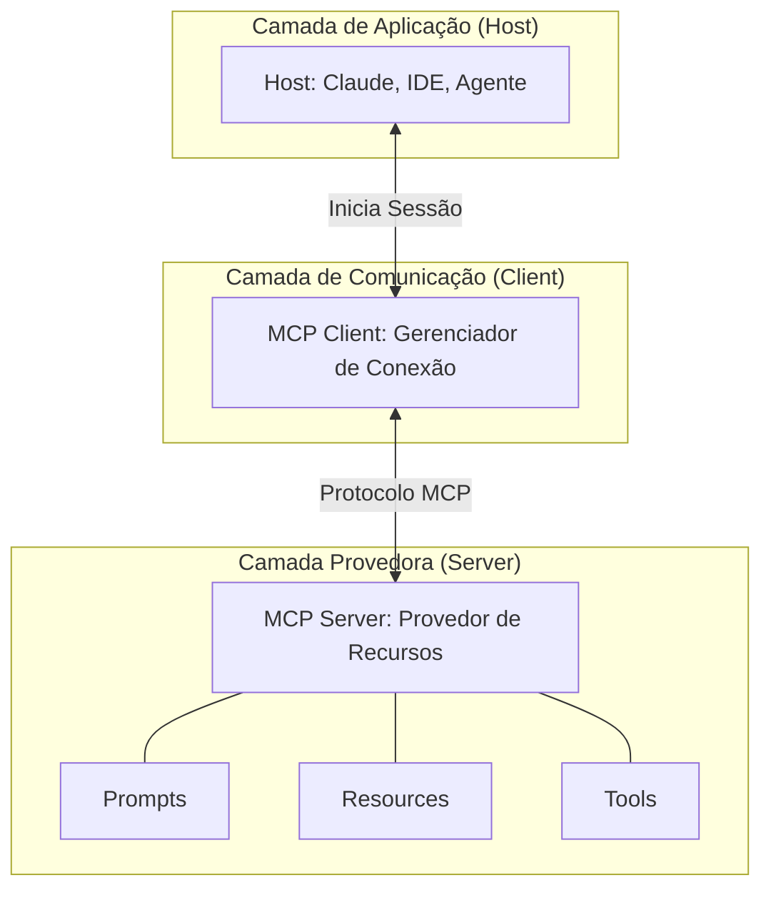

# Model Context Protocol (MCP)

## TL;DR / Resumo Executivo
O **Model Context Protocol (MCP)** é um protocolo aberto projetado para padronizar a conexão entre agentes de IA e recursos externos, como ferramentas, dados e prompts. Sua principal importância reside na eliminação da fragmentação de interfaces, atuando como um "USB-C para agentes", o que permite que diferentes modelos e sistemas interoperem de forma segura e escalável sem a necessidade de reescrever integrações complexas para cada novo serviço.

## Conceitos Fundamentais
Abaixo estão as definições técnicas e os pilares do protocolo:

*   **Definição:** O MCP é uma infraestrutura aberta que define como agentes e modelos de linguagem acessam recursos externos de maneira padronizada, segura e interoperável.
*   **Padronização:** Refere-se à criação de uma interface única e universal que substitui a complexidade de implementar dezenas de interfaces diferentes para acessar bancos de dados, CRMs, ERPs ou sistemas de arquivos.
*   **Componentes Centrais:** O MCP organiza as capacidades expostas em três tipos de primitivas:
    *   **Prompts:** Templates de interação reutilizáveis para padronizar como o agente formula pedidos (ex: template para geração de relatórios).
    *   **Resources:** Fontes de dados para leitura, como arquivos ou APIs de consulta, identificados por URIs.
    *   **Tools:** Funções executáveis com esquemas de entrada e saída bem definidos para realizar ações computadas (ex: executar código ou chamar APIs externas).

## Matriz de Comparação

### Tools Tradicionais vs. MCPs
A evolução do uso de ferramentas para o padrão MCP traz ganhos em governança e flexibilidade.

| Característica | Local Tools (Tradicional) | Model Context Protocol (MCP) | Por que e quando usar MCP? |
| :--- | :--- | :--- | :--- |
| **Localização** | Implementadas localmente junto ao agente. | Expostas remotamente via servidor dedicado. | **Quando:** Necessidade de reuso por múltiplos agentes. |
| **Integração** | Acoplamento direto e interfaces inconsistentes. | Desacopladas via interface única universal. | **Ponto Positivo:** Reduz o retrabalho ao adicionar serviços. |
| **Descoberta** | Hardcoded no código do sistema. | Dinâmica em tempo de execução via Client. | **Ponto Positivo:** Escalabilidade do ecossistema. |
| **Segurança** | Difícil de auditar e monitorar centralizadamente. | Nativa com autenticação, validação de esquema e auditabilidade. | **Ponto Positivo:** Controle de acesso e menor privilégio. |
| **Complexidade** | Alta fragmentação de interfaces. | Padronização unificada (USB-C da IA). | **Ponto Negativo:** Exige configuração de infraestrutura client-server. |

## Diagrama de Fluxo Lógico

A arquitetura do MCP separa as responsabilidades em três camadas fundamentais para garantir a interoperabilidade.

### Conceitos dos Componentes da Arquitetura:
1.  **Host (Aplicação):** É a aplicação final que incorpora o LLM e inicia a sessão MCP (ex: um Chatbot ou uma IDE).
2.  **Client (Intermediário):** Funciona como um "driver" que gerencia a conexão entre o host e o servidor. Suas responsabilidades incluem descobrir capacidades, traduzir chamadas, validar mensagens e controlar a autenticação.
3.  **Server (Provedor):** É quem de fato provê e expõe os recursos, ferramentas e prompts. Ele controla o que pode ser acessado, garantindo que o agente não acesse sistemas diretamente sem passar pelo contrato MCP.