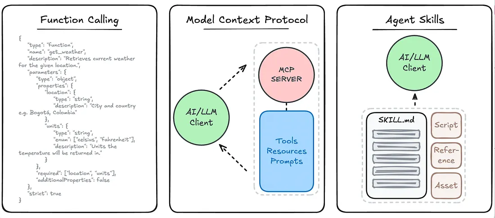
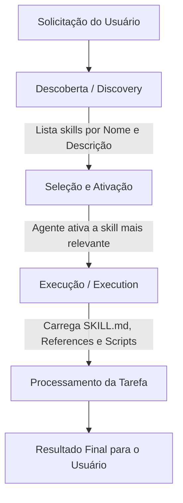
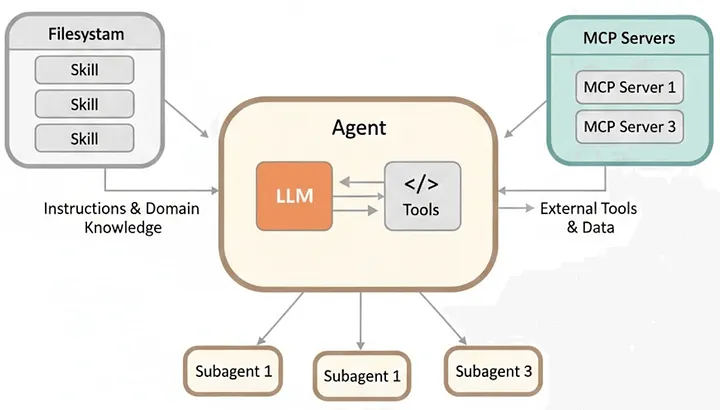

# Skills de Agentes

## TL;DR / Resumo Executivo
As **skills** são unidades modulares e reutilizáveis que encapsulam **conhecimento especializado** e procedimentos operacionais, permitindo que agentes de IA deixem de ser generalistas para se tornarem **especialistas** em domínios específicos. Sua importância reside em fornecer o contexto e o "como fazer" (procedimento), garantindo que o agente utilize ferramentas de forma consistente, segura e alinhada às políticas organizacionais, reduzindo drasticamente as alucinações.

## Conceitos Fundamentais

*   **Definição e Motivação:** Uma skill é um pacote que agrupa instruções, workflows e referências para executar uma tarefa específica. A principal motivação é que ter acesso a ferramentas (APIs) não garante que o agente saiba usá-las corretamente; ele precisa de **conhecimento procedimental** (ex: saber seguir um playbook de incidentes ou as regras de deploy da empresa).
*   **Componentes de um Skill:** Organizados em uma estrutura de diretórios padronizada:
    *   **SKILL.md:** Arquivo obrigatório contendo **metadados** (nome, descrição, versão) e as **instruções lógicas** (o passo a passo do comportamento esperado).
    *   **references/:** Base de conhecimento local (arquivos `.md`) com playbooks, arquiteturas e históricos de erros.
    *   **assets/templates/:** Modelos estruturados (markdown) para garantir que a saída do agente (relatórios, chamados) seja sempre padronizada.
    *   **scripts/:** Automações executáveis (ex: scripts Python) que o agente pode rodar para análise de dados ou diagnósticos.
*   **Como escrever uma boa skill:** Uma boa skill deve ter um **nome único** e uma **descrição clara** de seu propósito para facilitar a descoberta pelo agente. As instruções devem ser estruturadas como um **fluxo de execução rígido**, definindo posturas e regras de negócio explícitas para garantir auditabilidade e consistência.

## Matriz de Comparação

Abaixo, a evolução da inteligência operacional dos agentes, desde a instrução básica até a especialização por domínio.

| Abordagem | Foco Principal | O que resolve / Vantagem | Limitação / Problema |
| :--- | :--- | :--- | :--- |
| **Prompt Engineering** | Responder (palavras) | Guia o comportamento imediato do agente. | Difícil reuso, manutenção e contexto disperso. |
| **Tool Calling** | Agir (ferramentas) - _**o que** posso fazer?_ | Expande as capacidades, permitindo consultas externas. | Agente não sabe *quando* ou em qual *sequência* usar. |
| **MCP** | Acessar (recursos) - _**onde** posso acessar?_ | Padroniza o acesso a diferentes sistemas. | Resolve a conexão, mas não o conhecimento operacional. |
| **Skills** | Especializar (domínio) - _**como** devo fazer?_ | Encapsula o **método** de forma modular e versionável. | Exige manutenção e documentação sempre acurada. |

## Diagrama de Fluxo Lógico

O funcionamento de uma skill baseia-se no princípio de carregar apenas o necessário, no momento certo, para otimizar o uso de contexto.

**Passo a passo do processo:**
1.  **Solicitação:** O usuário envia uma demanda complexa ao sistema.
2.  **Descoberta (Discovery):** O agente mapeia dinamicamente quais competências (skills) estão disponíveis no ecossistema através de seus metadados.
3.  **Seleção e Ativação:** O agente identifica a skill que corresponde à tarefa e a "carrega" para sua memória de trabalho.
4.  **Execução:** A skill fornece as instruções, referências e ferramentas necessárias. O agente segue o fluxo operacional definido (ex: validar serviço -> consultar logs -> gerar relatório).
5.  **Resultado:** O agente entrega a resposta final baseada no conhecimento especializado da skill.

