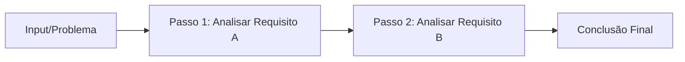
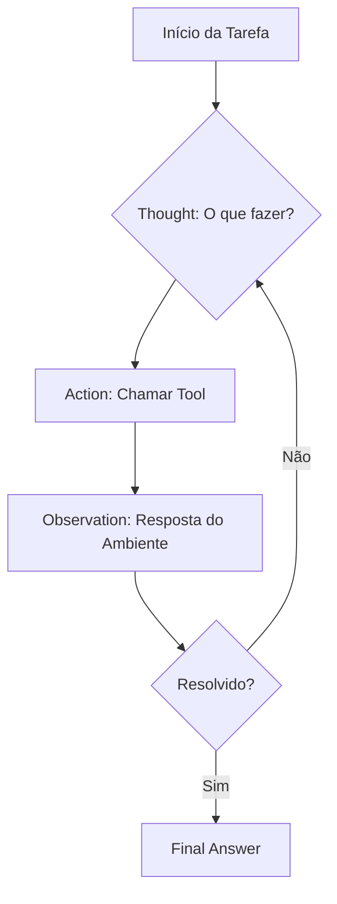
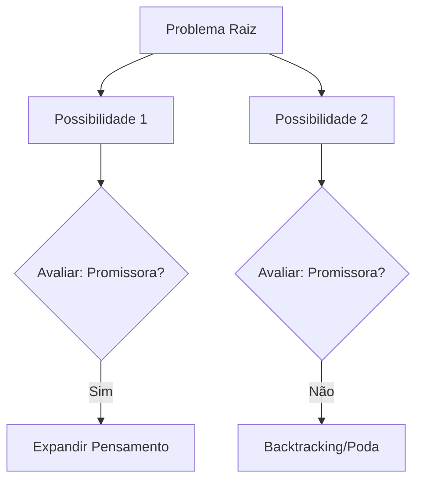

# Raciocínio em Agentes LLMs

## TL;DR / Resumo Executivo
O raciocínio (**reasoning**) em agentes baseados em LLMs é o processo cognitivo de transformar informações e percepções em decisões fundamentadas, indo além da simples geração de texto estatística. Enquanto problemas simples são resolvidos rapidamente por modelos *stateless*, tarefas complexas exigem a combinação de fatos, aplicação de regras e verificação de evidências para garantir que a conclusão seja logicamente sustentada, mitigando falhas como alucinações e propagação de erros.

## Conceitos Fundamentais
- **Definição de Reasoning:** É a capacidade de construir, comparar e verificar conclusões a partir de informações disponíveis, restrições e evidências. Diferencia-se do conhecimento puro (saber fatos) por envolver o encadeamento lógico e a tomada de decisão sobre esses fatos.
- **Requisitos e Importância da Memória:** Para um raciocínio eficaz, o agente depende crucialmente da memória para:
    - **Lembrar Objetivos:** Manter o foco no resultado final desejado.
    - **Lembrar Estados Anteriores:** Acompanhar o histórico de ações e o progresso de um plano em execução.
    - **Recuperar Evidências:** Acessar fatos relevantes e conhecimentos de longo ou curto prazo necessários para a decisão atual.
- **Desafios de Implementação:**
    - **Propagação de Erro:** Um erro em uma etapa intermediária pode invalidar toda a conclusão final.
    - **Custo e Latência:** Técnicas que exigem múltiplas chamadas de LLM aumentam significativamente o tempo de resposta e o consumo de tokens.
    - **Overthinking:** O risco de o agente entrar em loops excessivos de análise sem melhora real na qualidade da resposta.
    - **Alucinação Logística:** Modelos podem inventar fatos ou regras durante o processo de encadeamento.

## Matriz de Comparação

### Comparação entre Técnicas de Reasoning

| Técnica | Definição / Ideia | Quando usar | Prós / Contras |
| :--- | :--- | :--- | :--- |
| **Few-Shot** | Fornece exemplos resolvidos para o modelo identificar padrões. | Classificação e tarefas com padrão claro. | (+) Simples; (-) Limitado a padrões fixos. |
| **Chain-of-Thought (CoT)** | Induz o modelo a pensar "passo a passo" linearmente. | Resolução de problemas com regras lógicas. | (+) Melhora a lógica; (-) Sem acesso externo, pode alucinar. |
| **Self-Ask** | O modelo gera perguntas intermediárias para si mesmo antes da resposta final. | Problemas "multi-hop" (várias etapas de busca). | (+) Organiza a busca; (-) Aumenta latência. |
| **Self-Consistency** | Gera várias soluções e seleciona a mais frequente/consistente. | Redução de erros em lógica/matemática. | (+) Alta confiabilidade; (-) Custo multiplicado por N caminhos. |
| **Least-to-Most** | Decompõe um problema complexo em subproblemas menores sequenciais. | Problemas muito extensos ou complexos. | (+) Resolve partes difíceis; (-) Depende da decomposição correta. |
| **Tree of Thoughts (ToT)** | Explora múltiplos caminhos em árvore, avaliando alternativas. | Problemas de busca e otimização. | (+) Exploração profunda; (-) Altíssimo custo e complexidade. |
| **ReAct** | Integra raciocínio, ação (ferramentas) e observação em ciclos. | **Agentes Autônomos** interativos. | (+) Dados do mundo real; (-) Pode entrar em loops infinitos. |

### Reasoning vs Planning vs Tools

| Capacidade | Pergunta Central | Resultado Primário |
| :--- | :--- | :--- |
| **Reasoning** | O que posso concluir sobre os dados? | Conclusão, decisão ou hipótese. |
| **Planning** | O que devo fazer e em que ordem? | Plano de ação (lista de tarefas). |
| **Acting (Tool Use)** | Qual ferramenta resolve esta parte? | Resultado da execução (observação). |

## Diagrama de Fluxo Lógico

### 1. Chain-of-Thought (CoT) e Least-to-Most (Linear)

*(No Least-to-Most, o passo 1 é a decomposição em questões menores)*

### 2. ReAct (Ciclo Iterativo)

### 3. Tree of Thoughts (Exploração de Caminhos)

### 4. Self-Ask (Sequencial de Follow-up)
1.  **Pergunta Original** -> "Preciso de perguntas de acompanhamento?"
2.  **Follow-up 1** -> Resposta Intermediária 1.
3.  **Follow-up 2** -> Resposta Intermediária 2.
4.  **Resposta Final** consolidada.