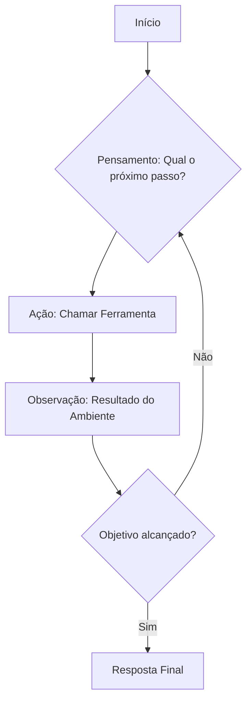
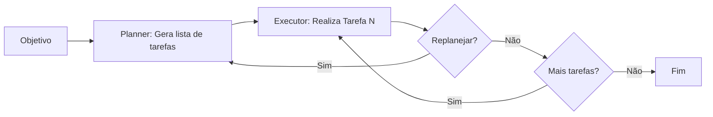
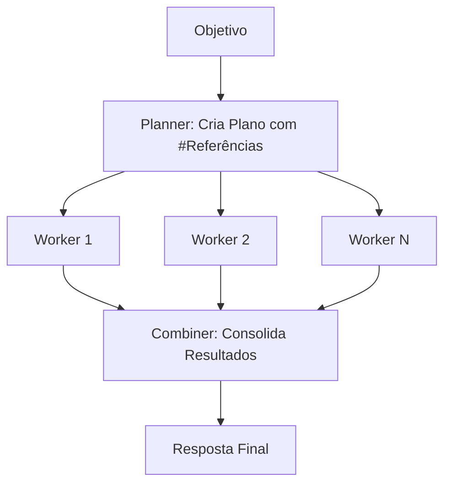
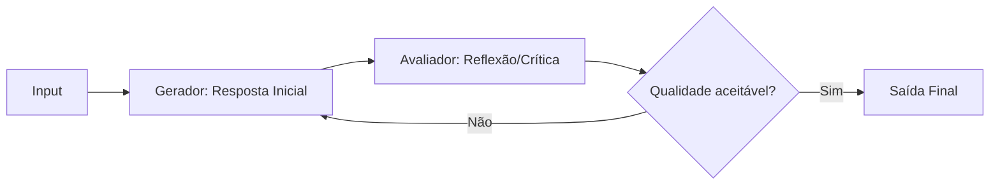
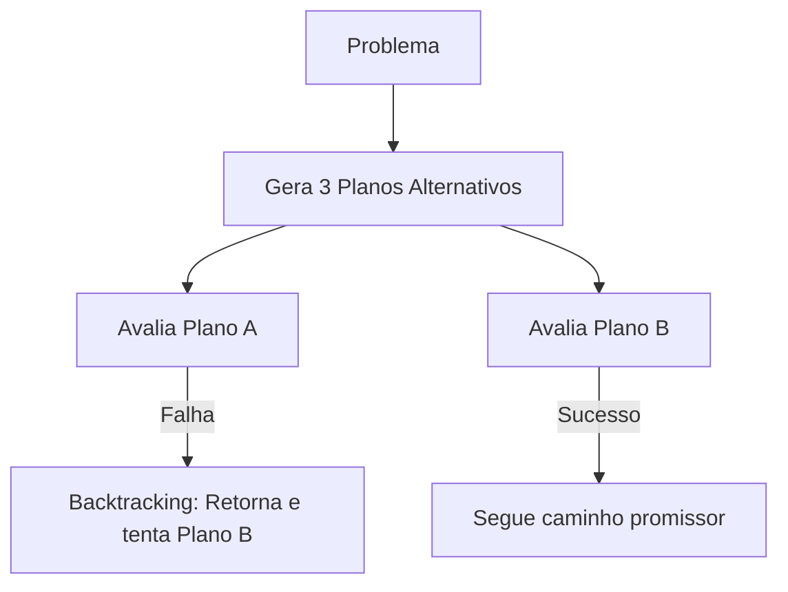

# Planejamento em Agentes LLM

## TL;DR / Resumo Executivo
O planejamento (**planning**) é a capacidade central que permite a um agente LLM decompor objetivos complexos e abstratos em uma sequência organizada e ordenada de ações executáveis. Enquanto modelos tradicionais tentam gerar uma resposta imediata, o planejamento permite que o agente gerencie dependências entre tarefas, acompanhe o progresso e adapte sua rota com base em novos dados do ambiente, sendo essencial para missões que exigem múltiplas etapas e coordenação.

## Conceitos Fundamentais
- **Definições técnicas:** Planejamento é o processo de transformar um objetivo em subobjetivos, que por sua vez se tornam ações específicas a serem executadas. Diferencia-se do raciocínio (**reasoning**) pois, enquanto o raciocínio foca em *como pensar* e tomar decisões, o planejamento foca no *o que fazer* e em *qual ordem*.
- **Importância e benefícios esperados:** É fundamental para evitar que o agente entre em loops infinitos ou repita buscas desnecessárias. Permite lidar com tarefas longas e complexas, garantindo que passos que dependem uns dos outros sejam respeitados e possibilitando o **rebranding** (replanejamento) para corrigir o curso durante a execução.
- **Desafios de implementação:**
    - **Alucinação:** O modelo pode criar planos com ferramentas inexistentes ou etapas impossíveis.
    - **Propagação de Erros:** Uma falha no primeiro passo pode invalidar toda a sequência seguinte.
    - **Custo e Latência:** Múltiplas chamadas de LLM para planejar e replanejar aumentam o consumo de tokens e o tempo de resposta.
    - **Rigidez:** Planos estáticos podem falhar se o ambiente mudar e o agente não tiver capacidade de adaptação dinâmica.

## Matriz de Comparação entre Padrões de Planejamento

| Método | Plano Global | Replanejamento | Custo | Melhor Uso |
| :--- | :--- | :--- | :--- | :--- |
| **ReAct** | Não | Contínuo | Baixo | Ambientes dinâmicos e flexíveis. |
| **Plan-and-Execute** | Sim | Opcional | Médio | Tarefas estruturadas com etapas claras. |
| **ReWOO** | Sim | Limitado | Baixo | Eficiência e execução em paralelo. |
| **Reflection** | Parcial | Sim | Alto | Melhoria da qualidade e correção de erros. |
| **Self-critics** | Parcial | Sim | Alto | Verificação de fatos e autocrítica. |
| **ToT (Tree of Thoughts)** | Múltiplos | Sim (Backtracking) | Muito Alto | Problemas de busca e decisões complexas. |

## Diagrama de Fluxo Lógico

### 1. ReAct (Ciclo Dinâmico)
O agente não possui um plano fixo inicial; ele decide o próximo passo após cada observação.

### 2. Plan-and-Execute (Estruturado)
Gera uma lista completa de tarefas a priori e usa um executor (muitas vezes um agente ReAct) para realizá-las.

### 3. ReWOO (Eficiente/Antecipado)
Planeja tudo antecipadamente usando referências (ex: #E1) para conectar resultados futuros antes da execução real.

### 4. Reflection (Iterativo)
O agente gera uma resposta, critica a própria criação e refina o resultado antes da entrega.

### 5. Tree of Thoughts (ToT - Exploração)
Gera múltiplos caminhos e utiliza *backtracking* para retornar a estados anteriores caso encontre um erro ou beco sem saída.
