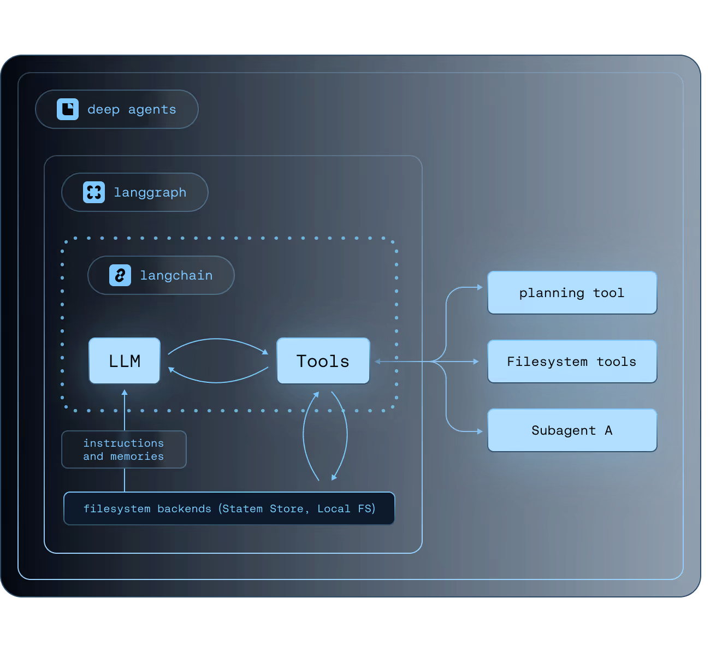

# Deep Agents: Arquiteturas para Tarefas de Longo Horizonte

## TL;DR / Resumo Executivo
**Deep Agents** não são novos modelos de linguagem, mas sim uma **arquitetura de agentes** projetada para executar tarefas complexas, abertas e de "longo horizonte" (que podem durar minutos, horas ou dias). Sua importância fundamental reside na capacidade de manter a coesão e o objetivo em processos extensos, utilizando um **agent harness** para coordenar planejamento, memória externa e subagentes, evitando a degradação de desempenho típica de agentes "rasos" que dependem apenas da janela de contexto.

## Conceitos Fundamentais

*   **Deep Agents e Harness:** Deep Agents são projetados para tarefas que exigem dezenas de etapas e manipulação de grandes volumes de dados. O **Harness** (ou arcabouço) é o ambiente de execução que coordena automaticamente o ciclo de vida do agente, unindo planejamento, gerenciamento de contexto e ferramentas em um fluxo coeso.
*   **Componentes do Deep Agents:**
    *   **Planner (Planejador):** Decompõe objetivos em planos explícitos e revisáveis.
    *   **Subagentes:** Unidades especializadas que executam subtarefas em contextos isolados, devolvendo apenas o resultado essencial ao agente principal.
    *   **Sistema de Arquivos Virtual:** Gerencia a persistência de dados e o estado fora da janela de contexto.
    *   **Skills (Habilidades):** Instruções procedimentais modulares que definem "como" o agente deve operar.
    *   **System Prompt:** Documentação extensa com regras e exemplos de uso de ferramentas.
*   **Offloading e Otimização de Memória:** O **offloading** (descarregamento) consiste em gravar resultados grandes em arquivos, mantendo na janela de contexto apenas um resumo e um ponteiro (referência) para o arquivo. Além disso, o uso de subagentes isola contextos pesados, e o **prompt caching** (em modelos suportados como Anthropic) reduz custos e latência ao reaproveitar seções estáticas do prompt.
*   **Desafios e Limitações:** Os principais riscos incluem alucinações (marcar tarefas como feitas sem executá-las), planos mal estruturados que levam ao erro, **custos elevados e pouco previsíveis**, e dificuldades na depuração de execuções longas e não determinísticas.

## Matriz de Comparação: Agente Comum vs. Deep Agents

| Aspecto | Agente Comum ("Raso") | Deep Agent (Profundo) | Quando usar Deep Agent |
| :--- | :--- | :--- | :--- |
| **Plano** | Implícito no histórico de mensagens. | **Explícito e revisável** via ferramentas. | Tarefas com múltiplos passos e objetivos abertos. |
| **Memória** | Limitada à janela de contexto. | **Externa e persistente** (arquivos/store). | Quando há grande volume de dados ou necessidade de persistência entre sessões. |
| **Contexto** | Cresce sem controle até estourar. | **Gerenciado** via offloading e isolamento. | Tarefas de longo horizonte (pesquisas, auditorias, codificação). |
| **Delegação** | Executa tudo no mesmo contexto (poluição). | **Subagentes isolados** com contextos próprios. | Processos que podem ser paralelizados ou exigem especialização. |

| Setor / Tipo de Problema | Agente Comum (Raso) | Deep Agent (Profundo) |
| :--- | :---: | :---: |
| **FAQs e Centrais de Ajuda** | **Sim** | Não indicado |
| **Chatbots de conversa simples** | **Sim** | Não indicado |
| **Tarefas de poucos passos e curta duração** | **Sim** | Não indicado |
| **Programação e Desenvolvimento de Software** | Não indicado | **Sim** |
| **Pesquisas e Revisões Bibliográficas** | Não indicado | **Sim** |
| **Auditoria e Análise de milhares de documentos** | Não indicado | **Sim** |
| **Data Science e Engenharia de Dados** | Não indicado | **Sim** |
| **Planejamento de Negócios e Marketing** | Não indicado | **Sim** |
| **Migração de Sistemas Complexos** | Não indicado | **Sim** |
| **Tarefas de "Longo Horizonte" (minutos, horas ou dias)** | Não indicado | **Sim** |

### Principais Diferenças para Decisão:

*   **Agente Comum:** Ideal quando o problema é **bem delimitado**, de poucos passos e não exige planejamento explícito ou memória persistente fora da janela de contexto.
*   **Deep Agent:** Essencial para tarefas **abertas e não determinísticas** que exigem a decomposição de um objetivo geral em subtarefas, delegação para subagentes e gestão de grandes volumes de dados via sistema de arquivos.

## Diagrama de Fluxo Lógico

O ciclo de vida de um Deep Agent é iterativo e focado na gestão do plano e do contexto:

1.  **Início:** O agente recebe o objetivo e utiliza a ferramenta de planejamento para criar uma checklist explícita.
2.  **Execução:** Para cada tarefa, ele decide se usa uma ferramenta direta ou delega a um subagente para não poluir o contexto principal.
3.  **Gestão:** Resultados volumosos são "descarregados" para o sistema de arquivos, mantendo o histórico de mensagens limpo e focado.
4.  **Adaptação:** Se uma observação revelar que o plano original é falho, o agente reescreve a lista de tarefas (planejamento dinâmico).
5.  **Conclusão:** Após dar "check" em todas as etapas, a resposta final é gerada a partir dos resultados acumulados nos arquivos e memórias.