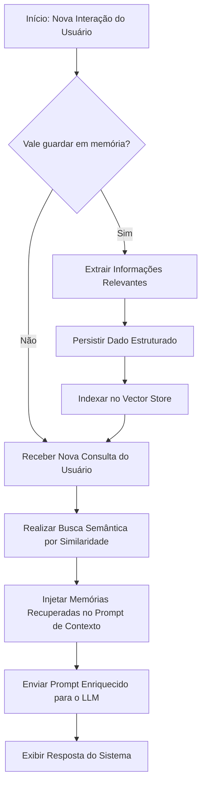

# Memória em Agentes Inteligentes com LLMs

## TL;DR / Resumo Executivo
Os Modelos de Linguagem de Grande Porte (LLMs) são sistemas *stateless* (sem estado), o que significa que cada interação à sua API ocorre de forma independente e isolada, sem retenção de lembranças de turnos anteriores. Para capacitar os agentes no cumprimento de tarefas complexas de longo horizonte, é indispensável arquitetar um componente de **memória persistente e seletiva**. A memória atua como o substrato que sustenta a execução, otimizando o contexto, minimizando custos de redundância e contornando o problema de degradação de atenção do modelo ("lost in the middle").

## Conceitos Fundamentais
- **LLM Stateless:** Propriedade em que o modelo funciona como uma função matemática pura sem estado interno persistente, exigindo que o histórico de dados seja reenviado a cada nova chamada se houver intenção de manter a continuidade.
- **Janela de Contexto vs. Memória Externa:**
  - *Janela de Contexto:* Buffer temporário e finito de tokens enviado ao modelo em cada requisição para processamento imediato. É volátil por natureza e possui alto custo por token.
  - *Memória:* Repositório persistente e estruturado que vive de forma externa ao LLM. Atua selecionando somente dados considerados relevantes por políticas inteligentes de triagem.
- **Tipos de Conhecimento em Agentes:**
  - *Conhecimento Paramétrico:* Conhecimento estático integrado diretamente nos pesos neurais do LLM durante seu pré-treinamento ou ajuste fino (ex: "Paris é a capital da França").
  - *Contexto:* Informação circunstancial inserida dinamicamente no prompt no momento da chamada (ex: "O usuário perguntou sobre a França").
  - *Memória:* Preferências e ocorrências históricas salvas e associadas ao perfil de uso (ex: "Este usuário sempre prefere viajar de trem").
- **Ciclo de Vida do Gerenciamento de Memória:**
  - *Escrita:* Ação de avaliar o fluxo de mensagens, filtrar os ruídos descartáveis e registrar somente o que é valioso em formatos como texto livre, estruturas de chave-valor ou triplas de conhecimento. Salvar dados excessivos causa "inchaço" da memória e degrada a eficiência do sistema.
  - *Recuperação:* Processo de buscar seletivamente dados históricos usando indexação direta por chaves ou similaridade semântica (cálculo de distância vetorial via similaridade de cosseno).
  - *Atualização:* Protocolo de reconciliação de dados antigos com novas observações (ex: atualizar a nota final de um aluno no sistema), substituindo, acumulando ou consolidando dados.
  - *Esquecimento:* Mecanismo para remover dados obsoletos, redundantes, incorretos ou em contradição, utilizando critérios como idade das informações (decaimento temporal) ou métricas de desuso.
- **Divisões de Memória Baseadas na Psicologia Cognitiva:**
  - *Memória de Curto Prazo (ou de Trabalho):* Armazenamento temporário do histórico ativo de mensagens, resultados e chamadas de ferramentas da sessão em andamento. Em grafos do LangGraph, ela é materializada diretamente no **Estado (State)** de execução.
  - *Memória de Longo Prazo:* Armazenamento externo de informações que sobrevivem ao término da sessão. Subdivide-se em:
    - *Semântica (Fatos):* Conhecimento factual independente do momento em que foi adquirido (ex: dados de cadastro e preferências estáticas do usuário).
    - *Episódica (Experiências):* Histórico contextualizado de diálogos e tomadas de decisão que são datados e situados temporalmente.
    - *Procedural (Regras):* Regras operacionais, políticas de conduta, prompts de sistema estruturados e códigos de habilidades (*skills*) do agente.

## Matriz de Comparação ou Tabela

### Janela de Contexto vs. Memória Externa
| Atributo | Janela de Contexto | Memória Externa |
| :--- | :--- | :--- |
| **Persistência** | Volátil (desaparece ao finalizar a execução da chamada). | Persistente (sobrevive ao fim de chamadas e sessões). |
| **Capacidade** | Limitada e fixa em número de tokens de acordo com o modelo. | Praticamente ilimitada, condicionada apenas ao espaço em disco. |
| **Custo de Operação** | Alto custo incremental por token consumido a cada novo turno. | Custos reduzidos voltados apenas para escrita e busca de precisão. |
| **Abordagem de Dados** | Exaustiva (tudo o que é colocado na janela de tokens é computado). | Seletiva (apenas fatias de conhecimento recuperado entram na janela de contexto). |

### Categorias de Memória de Longo Prazo
| Tipo de Memória | O que armazena no Agente | Analogia Cognitiva | Exemplo de Implementação / Estrutura |
| :--- | :--- | :--- | :--- |
| **Semântica** | Fatos consolidados sobre usuários, tarefas ou domínios de negócio. | "O que eu sei". | Documento JSON de Perfil (*Profile*) com as preferências estáveis do usuário. |
| **Episódica** | Interações e diálogos passados com o contexto temporal preservado. | "O que eu vivi". | Relato estruturado condensando uma situação, a ação tomada, o resultado e o aprendizado obtido. |
| **Procedural** | Prompts de sistema, fluxos de orquestração e lógicas de código (*skills*). | "Como eu faço". | Prompt explícito determinando o uso específico de ferramentas corporativas (ex: consultar ERP). |

### Persistência de Memória no Framework LangGraph
| Característica | Estado (State) | Checkpoint (Checkpointer) | Loja Global (Store) |
| :--- | :--- | :--- | :--- |
| **Escopo de Acesso** | Nó ativo durante a execução imediata. | Limitado à execução de uma *thread* (sessão). | Global e acessível por diferentes threads e sessões de usuários. |
| **Chave de Indexação** | Direta por meio de variáveis internas. | Indexação via `thread_id` da sessão. | Organizado por estruturas de `namespace` + chaves. |
| **Ciclo de Vida** | Dura exclusivamente enquanto o grafo está processando. | Mantido ativo enquanto a thread persistir no histórico. | Armazenamento permanente configurado em bases de dados relacionais ou vetoriais. |
| **Função no Agente** | Memória de Trabalho. | Memória de Curto Prazo (para restauração de turnos). | Memória de Longo Prazo (semântica, episódica, de preferências). |
| **Modo de Recuperação** | Leitura imediata do objeto em runtime. | Automática ao re-invocar o grafo usando a mesma thread. | Consulta ativa (*query*) por similaridade vetorial ou ID direto. |

## Diagrama de Fluxo Lógico

### 1. Fluxo de Interação e RAG Dinâmico de Memória
Abaixo está o fluxo lógico iterativo que o agente segue para decidir o registro de novas memórias e a subsequente recuperação semântica em interações futuras:



### 2. Fluxo das Três Camadas de Persistência no LangGraph
Este diagrama representa graficamente como os dados transitam entre as camadas de runtime e persistência para fornecer tolerância a falhas, depuração e manutenção de dados globais:

```mermaid
graph TD
    subgraph Memória de Trabalho (Runtime)
        State[Estado Ativo do Grafo: State]
    end

    subgraph Curto Prazo (Persistência por Sessão)
        Check[Checkpointer: thread_id]
    end

    subgraph Longo Prazo (Banco Global de Dados)
        StoreDB[Store: namespace + key]
    end

    State -->|Cada super-step gera um snapshot| Check
    Check -->|Restaura estado automático em caso de parada| State
    
    State -->|Grava fatos e preferências no fim da sessão| StoreDB
    StoreDB -->|Nós do grafo consultam dados de sessões passadas| State
```

### 3. Técnicas de Compressão de Curto Prazo para Sessões Longas
Quando o histórico da sessão ativa (memória de curto prazo) cresce muito, o agente aplica estratégias de gestão para evitar gargalos na janela de contexto:

1. **Truncamento (Truncate):** Descarte das mensagens mais antigas que ultrapassaram a janela limite, focado exclusivamente no momento imediato.
2. **Janela Deslizante (Sliding Window):** Configuração para reter e enviar sempre apenas as últimas *N* mensagens registradas na sessão de conversação.
3. **Sumarização (Summarize):** Compactação inteligente de trechos antigos do histórico através de uma chamada de LLM, gerando um resumo consolidado que substitui o bloco de mensagens original sem perder o significado central.