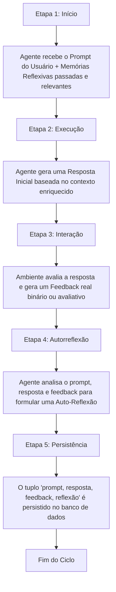

# Memória Reflexiva em Agentes LLM

## TL;DR / Resumo Executivo
A **Memória Reflexiva** é uma arquitetura de aprendizado autônomo baseada em **reforço verbal** que atua como uma memória de longo prazo para agentes baseados em LLMs. Sua principal importância é contornar a limitação de que os modelos de linguagem não aprendem de forma dinâmica com seus erros durante a execução (*on-the-fly*). Como o retreinamento completo ou ajuste fino do modelo é inviável financeiramente e tecnicamente para cada falha encontrada, a memória reflexiva permite ao agente criticar suas próprias ações passadas, gerando um catálogo de lições e correções textuais que guiam e aprimoram as tomadas de decisão futuras sem alterar os pesos internos do modelo.

## Conceitos Fundamentais

- **Memória Reflexiva:** Tipo de memória de longo prazo no qual o modelo de linguagem analisa suas próprias respostas anteriores e as avalia criticamente para aprimorar o desempenho em execuções subsequentes.
- **Reforço Verbal (Verbal Reinforcement):** Estratégia de aprendizado alternativa ao Aprendizado por Reforço (RL) tradicional. Em vez de ajustar pesos matemáticos por meio de gradientes complexos com alto volume de dados, o agente aprende por meio de feedbacks em formato de texto estruturado.
- **Meta-Raciocínio (Meta-Reasoning):** Processo em que o modelo raciocina sobre seu próprio raciocínio. O foco do agente muda de "Qual é a resposta?" para "Como devo abordar este tipo de problema na próxima vez?".
- **Abstração e Generalidade:** Capacidade de extrair lições aprendidas que vão além do contexto hiper-específico de uma tarefa concluída, gerando diretrizes generalizáveis e úteis para múltiplos domínios ou problemas futuros.
- **Conversão de Feedback:** Capacidade do agente de traduzir feedbacks puramente binários do ambiente (como sucesso/falha ou correto/incorreto) em explicações ricas sobre o porquê da falha ou do sucesso, convertendo-os em instruções acionáveis.
- **Padrões de Prompt de Reflexão:** Estruturas de engenharia de prompt desenhadas para orientar a autoavaliação. Exemplos comuns incluem:
  - *Error-Correction Reflection:* Focado em identificar o erro mais importante, o motivo de sua ocorrência e uma regra concreta para prevenção.
  - *Strategy Extraction Reflection:* Utilizado após sucessos para consolidar a estratégia mais impactante e prever cenários de reuso.
  - *Abstract Reflection:* Sintetiza as lições aprendidas em formato conciso de alta generalização.

## Matriz de Comparação

### Comparação de Abordagens para o Aprimoramento de Agentes

| Critério | Retreinamento de LLM | Aprendizado por Reforço (RL Tradicional) | Memória Reflexiva (Reforço Verbal) |
| :--- | :--- | :--- | :--- |
| **Definição** | Atualização dos pesos neurais do modelo através de novos datasets de treino. | Otimização de políticas de decisão via tentativa, erro e atribuição de recompensas numéricas. | Processo textual em que o agente analisa e salva auto-reflexões críticas sobre suas ações. |
| **Modo de Aprendizado** | Ajuste paramétrico (ajuste físico de pesos). | Ajuste paramétrico baseado em funções de recompensa. | Não paramétrico. Utiliza injeção dinâmica de contexto com memórias recuperadas. |
| **Custo / Viabilidade** | **Extremamente Alto**. Inviável para ser executado *on-the-fly*. | **Alto**. Exige grandes volumes de dados e infraestrutura computacional pesada. | **Médio/Baixo**. Custo restrito a chamadas de API de LLM adicionais e persistência de banco de dados. |
| **Pontos Positivos** | (+) Atualiza a base profunda de conhecimento do modelo. | (+) Excelente para otimizar políticas em ambientes de regras rígidas (ex: jogos). | (+) Permite aprendizado contínuo sem retreino; gera transparência e explicações amigáveis. |
| **Pontos Negativos** | (-) Demorado, custoso e impossibilita adaptação instantânea após um único erro. | (-) Demanda muitos dados e processos de ajuste fino financeiramente caros. | (-) Aumenta a latência e o consumo de tokens imediatos; herdado por problemas de gestão de memória. |

## Diagrama de Fluxo Lógico

O fluxo contínuo de processamento da memória reflexiva é composto por **5 etapas estruturadas**:

### Detalhamento do Fluxo Lógico:

1. **Entrada Contextualizada:** O agente inicia recebendo a requisição do usuário. O sistema faz uma busca semântica por similaridade na memória reflexiva e injeta no prompt as lições do passado mais relevantes para aquela categoria de problema.
2. **Geração Primária:** O agente executa a tarefa utilizando essa orientação de erros passados a fim de evitar loops de erro sistemáticos.
3. **Avaliação do Ambiente:** A resposta preliminar ou ação executada interage com o ambiente (que pode ser um compilador de código, um banco de dados, outro agente ou um usuário humano), retornando um feedback.
4. **Autoavaliação Crítica:** O modelo é estimulado por prompts especializados a analisar o cenário completo: por que falhou ou o que garantiu o sucesso. O sinal simples do ambiente é convertido em instruções compreensíveis para o próprio agente.
5. **Persistência de Dados:** Em vez de salvar a reflexão de forma isolada, o sistema armazena a estrutura contextualizada composta pelo prompt original, a resposta dada pelo agente, o feedback recebido e a reflexão final. Essa tupla completa fica disponível para consultas futuras.

***

💡 **Sugestão de próximo passo:** Gostaria de explorar os padrões práticos de prompts que ativam essa autorreflexão no agente (como o *Error-Correction* ou *Strategy Extraction*) ou discutir as questões em aberto sobre o uso de modelos menores (SLMs) para baratear esse processo?