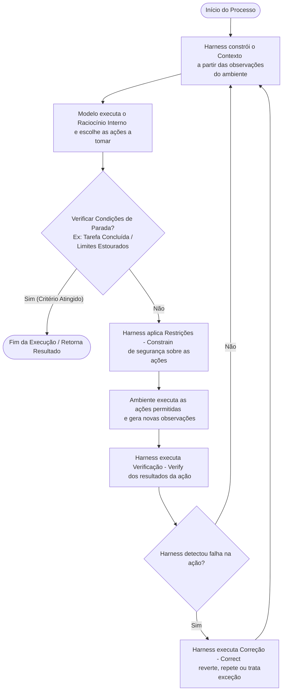

# Aula 1: De LLMs a Agentes de IA

## TL;DR / Resumo Executivo
O objetivo central desta aula é apresentar a transição do paradigma de modelos estáticos de linguagem (LLMs) para o de sistemas agênticos robustos. Destaca-se a importância crucial da **Engenharia de Controle (Harness Engineering)** para envolver os modelos em camadas estruturadas de segurança, restrição e correção, transformando meras demonstrações funcionais de tecnologia em soluções de produção confiáveis, previsíveis e seguras.

## Conceitos Fundamentais

### Diferença entre LLMs vs Agente
*   **LLM (Large Language Model):** Funciona de forma essencialmente linear e estática (entrada $\rightarrow$ inferência $\rightarrow$ saída). Ele gera a inferência por meio de um processo autorregressivo de predição do próximo token baseado na janela de contexto de forma direta em uma única passada de execução.
*   **Agente de IA:** Opera em um laço ou loop de controle ativo. Ele observa o contexto de trabalho, executa raciocínio interno para planejar ações, toma decisões dinâmicas, interage com o ambiente chamando ferramentas externas e analisa iterativamente o feedback dessas ações para continuar ou finalizar o processo de forma autônoma.

### Definição de Harness e seus componentes
O **Harness** (cabresto ou estrutura de controle) refere-se à arquitetura de runtime, governança e intermediação construída ao redor do modelo de linguagem para direcionar seu comportamento e garantir uma interação segura com o ambiente (não deve ser confundido com simplesmente tudo que está fora do modelo). É composto por cinco componentes fundamentais:
*   **Context (Contexto):** Organiza as observações do ambiente, histórico de execução, memórias e estado da tarefa para fornecer informação suficiente e necessária para embasar cada decisão do modelo.
*   **Tools (Ferramentas):** Interfaces de ação bem estruturadas que permitem ao agente interagir diretamente com o ambiente e modificar seu estado (como bancos de dados, APIs, interpretadores de código, etc.).
*   **Constrain (Restrições):** Define limites rígidos e regras de segurança para o comportamento do agente, estabelecendo o que ele pode ou não fazer no ambiente e prevenindo ações não autorizadas ou maliciosas.
*   **Verify (Verificação):** Mecanismos automatizados que analisam o resultado de cada ação tomada pelo agente para avaliar se ela funcionou conforme o esperado.
*   **Correct (Correção):** Estrutura de tratamento de falhas (análoga a exceções em programação) que atua quando o Verify aponta um erro, permitindo ao sistema recuperar, repetir ou reverter ações incorretas e retornar o sistema a um estado estável.

### Agent = Model + Harness
*   Embora a intuição original componha um agente como $Agente = LLM + Contexto + Ferramentas$, sistemas de produção utilizam a perspectiva de implementação prática: **Agent = Model + Harness**.
*   Nesse conceito, o **Model** (cérebro) fornece as capacidades cognitivas fundamentais de compreensão, raciocínio interno e planejamento. O **Harness** funciona como a camada que envolve e governa o modelo (Harness = Context + Tools + Constrain + Verify + Correct), fornecendo o ambiente de execução controlado e as barreiras de segurança necessárias para que o modelo não cause danos ao ambiente externo e opere de maneira previsível.

## Matriz de Comparação ou Tabela

### Níveis de Atualização de Capacidades
Os agentes podem aprender e se adaptar através de três escalas de tempo e mecanismos distintos:

| Nível / Mecanismo | Tempo de Execução / Escala | Prós / Vantagens | Contras / Desvantagens | Exemplo de Uso |
| :--- | :--- | :--- | :--- | :--- |
| **Adaptação Contextual (In-context learning)** | Milissegundos (Runtime/Inference) | - Adaptação instantânea - Baixo custo de atualização - Velocidade imediata | - Limitado pelo tamanho da janela de contexto - Custo cumulativo de tokens - Não persiste para a próxima sessão | Aprender um formato específico de resposta a partir de 3 exemplos (Few-shot learning). |
| **Atualização de Artefatos Externos (Externalized learning)** | Média (Runtime entre tarefas) | - Auditável, checável e revisável - Persistente entre tarefas - Seguro e confiável | - Exige que o agente os acesse ativamente via contexto ou ferramentas | Registrar procedimentos, regras ou prompts persistentes em uma base de conhecimento (RAG). |
| **Atualização de Parâmetros (Post-training / Fine-tuning)** | Semanas (Training time) | - Internalização profunda de capacidades difíceis de expressar em regras - Generalização ampla e natural | - Alto custo computacional e financeiro - Processo de atualização lento | Ajustar os pesos de um modelo aberto (ex: LLaMA via LoRA) para aprender quando chamar ferramentas nativamente. |

### Evolução da Engenharia de Sistemas Inteligentes
A engenharia ao redor de LLMs evoluiu progressivamente por cinco fases principais:

| Fase de Engenharia | Foco Principal | Definição | Quando Usar |
| :--- | :--- | :--- | :--- |
| **Prompt Engineering** | Instruções e Mensagens | Otimizar e refinar as instruções fornecidas ao modelo para direcionar o comportamento. | Para tarefas diretas de uma única chamada de inferência. |
| **Context Engineering** | Gerenciamento de Informação | Controlar o fluxo de informações que o modelo enxerga, como no uso de RAG (Geração Aumentada por Recuperação). | Para tarefas que exigem acesso a conhecimentos ou documentos externos. |
| **Harness Engineering** | Engenharia de Controle | Construção de camadas de controle, restrições de segurança (guardrails), verificação e correção ao redor do modelo. | Para garantir que a interação entre modelo e ferramentas seja segura e confiável. |
| **Loop Engineering** | Automação Autônoma | Organização e controle de execuções de loops contínuos e autônomos. | Para tarefas complexas que exigem iterações contínuas sem intervenção humana manual. |
| **Graph Engineering** | Estruturação de Fluxos | Organização de loops, programas complexos e interações multiagentes através de grafos de execução explícitos. | Para orquestrar sistemas multiagentes complexos de forma robusta e modular. |

## Boas Práticas para Construção de Sistemas de Agentes

### Princípios para construir Agentes eficazes
*   **Keep it simple (Mantenha simples):** Sempre inicie com a solução mais básica e simples (como um baseline). Só introduza complexidade e autonomia se o problema realmente exigir.
*   **Keep it transparent (Mantenha transparente):** Certifique-se de que o planejamento, os logs de execução, as decisões internas e o racional do agente sejam observáveis e auditáveis.
*   **ACI (Agent-Computer Interface) Adequada:** Desenhe as interfaces de ferramentas sob a perspectiva do que o próprio agente precisa para interagir bem com elas, e não sob a perspectiva humana clássica.
*   **Design errors out (Pokayoke):** Aplique a filosofia de eliminar erros evitáveis por construção. É mais eficiente prevenir que erros ocorram do que despender tempo e tokens depurando e corrigindo-os em runtime.

### Como escolher um modelo
*   Não se baseie apenas em classificações gerais de leaderboards; avalie o desempenho do modelo no seu caso de uso específico.
*   **Fechados vs. Abertos:** Modelos fechados possuem alta capacidade inicial, mas trazem dependência do provedor e altos custos. Modelos abertos oferecem privacidade, menor custo de inferência e capacidade de especialização local por fine-tuning, mas exigem infraestrutura.
*   **Critérios técnicos:** Considere se a tarefa exige raciocínio complexo (reasoning), baixa latência (velocidade de geração para loops longos), capacidade multimodal, ou suporte robusto a chamadas de ferramentas (tool calling).

### Escolha entre Workflow vs. Agente Autônomo
*   **Workflow (Orquestração Determinística):** Deve ser usado quando as etapas do processo são previsíveis e estruturadas. O código define o fluxo exato sequencial e o LLM opera apenas dentro de tarefas de cada nó. Garante alto controle e facilidade de harness, mas pouca flexibilidade.
*   **Agente Autônomo (Decisão em Tempo Real):** Deve ser usado para problemas complexos e abertos cujas etapas exatas não são conhecidas previamente (ex: pesquisas interativas, codificação de software). O agente planeja o caminho, lida com imprevistos e ajusta sua estratégia em tempo real. Troca eficiência, previsibilidade e custo (maior consumo de tokens) por alta capacidade de resolução de problemas flexíveis.

### Equilíbrio: Guardrails e Hard-stops
Para agentes autônomos que operam em loops livres, é fundamental configurar limites rígidos para conter erros e custos:
*   **Hard-stops (Condições de Saída):** O laço de repetição deve conter critérios explícitos de interrupção imediata, incluindo: tarefa concluída com sucesso, ausência de novas chamadas de ferramentas, estouro do limite máximo de iterações/loops, excesso de erros consecutivos de execução, e estouro de limites de tokens, tempo ou orçamento.
*   **Guardrails e Sandbox:** Isole as ações do agente (como escrita de arquivos ou execução de comandos) em sandboxes controladas de segurança e defina permissões estritas para evitar comportamentos destrutivos ou jailbreaks.

## Diagrama de Fluxo Lógico (Loop de Agente Autônomo com Harness)
Abaixo está representado o loop contínuo de controle de um agente robusto contendo as etapas do Harness e validações de parada:

