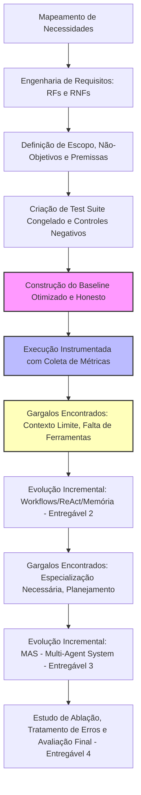

# Engenharia de Requisitos e Desenvolvimento de Baselines em Sistemas de IA

## TL;DR / Resumo Executivo
O desenvolvimento de sistemas de inteligência artificial robustos — incluindo soluções agênticas e multiagentes — exige uma transição disciplinada que se inicia com a engenharia de requisitos detalhada e a construção de um baseline honesto. Este processo inicial delimita o escopo de atuação do sistema, define métricas verificáveis e estabelece uma régua de avaliação padronizada. Sem essa linha de base metodológica, torna-se impossível quantificar se as arquiteturas agênticas e de múltiplos agentes (MAS), desenvolvidas incrementalmente nas fases posteriores, justificam o aumento de complexidade em relação aos fatores de qualidade, custo computacional e latência.

---

## Conceitos Fundamentais

### Engenharia de Requisitos
A Engenharia de Requisitos em inteligência artificial traduz as dores e necessidades abstratas de um problema em diretrizes técnicas mensuráveis de engenharia de software.

*   **Requisitos Funcionais (RFs):** Descrevem as ações, recursos semânticos ou comportamentos específicos que o sistema deve executar para resolver o problema prático.
    > *   *Exemplos práticos em Análise de Editais:*
        *   **RF-01 (Identificação de Prazos):** O sistema deve extrair as datas importantes (submissão, recursos) descritas no documento.
        *   **RF-02 (Listagem de Documentação):** O sistema deve mapear e listar todos os documentos obrigatórios exigidos.
        *   **RF-03 (Elegibilidade):** O sistema deve inferir se um proponente é elegível com base nos critérios declarados.
        *   **RF-04 (Restrição Factual):** O sistema deve formular respostas contidas estritamente no documento de entrada.
        *   **RF-05 (Abstenção em Ausência):** O sistema deve indicar explicitamente quando a informação solicitada não consta no edital.
        *   **RF-06 (Evidência Literal):** O sistema deve fornecer os trechos exatos (verbatim) copiados do documento para apoiar sua resposta.
*   **Requisitos Não-Funcionais (RNFs):** Definem os limites operacionais, especificações tecnológicas e propriedades de qualidade global da aplicação.
    > *   *Exemplos práticos:*
        *   **RNF-01 (Saída Estruturada):** A resposta deve seguir uma estrutura de dados rígida, validada programaticamente (ex: usando modelos Pydantic).
        *   **RNF-02 (Rastreabilidade):** Evitar qualquer afirmação textual que não seja acompanhada por sua respectiva evidência direta.
        *   **RNF-03 (Latência):** O tempo gasto para responder a uma requisição deve estar contido em limites aceitáveis.
        *   **RNF-04 (Controle de Custo):** Reduzir ou otimizar o uso de tokens por requisição.
        *   **RNF-05 (Reproduzibilidade):** A execução dos testes de IA deve ser reproduzível (ex: configurando temperatura zero nos prompts).
        *   **RNF-06 (Arquitetura Evolutiva):** O código deve aceitar refinamentos incrementais sem a necessidade de reconstrução completa da estrutura inicial.
*   **Como definir um bom requisito (verificável / testável):** Requisitos devem ser falseáveis e mensuráveis. Declarações genéricas impossibilitam a escrita de testes objetivos.
    > *   *Vago:* "O sistema deve ser preciso". /  *Verificável:* **RF-01:** "Em 10 editais de teste, o sistema deve extrair a data de submissão correta em pelo menos 8 execuções".
    > *   *Vago:* "O sistema não deve alucinar". /  *Verificável:* **RF-06:** "Toda afirmação gerada deve conter um trecho literal do documento original. Trechos inventados ou inexistentes no texto contam como erro".
    > *   *Vago:* "O sistema deve responder rápido". /  *Verificável:* **RNF-03:** "A latência mediana por pergunta não deve ultrapassar 10 segundos".
*   **Escopo, não-objetivos e premissas:**
    *   **Escopo (o que entra):** A abrangência exata do software no momento de sua especificação. No caso de análise de editais (V1): processar um documento em português, puramente textual, respondendo a uma pergunta por execução.
    *   **Não-objetivos (o que sai):** Delimitações conscientes do que não será desenvolvido para evitar inflar o projeto. No caso (V1): não tratar OCR de PDFs escaneados, não fazer buscas em múltiplos editais e não realizar submissões automáticas.
    *   **Premissas (o que assumimos verdadeiro):** Condições dadas como certas para viabilizar a implementação. No caso (V1): o edital completo cabe na janela de contexto nativa do LLM.
*   **Critérios de Sucesso e Avaliação:**
    *   *Correção e Completude:* A resposta atende semanticamente ao que foi pedido?
    *   *Fidelidade da Evidência:* Os trechos citados batem 100% com o documento ou foram alucinados?
    *   *Capacidade de Abstenção (Controle Negativo):* Capacidade crucial do modelo de declarar que "não sabe" ou que a informação está ausente no edital, em vez de inventar. Por exemplo, perguntar o "valor máximo de financiamento" em uma chamada que não menciona recursos financeiros. Nesses casos, o sistema deve retornar evidência vazia, confiança baixa (*low*) e relatar a ausência.
*   **Monitoramento (registro de execução):** Para permitir a comparação metodológica rigorosa (do baseline até o MAS), cada execução de teste deve persistir: modelo e versão do LLM, temperatura, data, versão do prompt, saída de dados bruta, latência registrada em segundos, total de tokens de entrada/saída, número de chamadas de API feitas e custo estimado.

---

### Baseline
O baseline é a menor e mais simples solução de software funcional para o problema delimitado.

*   **Definição e exemplos:** Serve como ponto de ancoragem científica do projeto. Se o seu sistema multiagente (MAS) altamente complexo não bater estatisticamente os números obtidos no baseline, a engenharia de agentes agregou apenas custo desnecessário à infraestrutura. Pode ser constituído por uma única requisição zero-shot direta a um LLM ou por regras heurísticas simples.
*   **Tipos de baselines:**
    1.  **Completo:** Executa a tarefa fim na sua totalidade, mas de forma simplificada (ex: responder a uma pergunta por vez sobre um edital pequeno de texto).
    2.  **Parcial:** Executa apenas uma etapa isolada, porém representativa, de um pipeline complexo que seria difícil de implementar de imediato (ex: ler 5 abstracts fixos e sintetizar, em vez de programar um fluxo que faça busca web automatizada, filtragem e síntese final em tempo real).
    3.  **Proxy / Substituto:** Utiliza um método de desenvolvimento clássico para estabelecer uma linha de comparação inicial aproximada de usabilidade (ex: usar um sistema de recomendação por filtro colaborativo clássico para servir de comparação com uma futura arquitetura baseada em agentes autônomos conversacionais).
*   **Como construir um bom baseline:** Ele deve ser desenvolvido da melhor maneira possível e com um prompt honesto. Sabotar intencionalmente o baseline ou criar prompts fracos para destacar o sistema agêntico posterior gera conclusões falsas de eficácia técnica e invalida o processo de engenharia.
*   **Como comparar baseline versus evoluções:** A comparação rigorosa exige a manutenção de uma régua única. Os mesmos testes automatizados, prompts de avaliação e métricas devem ser persistidos da primeira à última versão do projeto. Caso novos testes sejam inseridos posteriormente, o baseline precisa ser reexecutado sob as novas condições para garantir a comparabilidade de resultados ("maçãs com maçãs").

---

## Matrizes de Comparação

### 1. Métodos de Avaliação de Requisitos em Sistemas de IA

| Método de Medição | Definição / Quando Usar | Pontos Positivos | Pontos Negativos |
| :--- | :--- | :--- | :--- |
| **Verificação Determinística** | Comparação direta contra uma resposta exata pré-registrada (datas rígidas, valores específicos, listas estritas). | Custo computacional nulo, execução instantânea e 100% de objetividade matemática. | Extremamente frágil a variações de sinonímia, paráfrases e formatações de texto alternativas. |
| **Rubrica Humana** | Revisão qualitativa conduzida por especialistas humanos que avaliam as saídas geradas seguindo critérios estritos pré-definidos. | Altamente confiável para análises semânticas complexas e identificação de nuances. | Custo financeiro elevado, processo lento de execução e impossível de escalar de forma massiva. |
| **LLM como Juiz** | Uso de um LLM de alta capacidade em nuvem (ex: GPT-4, Claude) configurado como "juiz" para avaliar as respostas geradas do sistema de testes. | Processo automatizado, excelente escalabilidade e capacidade de interpretar o sentido semântico das respostas. | Exige processo prévio de calibração contra revisores humanos e pode introduzir vieses próprios do LLM avaliador. |

### 2. Tipos de Baseline no Desenvolvimento de IA

| Tipo de Baseline | Características de Construção | Exemplo de Aplicação | Recomendação de Uso | Vantagens Principais | Limitações |
| :--- | :--- | :--- | :--- | :--- | :--- |
| **Completo** | Resolve o fluxo de trabalho de ponta a ponta com o mínimo de passos possível. | Entrada de edital em texto + pergunta do usuário diretamente para uma chamada de LLM estruturada. | Quando a atividade central pode ser executada por uma arquitetura linear direta. | Garante a validação de todas as integrações iniciais e entrega valor imediato. | Não escala bem com grandes contextos ou fluxos complexos de tomada de decisão. |
| **Parcial** | Recorta uma fatia representativa do fluxo total e a isola para avaliação profunda. | Realizar sínteses qualitativas de cinco arquivos de texto previamente formatados e armazenados localmente. | Quando o projeto final abrange múltiplos canais, OCR e pesquisas externas que exigiriam muito tempo inicial. | Foca esforços técnicos no coração analítico do sistema agêntico. | Deixa de fora avaliações críticas sobre a orquestração e busca do fluxo. |
| **Proxy / Substituto** | Adota tecnologias existentes e consagradas para servir de baliza técnica inicial. | Utilizar uma ferramenta de busca semântica em banco vetorial de dados para encontrar respostas. | Quando a nova arquitetura agêntica visa substituir um software que já opera no mercado. | Estabelece um indicador competitivo realista da indústria para o projeto superar. | Não evolui de forma linear para herdar código nos entregáveis subsequentes. |

---

## Diagrama de Fluxo Lógico

O fluxo lógico de desenvolvimento do projeto inicia-se na Engenharia de Requisitos, estabiliza-se na avaliação rigorosa do Baseline e evolui incrementalmente respondendo aos gargalos mapeados em cada iteração:

