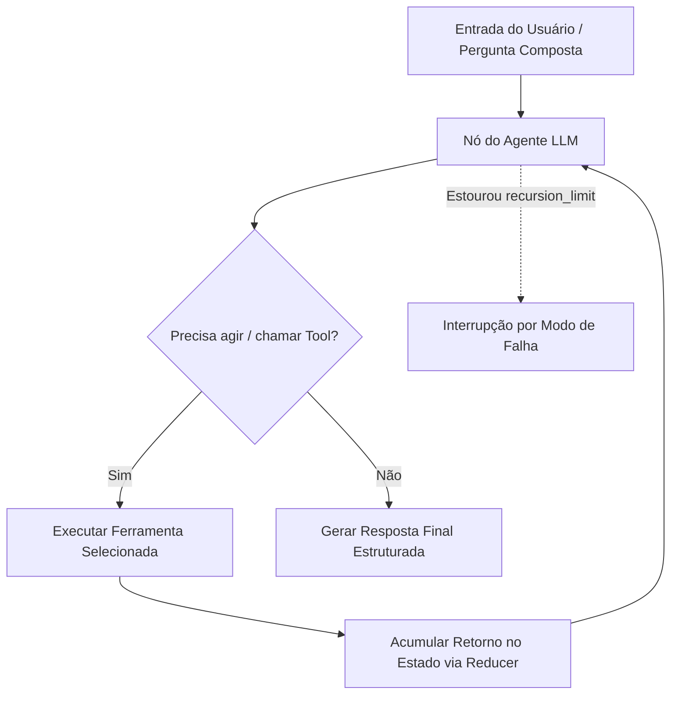

# Aula 3: Do Baseline ao Agente — Workflow, Ferramentas e ReAct com LangGraph

## TL;DR / Resumo Executivo
Esta aula aborda a transição arquitetural de uma única chamada a LLM (baseline v1) para sistemas agênticos flexíveis e workflows determinísticos em LangGraph (versão v2). O objetivo central é resolver limitações reais do baseline — como perguntas compostas, falta de ferramentas dinâmicas e opacidade de falhas intermediárias —, avançando de forma fundamentada e guiada pelo princípio da menor autonomia necessária para solucionar o problema.

---

## Conceitos Fundamentais

*   **Limitações do Baseline (v1):** Uma única chamada direta de LLM falha ao lidar com perguntas compostas que exigem decomposição, sobrecarga de instrução no prompt e incapacidade de escolher e invocar ferramentas dinâmicas sem arriscar alucinações de dados.
*   **Navalha de Ockham Agêntica:** Princípio de engenharia de software que estabelece o uso da menor autonomia e complexidade necessárias para resolver o problema. Se a ordem das etapas é fixa, utiliza-se um workflow determinístico; se exige escolhas dinâmicas de ferramentas em tempo de execução, adota-se o padrão ReAct.
*   **Anatomia de uma Ferramenta (Tool):** Implementada via funções decoradas (ex: `@tool`), cuja docstring funciona como instrução de prompt para o modelo decidir quando e como invocá-la. A ferramenta deve realizar trabalho real (extrair seções dinâmicas de dados), devendo evitar o antipadrão de respostas estáticas fixas e retornar exceções tratáveis em texto para o LLM.
*   **Padrão ReAct (Reasoning + Acting):** Loop iterativo dinâmico no formato `Observar -> Decidir -> Agir -> Observar`, no qual o modelo avalia o contexto, escolhe e executa ferramentas parametrizadas, e processa o retorno antes de sintetizar a resposta final.
*   **Estado e Reducers em LangGraph:** O estado da aplicação (ex: `TypedDict`) é compartilhado entre nós. Utiliza-se um reducer (como `add_messages`) para acumular o histórico de mensagens sem sobrescrever os passos anteriores.
*   **Condição de Parada e Limite de Recursão (`recursion_limit`):** Mecanismo de salvaguarda obrigatório para evitar loops infinitos e consumo desenfreado de cota da API. Atingir o limite configurado (ex: 10 passos) é registrado como um novo modo de falha do sistema.
*   **Modos de Falha Agênticos:** Erros inéditos decorrentes da autonomia agêntica, como ferramenta certa com argumento errado, chamada a ferramentas desnecessárias, ferramentas necessárias não invocadas, erros internos em ferramentas engolidos silenciosamente, loops truncados por limite e respostas finais que ignoram os dados retornados pelas ferramentas.
*   **Preservação da Régua Experimental:** Para atribuir ganhos puramente à evolução arquitetural, deve-se manter rigorosamente congelados o modelo, a temperatura, as entradas de teste, a saída estruturada e as funções de verificação utilizados na v1.

---

## Matriz de Comparação

| Critério / Dimensão | Workflow Determinístico | Agente ReAct (Dinâmico) |
| :--- | :--- | :--- |
| **Definição** | Fluxo de execução de etapas estático e predefinido pelo desenvolvedor (grafo acíclico ou árvore de decisão). | Loop open-ended autônomo onde o próprio LLM decide a próxima ação/ferramenta a cada passo. |
| **Exemplo de Uso** | Pipeline RAG fixo: recebimento de formulário, busca vetorial e geração de resposta. | Pesquisa profunda (*deep research*), reservas de voos ou consultas a múltiplas fontes abertas. |
| **Quando Usar** | Processos e etapas com dinâmica bem conhecida, fixa e previsível. | Tarefas abertas, variáveis ou com perguntas compostas imprevisíveis. |
| **Pontos Positivos (Prós)** | Alta previsibilidade, facilidade de teste, baixo custo de tokens e menor latência. | Alta flexibilidade e adaptabilidade para selecionar e encadear ferramentas em tempo de execução. |
| **Pontos Negativos (Contras)** | Baixa flexibilidade diante de variações de fluxo ou consultas não previstas no código. | Maior latência, consumo elevado de tokens, imprevisibilidade de caminhos e novos modos de falha em loops. |

---

## Diagrama de Fluxo Lógico

### Passo a Passo do Processo

1. **Inicialização do Estado:** A pergunta e o documento de referência são inseridos no dicionário de estado estendido do LangGraph (`State`).
2. **Avaliação pelo Agente:** O nó do LLM analisa o estado atual e as docstrings das ferramentas registadas no `bind_tools`.
3. **Roteamento Condicional:**
   * Se o modelo decidir que precisa consultar informações externas ou parciais, a aresta condicional direciona para o nó de ferramentas.
   * Se o modelo julgar ter dados suficientes, o fluxo é direcionado para a síntese e resposta final.
4. **Execução de Ferramentas (Tool Execution):** A ferramenta selecionada extrai a seção relevante do documento e insere a resposta de volta no estado através do reducer `add_messages`.
5. **Ciclo Reflexivo:** O LLM recebe a resposta da ferramenta via histórico acumulado e decide se realiza uma nova chamada de ferramenta ou encerra o ciclo.
6. **Condição de Término / Salvaguarda:** O fluxo termina ao gerar a estrutura de saída final ou ao atingir o limite máximo de recursão estipulado (`recursion_limit`), registrando o estouro de passos caso ocorra.