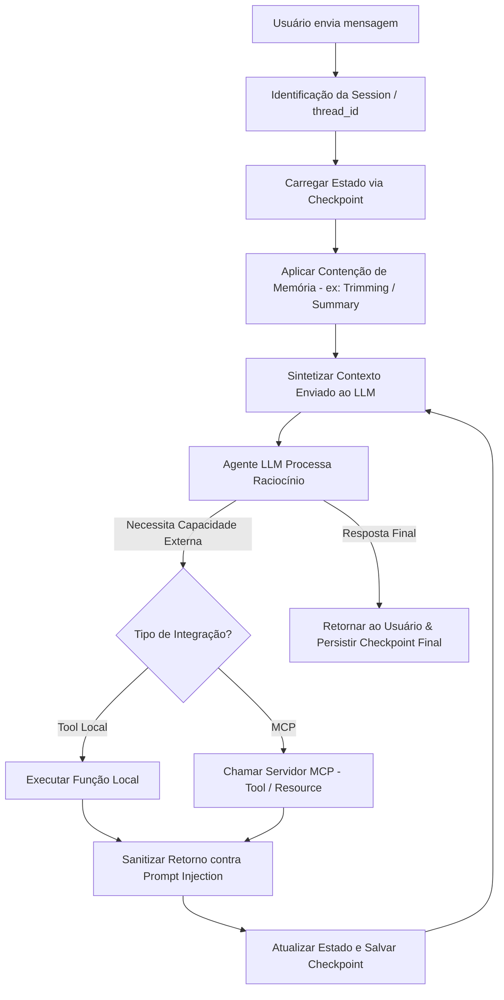

# Aula 4: Memória e MCP — Gerenciamento de Contexto, Checkpoints e Protocolo MCP

## TL;DR / Resumo Executivo
Esta aula aborda a transição de um sistema agêntico sem estado persistente para uma arquitetura com gerenciamento seletivo de memória, contenção do crescimento de contexto e padronização de integrações externas via Model Context Protocol (MCP). O objetivo central é garantir a continuidade de conversas e a recuperação precisa de informações entre múltiplos turnos sem gerar sobrecarga de custos ou degradação da acurácia de inferência, além de expor capacidades externas sob contratos claros e seguros de engenharia.

---

## Conceitos Fundamentais

*   **Histórico vs. Estado vs. Contexto vs. Memória:**
    *   *Histórico:* O registro bruto de todas as mensagens e eventos ocorridos na execução.
    *   *Estado:* O conjunto completo de dados e variáveis mantido e trafegado entre os nós do grafo no LangGraph.
    *   *Contexto:* O subconjunto de informações (instruções do sistema, mensagem do usuário, retornos de ferramentas e memória seletiva) efetivamente enviado ao LLM durante uma chamada.
    *   *Memória:* As informações seletivamente preservadas entre execuções para fundamentar tomadas de decisão futuras.
*   **Checkpoints (`thread_id` e `MemorySaver`):** Mecanismos no LangGraph que persistem o estado do sistema nó a nó, permitindo retomada de conversas, depuração, isolamento de sessões multiusuário e controle com humano no loop (*human-in-the-loop*).
*   **Estratégias de Contenção de Contexto:** Métodos para conter o crescimento descontrolado da janela de contexto e prevenir aumento de custos e perda de acurácia:
    *   *Recorte (Trimming):* Mantém apenas as \\(N\\) mensagens mais recentes enviadas ao modelo, preservando todo o histórico no estado do grafo.
    *   *Resumo (Summarization):* Condensa mensagens antigas em uma síntese textual por meio de uma chamada dedicada ao LLM.
    *   *Recuperação (RAG / Memória Persistida):* Armazena memórias externamente (ex: banco vetorial) e recupera passagens relevantes sob demanda via ferramentas.
*   **Model Context Protocol (MCP):** Protocolo padronizado que adota a arquitetura cliente/servidor para expor contexto e capacidades de recursos externos a aplicações baseadas em LLMs, desacoplando quem usa a capacidade de quem a implementa.
*   **Primitivas do MCP:**
    *   *Tools:* Ações operacionais executáveis pelo modelo (ex: `buscar_edital(id)`).
    *   *Resources:* Dados e arquivos endereçáveis para leitura via URI (ex: `edital://2026/inovacao`).
    *   *Prompts:* Modelos e templates de interação reutilizáveis (ex: "checklist de submissão").
*   **Injeção de Prompt em Ferramentas e Documentos:** Vulnerabilidade na qual dados retornados por ferramentas locais, servidores MCP de terceiros ou documentos (ex: PDFs com textos ocultos em branco) contêm instruções maliciosas que sobrescrevem o comportamento do sistema. A saída de qualquer ferramenta deve ser tratada como entrada não confiável.

---

## Matriz de Comparação

### Tabela 1: Estratégias de Gerenciamento de Memória e Contenção de Contexto

| Estratégia | Funcionamento | Ponto Forte (Prós) | Ponto Fraco (Contras) | Quando Usar |
| :--- | :--- | :--- | :--- | :--- |
| **Recorte (Trimming)** | Mantém apenas as \\(N\\) mensagens ou tokens mais recentes no contexto enviado ao LLM. | Baixíssimo custo e implementação simples sem chamadas adicionais de API. | Perde totalmente o contexto e fatos antigos que ficaram fora da janela. | Diálogos focados nas trocas imediatas e de curto prazo. |
| **Resumo (Summarize)** | Condensa o histórico antigo em uma síntese textual por meio de chamada extra ao LLM. | Mantém a essência do histórico antigo ocupando um número reduzido de tokens. | Adiciona latência e custos financeiros por exigir chamadas de inferência extras. | Conversas longas onde diretrizes antigas precisam permanecer vivas. |
| **Recuperação (RAG / Persistência)** | Persiste memórias externamente em banco vetorial e realiza busca semântica via tools. | Escala para volumes massivos de dados sem inflar a janela de contexto. | Exige infraestrutura de busca e lógica adicional de indexação/recuperação. | Histórico episódico denso e consultas a fatos distribuídos em sessões passadas. |

### Tabela 2: Tool Local vs. Servidor MCP

| Critério / Dimensão | Tool Local | Servidor MCP |
| :--- | :--- | :--- |
| **Definição** | Função Python integrada e acoplada diretamente ao código da aplicação. | Interface cliente/servidor padronizada para expor ferramentas, recursos e prompts. |
| **Acoplamento** | Alto acoplamento com o código do agente. | Baixo acoplamento com separação clara de responsabilidades. |
| **Reutilização** | Restrita ao contexto do próprio script ou projeto local. | Reutilizável por múltiplos agentes, aplicações ou sistemas externos. |
| **Complexidade** | Simples, rápida e ideal para protótipos e baselines. | Exige infraestrutura cliente/servidor e especificação formal de contrato. |
| **Quando Usar** | Integrações específicas de protótipos sem perspectiva de reuso. | Arquiteturas escaláveis, ecossistemas multiagentes e recursos compartilhados. |

---

## Diagrama de Fluxo Lógico

### Passo a Passo do Processo

1. **Isolamento de Sessão:** A requisição é associada a um `thread_id` exclusivo para garantir a separação entre conversas e evitar vazamento de dados.
2. **Carregamento de Checkpoint:** O checkpointer resgata o estado e o histórico de mensagens gravados na execução anterior.
3. **Contenção de Contexto:** Aplica-se a estratégia de contenção (ex: recorte/trimming) para filtrar mensagens antigas e otimizar o uso de tokens antes da chamada do modelo.
4. **Invocação do LLM:** O agente recebe o contexto montado e avalia a próxima ação necessária.
5. **Execução de Capacidade Externa:** Se necessário, o agente aciona uma ferramenta local ou requisita uma primitiva (*Tool* ou *Resource*) ao Servidor MCP.
6. **Validação de Segurança:** O retorno da ferramenta é sanitizado para impedir injeções de prompt antes de ser incorporado ao contexto.
7. **Atualização do Estado:** O resultado é gravado em um novo checkpoint e a resposta final é entregue ao usuário.