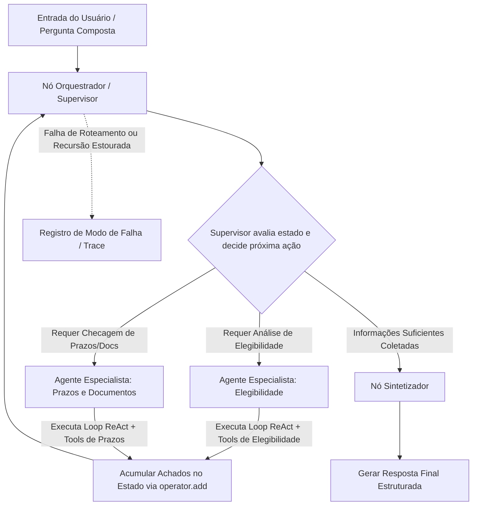

# Aula 5: Sistemas Multiagentes — Especialização, Padrões de Organização e Arquiteturas MAS

## TL;DR / Resumo Executivo
Esta aula aborda a transição arquitetural de um sistema agêntico único ou workflow para uma arquitetura de Sistemas Multiagentes (MAS / v3). O objetivo principal é decompor problemas complexos dividindo atribuições entre agentes especializados que possuem escopos bem delimitados, instruções dedicadas e conjuntos próprios de ferramentas. A adoção do paradigma multiagente deve ocorrer estritamente via engenharia *bottom-up*, justificando o aumento na latência, consumo de tokens e complexidade de depuração através de ganhos mensuráveis na resolução de tarefas compostas sobre uma régua de testes congelada.

---

## Conceitos Fundamentais

*   **Agente Especializado:** Entidade autônoma do sistema que não se reduz a um prompt longo ou função simples. Possui obrigatoriamente quatro pilares: (1) escopo declarado com fronteira explícita de contexto; (2) conjunto próprio e exclusivo de ferramentas; (3) instrução dedicada sem concorrência de diretrizes; e (4) critério de sucesso avaliável isoladamente.
*   **Sinais para Divisão de Responsabilidades:** Ocorre quando instruções de múltiplos domínios se atrapalham no mesmo prompt, ferramentas de um domínio são chamadas erroneamente em outro, etapas podem rodar em paralelo, ou subtarefas exigem modelos de linguagem com custos, capacidades e latências distintas.
*   **Sinais contra a Divisão:** A divisão deve ser evitada quando apenas renomeia etapas de um fluxo já determinístico, quando os agentes precisam trocar quase todo o contexto entre si, quando a responsabilidade cabe em poucas linhas de instrução, ou quando nenhum caso de teste diferencia a versão multiagente do baseline.
*   **O Custo da Especialização:** Cada agente adicionado incrementa chamadas ao LLM (aumentando custo financeiro e latência), insere pontos de passagem de contexto passíveis de perda informacional, adiciona novos pontos de decisão sujeitos a falhas de raciocínio e amplia a superfície de manutenção e depuração do código.
*   **Isolamento de Contexto e "Telefone Sem Fio":** Prática de enviar a cada agente especialista apenas a fatia de dados estritamente necessária para a execução de sua tarefa, reduzindo ruídos e custos de tokens. A passagem de dados entre agentes deve priorizar estruturas de dados formatadas/estruturadas em vez de texto livre para evitar a degradação e alucinação de informações ao longo do fluxo.
*   **Estado Compartilhado e Reducers em LangGraph:** Estrutura de dados centralizada (ex: `TypedDict`) onde o operador `operator.add` acumula os achados produzidos por cada especialista e o campo de controle sinaliza a próxima ação ou agente a ser acionado.
*   **Instrumentação e Rastreabilidade por Agente:** Necessidade de registrar, em cada execução, a rota exata percorrida, a ordem de acionamento dos agentes, a latência individual, o número de chamadas ao LLM/ferramentas e as decisões tomadas pela orquestração.
*   **Novos Modos de Falha Multiagentes:** Falhas específicas de arquiteturas MAS, como encaminhamento do orquestrador para o especialista errado, atuação de especialistas fora de seu escopo, perda de dados corretos na etapa de síntese e laços de transferência sem convergência que esgotam os limites de execução.

---

## Matriz de Comparação

| Padrão de Organização | Definição / Mecânica | Exemplo de Uso | Quando Usar | Pontos Positivos (Prós) | Pontos Negativos (Contras) |
| :--- | :--- | :--- | :--- | :--- | :--- |
| **Supervisor** | Um agente centralizador ("orquestrador") avalia a entrada, delega tarefas para agentes especialistas, recebe os achados e decide a próxima ação ou síntese. | Analisador de editais que delega a checagem de elegibilidade e prazos a especialistas antes de sintetizar. | Quando a ordem das etapas é dinâmica ou depende das respostas parciais obtidas durante a execução. | Alta flexibilidade de roteamento, centralização do controle do fluxo e facilidade de encerramento. | Ponto único de falha no orquestrador e chamadas extras de LLM para coordenação. |
| **Pipeline** | Fluxo sequencial rígido em que a saída de um agente especializado serve diretamente como entrada para o próximo. | Processamento em cadeia: extração de texto $\rightarrow$ tradução $\rightarrow$ análise de sentimento $\rightarrow$ relatório. | Quando a dependência entre as tarefas é estritamente linear, previsível e conhecida a priori. | Alta previsibilidade, facilidade de implementação, menor latência e ausência de loops infinitos. | Rigidez estrutural; incapacidade de pular ou reordenar etapas dinamicamente conforme a necessidade. |
| **Transferência (Handoffs / Peer-to-Peer)** | Os agentes decidem autonomamente, ao final de sua execução, para qual outro agente devem transferir o controle. | Atendimento ao cliente onde o agente de triagem transfere diretamente para vendas, suporte ou financeiro. | Quando a complexidade do domínio exige flexibilidade total e não existe uma figura central de orquestração. | Máxima autonomia, desacoplamento do orquestrador e capacidade de adaptação a fluxos altamente imprevisíveis. | Alto risco de loops infinitos, dificuldade de controle de custos/recursão e rastreabilidade complexa. |

---

## Diagrama de Fluxo Lógico

### Passo a Passo do Processo

1. **Recepção da Pergunta Composta:** O sistema recebe a consulta inicial do usuário e a insere no estado compartilhado do LangGraph (`Estado`).
2. **Avaliação pelo Supervisor:** O agente supervisor analisa a pergunta, verifica os achados já acumulados no estado e decide qual especialista acionar a seguir.
3. **Execução do Especialista Selecionado:** O agente especialista acionado recebe o prompt dedicado e seu conjunto exclusivo de ferramentas, executando um loop ReAct local focado estritamente no seu escopo.
4. **Acumulação de Achados no Estado:** As evidências e resultados extraídos pelo especialista são adicionados ao campo `achados` da estrutura de estado via `operator.add`, preservando o histórico sem sobrescrever dados anteriores.
5. **Retorno ao Orquestrador:** O controle retorna ao supervisor, que reavalia se a consulta foi totalmente respondida ou se outro especialista precisa ser acionado.
6. **Síntese Final:** Ao constatar que há informações suficientes no estado, o supervisor direciona o fluxo para o nó sintetizador, que consolida os achados e gera a saída final no formato estruturado padronizado.

---