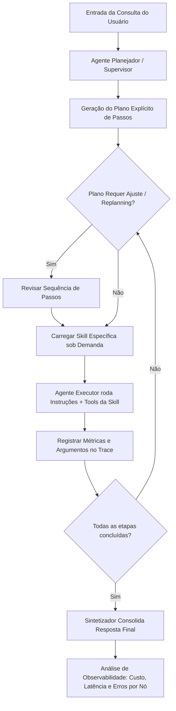

# Aula 6: Skills, Planejamento Explícito e Trace (Observabilidade)

## TL;DR / Resumo Executivo
Esta aula apresenta estratégias para otimizar a eficiência, a estrutura e a confiabilidade de sistemas agênticos complexos por meio do carregamento dinâmico de habilidades (*skills*), do planejamento explícito de etapas e da rastreabilidade total da execução (*trace*). O objetivo central é combater o crescimento desmedido de prompts e a opacidade na tomada de decisões, permitindo modularizar instruções e ferramentas sob demanda, estruturar sequências de ações inspecionáveis e depurar falhas ou gargalos de custo e latência de forma granular e quantitativa.

---

## Conceitos Fundamentais

*   **Skills (Habilidades sob Demanda):** Capacidades nomeadas compostas por três elementos: (1) uma instrução detalhada de execução de tarefa; (2) um conjunto específico de ferramentas; e (3) um critério claro de sucesso. São carregadas dinamicamente via índice e resumo enxuto para economizar janela de contexto, reduzir latência e aumentar a acurácia do modelo.
*   **Diferença entre Ferramenta, Skill e Agente:**
    *   *Ferramenta (Tool):* Função executável individual que aciona dados ou efeitos colaterais fora do modelo.
    *   *Skill:* Pacote dinâmico contendo instruções específicas, ferramentas associadas e critérios de validação para uma tarefa demarcada.
    *   *Agente:* Entidade autônoma com raciocínio e tomada de decisão para determinar iterativamente os próximos passos do fluxo.
*   **Plano Implícito (ReAct) vs. Plano Explícito:** No plano implícito, a próxima ação emerge dinamicamente da observação imediatamente anterior. No plano explícito, o sistema gera previamente um artefato estruturado com a sequência ordenada de passos antes de iniciar a execução, permitindo que a sequência seja lida, avaliada e corrigida.
*   **Replanejamento (*Replanning*):** Ajuste dinâmico da sequência de ações quando os resultados intermediários observados no ambiente se desviam do plano inicial. Deve ser acionado sob demanda para evitar o custo excessivo de reescrever planos a cada passo simples.
*   **Trace (Rastreabilidade de Execução):** O registro ordenado e granular de todas as ações executadas pelo sistema (agentes acionados, ordem de execução, entradas/saídas, ferramentas chamadas com argumentos, custos e latência por nó).
*   **As Três Perguntas Essenciais do Trace:** Para caracterizar observabilidade real e não apenas um registro de logs brutos, o *trace* deve responder: (1) Por que o sistema tomou esse caminho? (2) Onde a informação correta se perdeu? (3) Qual etapa dominou o custo e a latência?.
*   **Procedimento Sistemático de Depuração:** Método em quatro etapas para diagnosticar falhas no sistema: (1) confirmar se a informação existia na fonte; (2) verificar se a ferramenta a retornou; (3) verificar se o especialista a incluiu nos achados; e (4) verificar se o sintetizador a preservou na resposta final.
*   **Avaliação Fim a Fim (*End-to-End*) vs. Avaliação por Parte:** A avaliação *end-to-end* mede o desempenho do sistema completo na régua congelada, enquanto a avaliação interna/por parte valida subsistemas isolados (ex: acerto do supervisor, escopo do especialista, preservação na síntese).

---

## Matriz de Comparação

### Tabela 1: Abordagens de Planejamento (Implícito vs. Explícito)

| Critério / Dimensão | Plano Implícito (ReAct) | Plano Explícito |
| :--- | :--- | :--- |
| **Definição** | O próximo passo emerge dinamicamente da observação anterior do modelo. | O sistema escreve uma sequência estruturada de passos antes de executar qualquer ação. |
| **Exemplo de Uso** | Consultas simples e iterativas sem ordem rígida de dependência. | Decomposição de requisições complexas com checagens independentes em paralelo. |
| **Quando Usar** | Tarefas curtas e diretas, onde criar um plano custa mais caro que a própria execução. | Tarefas com múltiplas partes, onde errar a ordem custa caro ou exige aprovação humana (*Human-in-the-loop*). |
| **Pontos Positivos (Prós)** | Baixa latência inicial, menor consumo de tokens em tarefas simples e alta flexibilidade. | Sequência vira artefato inspecionável, corrigível via *replanning* e comparável. |
| **Pontos Negativos (Contras)** | Dificuldade para lidar com dependências rígidas e risco de loops ineficientes. | Custo e latência adicionais para gerar e gerenciar o plano em tarefas simples. |

### Tabela 2: Abstrações do Sistema (Ferramenta vs. Skill vs. Agente)

| Abstração | Definição | Componentes Principais | Quando Usar | Pontos Positivos (Prós) | Pontos Negativos (Contras) |
| :--- | :--- | :--- | :--- | :--- | :--- |
| **Ferramenta (Tool)** | Ação executável individual que acessa dados ou gera efeitos externos. | Código executável, parâmetros e docstring. | Execução de chamadas diretas de API ou banco de dados. | Alta precisão determinística e baixo overhead. | Sem instrução contextualizada ou raciocínio próprio. |
| **Skill** | Pacote dinâmico de instrução contextualizada e ferramentas para uma tarefa. | Nome/Índice, instrução enxuta, pool de ferramentas e critério de sucesso. | Quando o agente executa tarefas distintas sem precisar criar múltiplos subagentes. | Economia expressiva de contexto, redução de tokens e latência. | Exige um bom índice e descritor para evitar seleção errada. |
| **Agente** | Entidade autônoma com raciocínio e autonomia de decisão. | Escopo, ferramentas exclusivas, instrução dedicada e avaliação própria. | Divisão de grandes domínios funcionais e responsabilidades do sistema. | Autonomia de raciocínio, especialização e isolamento. | Alto custo de latência, consumo de tokens e complexidade. |

---

## Diagrama de Fluxo Lógico

### Passo a Passo do Processo

1. **Geração do Plano Explícito:** O Agente Planejador analisa a requisição composta e constrói uma sequência estruturada de passos antes de acionar qualquer ferramenta.
2. **Avaliação e Seleção de Skill:** Para cada passo do plano, o Agente Executor lê o índice/resumo enxuto e carrega sob demanda a *skill* adequada (instrução completa + ferramentas específicas).
3. **Execução e Gravação do Trace:** A *skill* é executada e cada evento (ferramentas acionadas, argumentos passados, tempo de execução e contagem de tokens) é registrado nó a nó no *trace*.
4. **Verificação e Replanejamento (*Replanning*):** Caso os dados intermediários obtidos divirjam do esperado, a malha de *replanning* reescreve os passos restantes do plano.
5. **Consolidação na Síntese:** O Agente Sintetizador reúne todas as evidências coletadas e gera a resposta final fundamentada.
6. **Depuração e Atribuição via Observabilidade:** O desenvolvedor utiliza o *trace* completo para responder às três perguntas essenciais, identificar o nó que dominou custo/latência e verificar a preservação da informação.

---