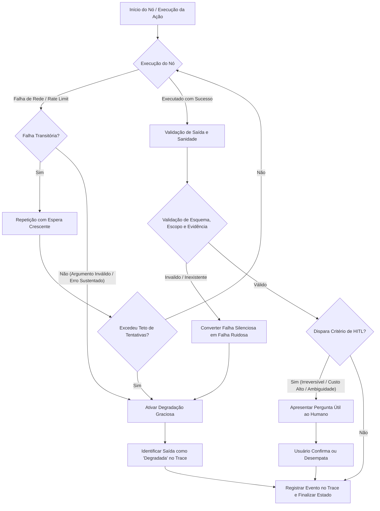

# Aula 7: Robustez e Confiabilidade — Tratamento de Erros, Contenção, Variabilidade e Humano no Laço

## TL;DR / Resumo Executivo
Esta aula aborda os fundamentos de engenharia essenciais para transformar sistemas agênticos experimentais em soluções de alta confiabilidade, robustez e resiliência operacional. O objetivo central é mapear as falhas em quatro camadas estruturais (infraestrutura, ferramentas, modelo e arquitetura), converter falhas silenciosas em falhas ruidosas auditáveis, aplicar padrões rigorosos de contenção (repetição com espera crescente, tempos limite e degradação graciosa), medir o não-determinismo experimental via testes repetidos e integrar o humano no laço (*Human-in-the-Loop*) de forma estratégica, acionando-o apenas sob critérios explícitos de risco e ambiguidade.

---

## Conceitos Fundamentais

*   **As Quatro Camadas de Falha:**
    *   **Infraestrutura:** Erros de rede, estouros de tempo limite (*timeout*), cota/limite de taxa (*rate limit*) de requisições e indisponibilidade temporária do provedor de LLM.
    *   **Ferramenta:** Argumentos inválidos gerados pelo modelo, recursos ou endpoints ausentes, exceções de código e exceções internas não tratadas.
    *   **Modelo (LLM):** Resposta com formato de saída quebrado (violação de JSON/Pydantic), alucinação de dados/evidências e descumprimento deliberado de instruções.
    *   **Arquitetura:** Erros de roteamento no grafo, laços infinitos sem convergência (ex: no loop ReAct) e perda de achados cruciais durante a fase de síntese.
*   **Falha Ruidosa vs. Falha Silenciosa:**
    *   *Falha Ruidosa:* O sistema interrompe a execução lançando uma exceção tratável ou emitindo uma mensagem de erro explícita.
    *   *Falha Silenciosa:* O sistema responde normalmente gerando uma saída, porém com conteúdo incorreto, incompleto ou inventado (ex: o modelo usa o texto da página de erro 404 como conteúdo factual, especialista atua fora do escopo ou cita evidências inexistentes). É a categoria mais perigosa por propagar erros em cascata sem disparar alarmes.
    *   *Regra de Ouro da Confiabilidade:* A engenharia de confiabilidade consiste em transformar falhas silenciosas em falhas ruidosas através de validações e tratá-las de forma programática.
*   **Falha Transitória vs. Falha Sustentada:**
    *   *Transitória:* Falhas momentâneas como picos de latência na rede ou estouro de *rate limit*. Podem ser resolvidas tentando a execução novamente.
    *   *Sustentada:* Erros permanentes de sintaxe, argumentos inválidos passados a ferramentas ou chamadas a recursos inexistentes. Não são resolvidas com simples repetição e exigem reintervenção ou tratamento de exceção.
*   **Estratégias de Contenção de Erros:**
    *   *Repetição com Espera Crescente (Backoff Exponencial):* Repetir requisições que sofreram falhas transitórias, inserindo intervalos de tempo progressivamente maiores entre as tentativas, respeitando obrigatoriamente um teto máximo de repetições.
    *   *Tempo Limite (Timeout) e Limite de Passos:* Restrições de tempo e iterações definidas por operação ou por ferramenta (nunca globalmente para o sistema todo) para impedir que o grafo fique travado indefinidamente.
    *   *Degradação Graciosa (Graceful Degradation):* Caso um componente ou ferramenta falhe, o sistema entrega uma resposta parcial ou simplificada (ex: consulta baseada no contexto local ou conhecimento prévio do modelo) em vez de falhar totalmente, rotulando explicitamente a saída como "degradada" no *trace*.
*   **Validação de Saída e Sanidade:**
    *   *Validação de Esquema:* Garante que a saída do modelo adere estritamente à estrutura definida (ex: Pydantic / JSON Schema).
    *   *Verificação de Evidência:* Confronta as citações e trechos reportados pelo agente contra o documento fonte original para detectar alucinações.
    *   *Verificação de Escopo:* Checa se o agente especializado manteve sua atuação restrita ao seu domínio de atribuição.
*   **Variabilidade Experimental e Não-Determinismo:**
    *   Mesmo com `temperature = 0`, a inferência em nuvem distribuída (diferenças de hardware, sistemas operacionais e otimizações de GPU/TPU) impede que as saídas sejam rigorosamente idênticas entre execuções distintas.
    *   Exige executar a suíte de testes congelada no mínimo 3 vezes, calculando e relatando a faixa/intervalo de variação dos resultados e analisando com atenção os "casos de teste instáveis" (que alternam entre acerto e erro).
    *   Deve-se reportar a contagem absoluta de acertos (ex: "7 de 8") em vez de apenas a porcentagem (ex: "87,5%"), pois porcentagens mascaram a escala de conjuntos pequenos.
*   **Humano no Laço (*Human-in-the-Loop* - HITL):**
    *   Pausar a execução automatizada e solicitar intervenção/confirmação humana sob 5 critérios principais: (1) Ação irreversível; (2) Custo de erro alto e assimétrico; (3) Baixa confiança do modelo; (4) Discordância entre verificações/agentes; (5) Entrada ambígua cuja escolha altera drasticamente o resultado.
    *   *Princípio da Pergunta Útil:* A consulta ao humano deve ser direcionada, explicitando o que o sistema já sabe, nomeando a dúvida com clareza e oferecendo opções objetivas de escolha. Perguntas abertas ou genéricas que transferem todo o trabalho de volta ao usuário são ineficientes e ruins.

---

## Matriz de Comparação

### Tabela 1: As Quatro Camadas de Falha em Sistemas Agênticos

| Camada de Falha | Descrição / Causa Raiz | Exemplos Práticos | Estratégia de Proteção / Remédio |
| :--- | :--- | :--- | :--- |
| **Infraestrutura** | Problemas de conectividade, indisponibilidade externa e restrições de API. | Queda de rede, *timeout* de socket, estouro de cota/rate limit, API do provedor fora do ar. | Repetição com espera crescente (*backoff*), fallback para provedores secundários e registro no *trace*. |
| **Ferramenta** | Erros de execução no código local ou chamadas com parâmetros errados. | Argumento inválido gerado pelo LLM, método local ausente, exceção não tratada na *tool*. | Captura de exceção (`try/except`), validação de parâmetros e conversão de erro em mensagem clara para o LLM. |
| **Modelo (LLM)** | Erros de geração cognitiva e não conformidade com instruções. | Formato JSON quebrado, alucinação de dados/citações, instrução do prompt ignorada. | Validação de esquema (Pydantic), verificação de evidências contra a fonte e re-prompting estruturado. |
| **Arquitetura** | Falhas na orquestração e fluxo de dados do grafo agêntico. | Roteamento condicional incorreto, loop infinito no ReAct, perda de achados na síntese. | Definição de `recursion_limit` de iterações, revisão de prompts de roteamento e contratos de estado bem definidos. |

---

### Tabela 2: Estratégias de Contenção de Erros (Resiliência)

| Estratégia | Funcionamento | Quando Usar | Pontos Positivos (Prós) | Pontos Negativos / Cuidados |
| :--- | :--- | :--- | :--- | :--- |
| **Repetição com Espera Crescente** | Tenta reexecutar a chamada aumentando o tempo de espera entre cada tentativa. | Exclusivamente em falhas transitórias (instabilidade de rede ou *rate limit*). | Recupera a execução automaticamente sem falhar o fluxo. | Não resolve erros sustentados (argumento inválido); se sem teto, gera sobrecarga e custos. |
| **Tempo Limite (*Timeout*)** | Define um tempo máximo de tolerância para a conclusão de uma operação/ferramenta. | Em todas as chamadas a ferramentas externas, APIs ou tarefas computacionalmente densas. | Impede que uma chamada pendurada trave a execução do grafo inteiro. | Requer definir limites realistas por operação para não cortar execuções legítimas. |
| **Degradação Graciosa** | Substitui a chamada com falha por uma alternativa simplificada ou dados em contexto local. | Quando uma ferramenta/especialista falha, mas é preferível entregar uma resposta parcial do que falhar. | Mantém a disponibilidade da aplicação e entrega valor ao usuário. | A resposta é menos precisa; exige sinalizar explicitamente o rótulo "degradada" no *trace*. |

---

### Tabela 3: Critérios para Ativação do Humano no Laço (*Human-in-the-Loop*)

| Critério HITL | Definição / Mecânica | Exemplo (Assistente de Editais) | Como Executar Corretamente |
| :--- | :--- | :--- | :--- |
| **Ação Irreversível** | Ações com efeitos colaterais permanentes no ambiente. | Escrita permanente, deleção de arquivos ou submissão final. | Solicitar confirmação explícita mostrando a ação exata e o impacto antes de executar. |
| **Custo Assimétrico do Erro** | O custo de cometer um erro é desproporcionalmente maior que o custo de pedir confirmação. | Informar prazo ou data de submissão incorreta na véspera do fechamento do edital. | Apresentar os dados extraídos e pedir para o usuário validar os valores críticos. |
| **Confiança Baixa** | O modelo gera uma resposta com baixo nível de certeza ou nota campos ausentes. | O valor de financiamento não consta no documento do edital. | Indicar a ausência do dado no documento e perguntar se o usuário deseja fornecer a informação. |
| **Discordância nas Verificações** | Verificadores ou agentes especialistas produzem resultados conflitantes. | A resposta textual está correta, mas a evidência citada não consta no documento. | Exibir o conflito encontrado e solicitar que o humano decida o valor de desempate. |
| **Entrada Ambígua** | A consulta possui múltiplos significados e cada interpretação altera o resultado. | Pergunta: "Qual é o prazo?" (Refere-se ao prazo de submissão ou ao resultado?). | Formular pergunta útil nomeando a dúvida e oferecendo as alternativas conhecidas para escolha. |

---

## Diagrama de Fluxo Lógico

### Passo a Passo do Processo

1. **Tentativa de Execução:** O nó agêntico executa uma tarefa, chamada de ferramenta ou inferência de LLM.
2. **Tratamento de Falhas Transitórias:** Caso ocorra um erro de infraestrutura ou limite de taxa, o sistema ativa a *repetição com espera crescente* até atingir o teto de repetições configurado.
3. **Conversão de Falhas Silenciosas em Ruidosas:** A resposta gerada passa por camadas de *validação de esquema*, *verificação de escopo* do especialista e *checagem de evidências* contra o documento fonte. Se a validação falhar, o erro silencioso é capturado e transformado em exceção ruidosa.
4. **Aplicação de Degradação Graciosa:** Se a recuperação completa falhar ou for interrompida, o sistema recupera o controle via tratamento de exceção, gera um resultado simplificado/parcial e grava o rótulo de "resposta degradada" no *trace*.
5. **Avaliação dos Critérios de HITL:** Antes de consolidar a saída, o sistema checa se a ação se enquadra em algum dos 5 critérios de intervenção humana (irreversibilidade, custo assimétrico, baixa confiança, discordância ou ambiguidade).
6. **Formulação de Pergunta Útil:** Se o HITL for ativado, o sistema constrói uma pergunta objetiva (mostrando o que já sabe, indicando a dúvida precisa e oferecendo as opções) para o usuário tomar a decisão.
7. **Rastreabilidade e Log do Trace:** Todas as tentativas, repetições, tempos limite, status de degradação e intervenções humanas são gravados no *trace* para auditoria quantitativa de resiliência e confiabilidade.