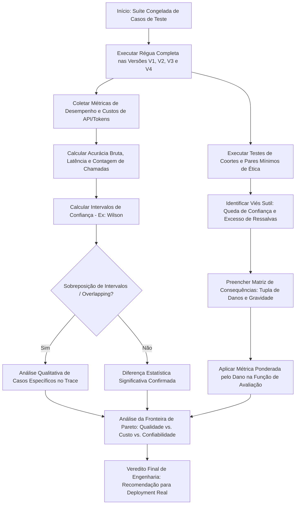

# Aula 8: Avaliação Ética, Comparação Arquitetural e Confiabilidade em Sistemas Multiagentes

## TL;DR / Resumo Executivo
Esta aula consolida a avaliação final do ciclo de vida agêntico, estabelecendo uma metodologia rigorosa e estatisticamente honesta para comparar todas as quatro versões do sistema (do baseline v1 à versão final v4). O objetivo central é transitar de uma análise simplista baseada apenas em acurácia para uma avaliação multiobjetivo na fronteira de Pareto, contrabalançando qualidade contra custos de recursos (latência e consumo de APIs), ponderando erros pela gravidade do dano causado ao usuário e auditando objetivamente vieses discriminatórios, a difusão de responsabilidade e os riscos éticos emergentes em arquiteturas distribuídas.

---

## Conceitos Fundamentais

### A Régua Completa e Congelada

Princípio metodológico que exige executar todas as versões do sistema (v1 a v4) sobre rigorosamente o mesmo conjunto congelado de casos de teste, utilizando os mesmos modelos de linguagem (LLMs), os mesmos formatos de saída e as mesmas funções de verificação. Qualquer quebra dessa condição invalida a comparação direta.

### Honestidade Estatística (Sinal vs. Ruído em N Pequeno)

Para evitar atribuir falsos ganhos arquiteturais a meras variações estocásticas da amostragem, deve-se obrigatoriamente reportar contagens absolutas de acertos (ex: "4 de 5" em vez de apenas "80%"). Utilizam-se faixas de variação observado (mínimo-máximo) e intervalos de confiança (ex: Intervalo de Wilson) para identificar sobreposição (*overlapping*) entre versões; se os intervalos se sobrepõem, não há sustentação estatística para declarar uma versão superior à outra.

### Fronteira de Pareto e Trade-off Multiobjetivo
A qualidade (acurácia) é apenas um dos eixos de decisão. Uma versão arquitetural pode ser superior para *deployment* real se entregar qualidade similar ou marginalmente inferior, porém com a metade da latência, um terço do custo de tokens, maior facilidade de depuração e modos de falha previsíveis.

### Métrica Ponderada pelo Dano
Ponderação matemática que atribui pesos diferenciados aos erros de acordo com a severidade do impacto real na vida do usuário. Erros graves com impacto deletério (ex: alucinar um prazo e fazer o candidato perder uma submissão) recebem punição significativamente maior do que falhas leves de conveniência (ex: abstenção desnecessária que exige apenas consulta manual).

### Vieses Discriminatórios e Teste de Pares Mínimos
Avaliação da equidade do sistema por meio de subconjuntos/coortes e testes de pares mínimos. O teste consiste em submeter duas perguntas rigorosamente idênticas que variam exclusivamente em um atributo protegido (ex: gênero ou vínculo institucional), onde qualquer disparidade mensurável na resposta revela um viés introduzido pelo próprio sistema.

#### Manifestação Sutil do Viés ("O viés raramente diz não")
Em modelos de linguagem e MAS, o viés discriminatório raramente se manifesta como recusa direta. Ele se expressa de forma velada e prestativa por meio de degradação nos níveis de confiança declarados, redução na quantidade de evidências citadas e aumento desproporcional de ressalvas e alertas de incerteza ("confirme com a agência").

### Ilusão do Cânon da Votação / Consenso Falso
A suposição equivocada de que utilizar múltiplos agentes em votação majoritária cancela o viés. Como os agentes compartilham a mesma base de pré-treino do LLM, os erros são correlacionados. A votação entre instâncias correlacionadas não elimina o viés; ao contrário, reforça o erro, eleva artificialmente a confiança declarada e cala opiniões minoritárias corretas ("maioria burra").

### Difusão de Responsabilidade em MAS
Fenômeno em que a autoria do erro é fracionada entre múltiplos componentes. O supervisor pode ter roteado de forma defensável, os especialistas atuado corretamente em seus escopos e o sintetizador omitido um achado; assim, o erro não pertence a um único ponto de falha, mas emerge como uma propriedade do sistema distribuído como um todo.

### Matriz de Consequências
Artefato de engenharia de confiabilidade que registra para cada modo de falha a tupla `(Modo de Falha, Quem é Prejudicado, Gravidade, Mitigação Adotada, Peso Ponderado)`, servindo como justificativa explícita e auditável para os pesos atribuídos na função de avaliação do sistema.

---

## Matriz de Comparação

### Tabela 1: Matriz Multiobjetivo de Comparação entre Versões Arquiteturais (V1 a V4)

| Versão / Arquitetura | Acurácia Bruta (Contagem) | Acurácia Ponderada pelo Dano | Latência Mediana | Chamadas ao LLM / Tokens | Complexidade de Depuração | Previsibilidade de Falhas |
| :--- | :--- | :--- | :--- | :--- | :--- | :--- |
| **V1: Baseline Monolítico** | Menor em perguntas compostas; alta em buscas diretas. | Baixa flexibilidade, porém sem alucinações de orquestração. | Mínima (1 chamada direta de inferência). | Mínimo consumo de tokens por consulta. | Extremamente simples (prompt único). | Alta; falha diretamente por limitação do modelo. |
| **V2: Workflow / ReAct** | Intermediária; resolve perguntas que exigem ferramentas. | Melhora recuperações objetivas, mas arrisca erros de loop. | Média (depende do número de iterações do ReAct). | Moderado a alto em loops de ferramentas. | Média; inspecionável pelo grafo de estado. | Média; propício a estouro de limite de passos. |
| **V3: Sistema Multiagente (MAS)** | Alta decomposição de tarefas complexas. | Pode degradar se o sintetizador omitir achados minoritários. | Alta (múltiplos nós executando em sequência). | Elevado (chamadas do supervisor + especialistas). | Alta; difusão de responsabilidade entre nós. | Baixa; risco de erros de roteamento e síntese. |
| **V4: MAS com Resiliência e Confiabilidade** | Máxima na suíte congelada. | Máxima; contém falhas graves com tratamento de erro. | Alta com retentativas, porém delimitada por timeouts. | Teto controlado com regras de contenção. | Média a Alta; auditável por *trace* persistido. | Alta; falhas ruidosas e degradação graciosa. |

---

### Tabela 2: Diagnóstico da Origem Arquitetural de Vieses em Sistemas Multiagentes

| Nó / Etapa da Arquitetura | Manifestação do Viés no Sistema | Causa Raiz na Engenharia de Prompts / Grafo | Estratégia de Mitigação e Correção |
| :--- | :--- | :--- | :--- |
| **Supervisor / Orquestrador** | Redireciona a consulta para rotas simplificadas com base no perfil do usuário. | O prompt de roteamento utiliza traços de forma da pergunta (linguagem/vínculo) em vez do conteúdo objetivo. | Refinar o prompt do supervisor para ignorar atributos protegidos e padronizar as regras de decisão de rota. |
| **Agente Especialista** | Responde com menor nível de confiança e omite detalhes técnicos. | O especialista não recebe o contexto adequado para interpretar coortes atípicas ou possui prompt enviesado. | Garantir passagem completa de contexto relevante no estado e adicionar diretrizes explícitas de equidade no system prompt. |
| **Sintetizador / Consolidador** | Suprime achados minoritários corretos trazidos pelos especialistas. | O sintetizador aplica voto de maioria cego ou descarta dados atípicos ao resumir a resposta. | Exigir no contrato de saída que o sintetizador preserve todas as evidências citadas, proibindo descarte por maioria. |

---

### Tabela 3: Exemplo de Matriz de Consequências e Valoração de Erros (Estudo de Caso)

| Modo de Falha | Quem é Prejudicado | Gravidade do Impacto | Mitigação Adotada no Sistema | Peso na Avaliação Ponderada |
| :--- | :--- | :--- | :--- | :--- |
| **Alucinação de Prazo Inexistente** | Candidato / Usuário final. | **Crítica**: O usuário perde a janela de submissão do edital. | Verificação de evidência obrigatória contra o documento fonte. | **Peso 5 (Punição Máxima)** |
| **Exclusão de Perfil Menor / Viés** | Grupos sub-representados / Minorias. | **Alta**: Discrimina e desencoraja candidaturas legítimas. | Testes de pares mínimos no CI/CD e auditoria de coortes. | **Peso 5 (Punição Máxima)** |
| **Informação Incorreta Objetiva** | Usuário do sistema. | **Média**: Gera dúvida, mas pode ser checada no texto. | Chamada de ferramenta RAG/SQL com extração estruturada. | **Peso 3 (Punição Moderada)** |
| **Abstenção Desnecessária** | Usuário do sistema. | **Baixa**: O sistema não responde e o usuário lê o PDF manualmente. | Mensagem clara de ausência com indicação da seção do documento. | **Peso 1 (Punição Leve)** |

---

## Diagrama de Fluxo Lógico

### Passo a Passo do Processo

1. **Execução da Régua Congelada:** Executa-se a suíte de testes padronizada idêntica para todas as quatro versões da arquitetura (v1 a v4), mantendo rigorosamente congelados o modelo LLM e os critérios de verificação.
2. **Coleta Integrada de Métricas e Custos:** Registram-se a contagem absoluta de acertos, a latência mediana, o número de chamadas ao LLM e às ferramentas, e o consumo estimado de tokens por consulta.
3. **Auditoria de Coortes e Pares Mínimos:** Executam-se pares mínimos de teste variando apenas atributos protegidos para mensurar a equidade do sistema e identificar manifestações sutis de viés (queda de confiança ou excesso de ressalvas).
4. **Análise de Variabilidade Estatística:** Calculam-se os intervalos de confiança (ex: Intervalo de Wilson) e as faixas de mínimo-máximo entre execuções repetidas para verificar se as diferenças entre versões superam o ruído de amostragem.
5. **Construção da Matriz de Consequências:** Registra-se cada modo de falha observado com seu respectivo grupo prejudicado e gravidade, derivando os pesos numéricos para a função de avaliação ponderada.
6. **Avaliação na Fronteira de Pareto:** Combina-se a pontuação da métrica ponderada com os custos computacionais e a facilidade de depuração para selecionar a versão arquitetural ideal para implantação no mundo real.