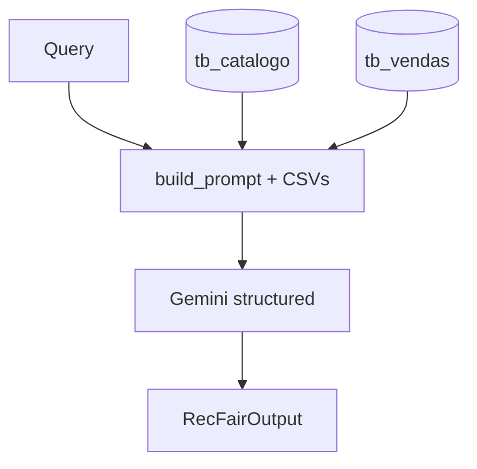

# ADR 0001: Baseline stuffing com structured output

- **Status:** aceito
- **Data:** 2026-09-07
- **Arquitetura:** `baseline` (`prompt_version=v1`)
- **Substituído por:** n/a (permanece executável para comparação)

## Contexto

RecFair E1 precisa do baseline mais simples que ainda resolva recomendação Top-5 por popularidade na janela de 7 dias, com abstenção quando faltam slots (RF-04/05), diversidade de marca quando aplicável (RF-07) e contrato de saída estável para evoluções E2–E4.

Golden-set inicial: 30 casos. Limitação observada **antes** do E2: o modelo recebe ~29k tokens de CSV por consulta e ainda erra agregação, ordem e filtros — hipótese que motivou o ADR 0002.

## Opções

### A — Stuffing + structured output (escolhida)

Uma chamada `ChatGoogleGenerativeAI.with_structured_output(RecFairOutput)` com `tb_catalogo` + `tb_vendas` inline no prompt.

- **Prós:** pipeline mínimo; interpreta paráfrases; contrato Pydantic; baseline honesto para comparar incrementos.
- **Contras:** custo/latência altos por token; ranking não auditável; sem preço/estoque/claims no E1.

### B — Proxy SQL / heurística sem LLM

Ranking determinístico direto no SQL.

- **Prós:** barato, reprodutível.
- **Contras:** não exercita NL do golden-set (paráfrase, ambiguidade); invalida comparação de interpretação.

### C — RAG + tools já no E1

LangGraph/ReAct no primeiro entregável.

- **Prós:** arquitetura “completa” cedo.
- **Contras:** complexidade sem limitação medida; viola regra “comece pelo mais simples”.

## Decisão

Adotar **A — stuffing + structured output**:

- `architecture_id=baseline`, implementação em `recfair/graphs/baseline.py`.
- Prompt em `recfair/prompts/baseline_v1.py`.
- **Sem** tools, memória, LangGraph, MCP, `tb_claims`, `tb_inventory`.
- Saída: `RecFairOutput` (`recfair/schemas/output.py`).

### Desenho técnico

## Consequências

### Contratos

- Entrada: string NL.
- Saída: `RecFairOutput` — mantido nas versões seguintes.
- Métricas: `CaseMetrics` (latência, tokens, `chamadas_llm=1`, `tool_calls=0`).

### Ganhos esperados (E1)

| Expectativa | Racional |
| :--- | :--- |
| Baseline rápido de implementar | 1 arquivo runner + 1 prompt |
| Medir interpretação NL pura | Sem camada determinística |
| Referência para evolução | Empate/piora no E2 ainda é resultado válido |

### Resultados obtidos

**E1 (régua original, 30 casos):** ver notebook [`eval/notebooks/E1_baseline.ipynb`](../../eval/notebooks/E1_baseline.ipynb) e runs históricos em `eval/runs/`.

**Reexecução na régua E2 (38 casos, gabarito via engine):** manifest [`eval/runs/00b767134d22.json`](../../eval/runs/00b767134d22.json) — campo `resumo`:

| Métrica | Valor (indicativo) |
| :--- | ---: |
| `e1_rate_overall` | 7/38 (18,4%) |
| `e1_rate_restrict` | 6/23 (26,1%) |
| Tokens entrada médios/caso | ~29 424 |
| Latência mediana | ~1,91 s |
| Custo estimado (run) | ~$0,38 |
| `tool_calls` | 0 |

Interpretação completa vs workflow: [`eval/notebooks/E2_workflow.ipynb`](../../eval/notebooks/E2_workflow.ipynb) seção F — **não repetir tabelas neste ADR**.

### Riscos / limitações confirmadas

- Agregação `units_7d` e desempate delegados ao LLM → falhas T05/T12 na régua E2.
- Impossível auditar **por que** um SKU entrou no Top 5.
- Custo escala linearmente com tamanho do catálogo no prompt.

## Próximo incremento

Medido no E2: workflow LangGraph + tools locais (ADR 0002). Baseline **permanece** registrado e executável via `make chat ARCH=baseline`.

## Evidência / reavaliação

- **Hipótese E2:** stuffing falha em tarefas compostas e filtros → workflow deve ganhar na mesma régua.
- **Experimento:** `golden_revision=15f3ed6986de9ce9`, comparação no notebook E2.
- **Reavaliar:** a cada novo incremento arquitetural com baseline reexecutado na mesma sessão.
