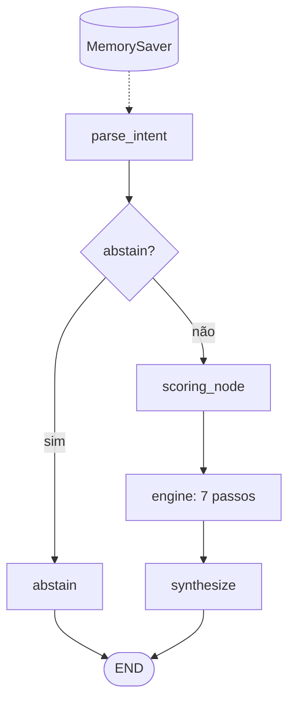
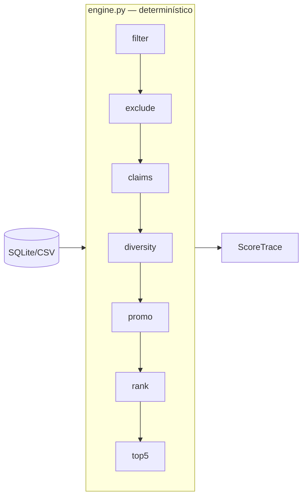

# ADR 0002: Workflow determinístico com scoring por pontos

- **Status:** aceito
- **Data:** 2026-09-13
- **Arquitetura:** `workflow` (`prompt_version=v2`) — executável via `ARCH=workflow` (não é mais `CURRENT_ARCH`; vigente E3 = `multiagent`, ADR 0003)
- **Substitui:** n/a (coexiste com `baseline`)

## Contexto

ADR 0001 confirmou que stuffing falha em agregação determinística, filtros (preço, estoque), claims, promo/launch e memória multi-turn. O E2 (entregável disciplina) exige: LangGraph com estado, fluxo >1 etapa, tool real, roteamento, limite de passos, memória ou justificativa de estado, integração documentada.

Golden-set cresce: T31–T38 (memória + dimensões de scoring). Gabarito unificado via `recfair/tools/scoring/engine.py` — baseline E1 **não alterado**, expectativa (`eval/gold.py`) evolui.

## Opções

### A — ReAct híbrido

LLM escolhe qual passo de scoring executar a cada iteração.

- **Prós:** flexível para queries atípicas.
- **Contras:** não-determinismo; múltiplas chamadas LLM; difícil auditar; alto custo.

### B — Workflow determinístico (escolhida)

LLM **somente** em `parse_intent`; pipeline fixo de 7 passos; LangGraph para roteamento abstain/score e checkpoint.

- **Prós:** offline = runtime; trace por SKU; prompt ~98% menor; tools reais sobre SQLite.
- **Contras:** erros de NL em `parse_intent`; match claims por substring; LangGraph + checkpoint.

### C — Proxy SQL sem LLM

SQL direto, sem interpretação NL.

- **Prós:** barato.
- **Contras:** falha em paráfrases/ambiguidade do golden-set.

## Decisão

Adotar **B — workflow LangGraph** (`architecture_id=workflow`):

| Peça | Implementação |
| :--- | :--- |
| Grafo | `recfair/graphs/workflow/__init__.py` — 4 nós, `recursion_limit=12` |
| Intent | `nodes/intent.py` + `prompts/workflow_v2.py` |
| Scoring | `nodes/scoring.py` → `tools/scoring/engine.py` |
| Memória | `MemorySaver` + `thread_id` → `session_intent` |
| Integração | Tools **locais** CSV/SQLite — **sem MCP** (justificado: dados empacotados, 1 consumidor) |
| Observabilidade | `ScoreTrace` → manifest + CLI `/trace` |

### Grafo

### Pipeline (tool única lógica `score_recommendation`)

### Dados novos

- **`tb_claims`:** 40 SKUs × 5 `claim_type`; texto de PDPs [boticario.com.br](https://www.boticario.com.br/); manifest `data/claims_manifest.json`.
- **`tb_inventory`:** snapshot `2026-09-01`; `E4N8J1` estoque 0; `G7Q2D4` launch; `3G7P2W` promo.

### Golden-set

- T01–T30: entradas imutáveis; gabarito recalculado quando régua engine diverge do E1.
- T31–T33: multi-turn (`thread_id=case_id`).
- T34–T38: casos isolados por dimensão de scoring.

## Consequências

### Ganhos esperados

| Área | Expectativa |
| :--- | :--- |
| Qualidade restrita S_* | Acertar T05/T12, filtros, claims determinísticos |
| Memória | T31–T33 com `session_intent` |
| Custo/latência | Prompt curto; scoring local |
| Auditabilidade | Trace `pool` / `removed` / `bonus` / `ranked` |
| Comparabilidade | Mesmo engine em runtime e `eval/gold.py` |

### Resultados obtidos

Manifest [`eval/runs/d79563e06651.json`](../../eval/runs/d79563e06651.json) vs baseline [`00b767134d22.json`](../../eval/runs/00b767134d22.json) — mesma sessão, `golden_revision=15f3ed6986de9ce9`.

**Indicadores (campo `resumo` — detalhes no notebook E2):**

| Métrica | Baseline | Workflow | Δ |
| :--- | ---: | ---: | ---: |
| `e2_rate_overall` | 18,4% | 76,3% | +57,9 pp |
| `e2_rate_restrict` | 26,1% | 82,6% | +56,5 pp |
| `e2_rate_memory` | 0% | 66,7% | +66,7 pp |
| `e2_rate_scoring` | 20% | 80% | +60 pp |
| Latência mediana | 1,91 s | 0,80 s | −58% |
| Custo run | ~$0,38 | ~$0,01 | −97% |
| `tool_calls` | 0 | 238 | +238 |

Relatório interpretado: [`eval/notebooks/E2_workflow.ipynb`](../../eval/notebooks/E2_workflow.ipynb) (seções F, G, H).

**Hipótese refutada:** latência não piorou — prompt menor compensa o grafo.

**Gaps confirmados:** T09 (intent), T14 (RF-06), T17/T20 (preço no intent), T18/T21/T22 (claims regex), T31 (merge memória), T26–T30 (sem guardrail real).

### Riscos

- Dependência LangGraph + checkpoint in-memory (não persistente entre processos).
- `_claim_match`: substring literal — candidato a agente E3.
- Entrada NL não confiável ainda alcança `parse_intent` sem filtro de segurança.

## Próximo incremento

Implementado no E3: ADR [0003](0003-multiagent-supervisor.md) (supervisor) e [0004](0004-layered-evaluation-metrics.md) (régua nDCG@5). MCP continua fora.

## Evidência / reavaliação

- **Experimento:** `run_eval(arch="baseline")` + `run_eval(arch="workflow")` no notebook E2.
- **Mapa técnico:** [`docs/architecture.md`](../architecture.md).
- **Reavaliar:** a cada incremento multi-agente; baseline sempre reexecutado na mesma régua.
