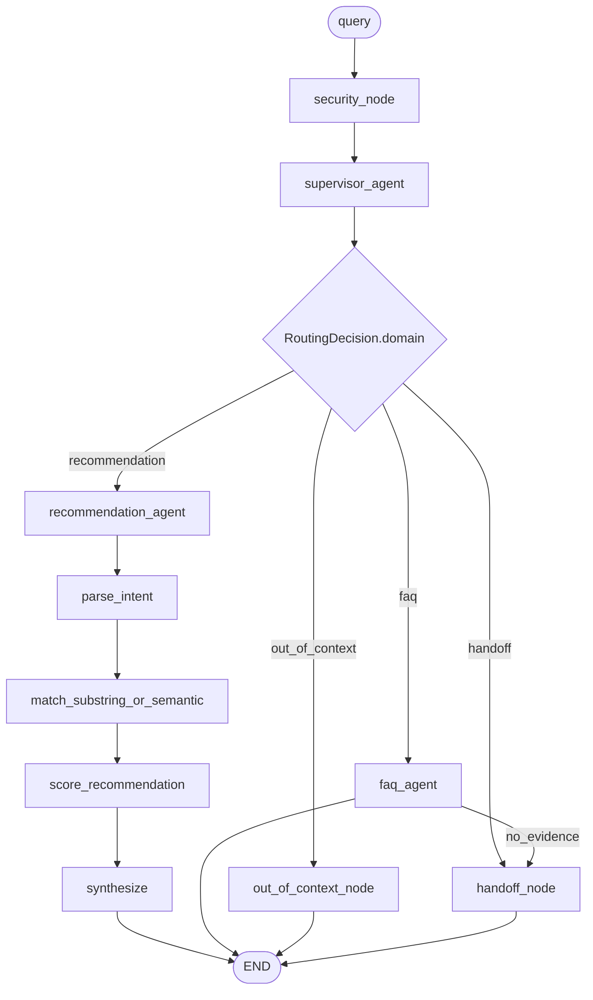
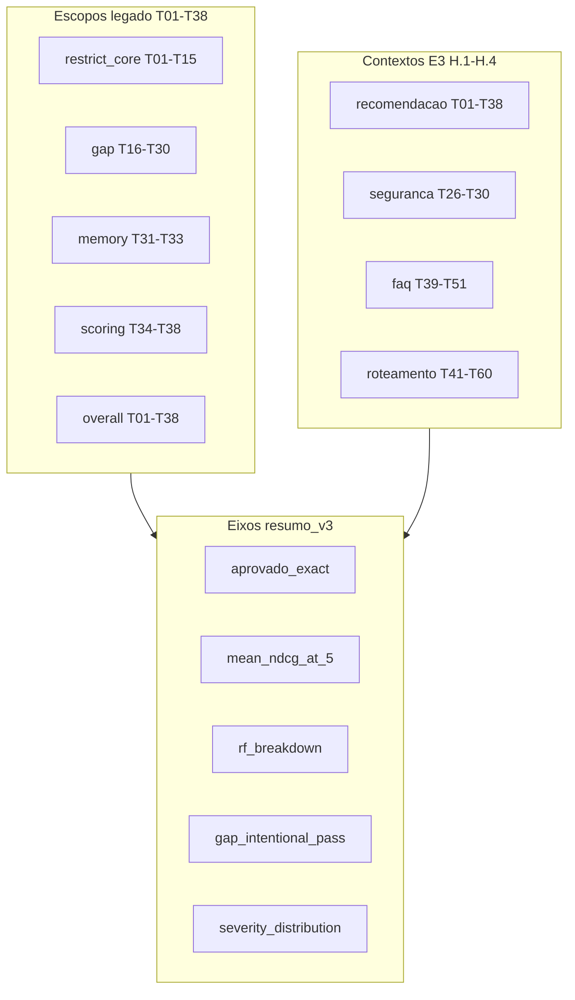

# ADR 0003: RecFair E3 — multiagente, régua e roteamento

- Status: aceito
- Data: 2026-09-19
- Arquitetura: `multiagent` (vigente) + pacote `eval/` (régua E3)
- Autores: RecFair E3

---

## 1. Contexto

O entregável E3 combina **três decisões** datadas 2026-09-19 — runtime multiagente, régua em camadas e refinamento de roteamento (`out_of_context` vs `handoff`) — num único ADR porque compõem a mesma arquitetura executável.

### 1.1 Limitações do E2 (runtime)

O E2 (`workflow`, ADR 0002) mede 76,3% em T01–T38 (`eval/runs/d79563e06651.json`) com ranking determinístico. Limitações medidas que o incremento fecha:

| Limitação | Casos | Causa no E2 |
| :--- | :--- | :--- |
| Claims por substring | T18, T21, T22 | `_claim_match` literal |
| Guardrail ausente | T26–T30 | Passam sem sanitização real |
| Domínio único | — | Sem FAQ, revenda ou transbordo |

O enunciado E3 exige ≥2 agentes, padrão de organização, contrato, skills/planejamento justificados e observabilidade por etapa. Empate ou piora no Painel A (T01–T38) é resultado válido e **não** remove `multiagent` do CLI.

### 1.2 Defeito na régua E2 (avaliação)

Feedback do professor sobre `eval/verify` no E2:

1. **Binário sem nuance** — T12 (5/5 SKUs, ordem trocada) pesa igual a T14 (categoria errada).
2. **Sem breakdown por RF** — RF-01–RF-07 só aparecem em strings de `motivo_erro`.
3. **Gaps inflam a nota** — `G_*` pode “passar” com lista ingênua de popularidade; `G_need` com `target_sku` passa só com o SKU-alvo na lista.

Isso é **defeito real na medida** (skill `agent-evaluation`): entradas T01–T30 permanecem imutáveis; `verify` e o agregado mudam. A régua **não altera o runtime**.

Justificativa teórica da métrica única de proximidade: nDCG@5 com relevância binária (Valcarce et al. 2020; Bauer et al. TORS 2024; sínteses Evidently AI / Weaviate). Precision/Recall/Hit@5 e overlap são redundantes com gabarito de 5 itens.

### 1.3 Confusão handoff vs fora de domínio

A primeira versão do grafo E3 tratava **fora de domínio** e **transbordo humano in-contexto** como o mesmo destino `handoff`, sempre com telefone `0800-000-0000`. Isso gerava transbordo indevido para perguntas totalmente externas a O Boticário (imposto de renda, clima, jurídico geral).

O produto exige dois comportamentos distintos:

1. **Fora de contexto** — template fixo simpático explicando a função do assistente, **sem** telefone.
2. **Transbordo humano** — perguntas sobre o negócio Boticário que não são ranking nem FAQ respondível pela KB.

Casos golden T43, T57 e T58 mediam transbordo quando deveriam medir redirecionamento (defeito real de régua, corrigido neste incremento).

---

## 2. Opções

### 2.1 Runtime — supervisor multiagente

#### A — Permanecer no workflow E2

Prós: menor latência (1× LLM); ranking já auditável. Contras: não cobre FAQ/handoff; T26–T30 sem guardrail; claims frágeis; não cumpre o entregável E3.

#### B — Supervisor com 3 agentes + nós determinísticos (escolhida)

Supervisor LLM roteia FAQ vs recomendação vs transbordo vs fora de contexto. Segurança, handoff e out_of_context são nós (regex/template). Recomendação reusa o engine E2 com matcher semântico injetado. FAQ = RAG MiniLM + síntese ground-only.

Prós: fecha as três limitações; skills inline (sem pacote extra); um replanejamento FAQ→handoff. Contras: +1 chamada LLM no supervisor; risco de rota errada (−0 a −2 pp no Painel A).

#### C — ReAct / peer-to-peer / agente LLM de segurança e de claims

Prós: flexível. Contras: over-engineering; segurança LLM é cara e não determinística; agente de claims duplica uma tool; MCP sem reuso medido. Recusado pelo architecture-guardian.

### 2.2 Avaliação — régua em camadas

#### A — Permanecer no exact-match legado

Prós: notebooks E1/E2 inalterados. Contras: T12=T14; RF invisível; G_* inflados.

#### B — nDCG@5 + exact + severity + RF + gap_intentional_pass (escolhida)

Cinco eixos no pacote `eval/`. `aprovado` legado permanece para não quebrar manifests E1/E2. Painel E3 lê `e3_*`.

#### C — Pacote com P@5, R@5, overlap e Kendall

Redundante com nDCG binário em top-5 fixo. Recusado pelo plano de métricas.

### 2.3 Roteamento — out_of_context vs handoff

#### A — Reutilizar `abstention` com novo `reason`

Prós: sem novo status. Contras: mistura abstenção de catálogo (fluxo recommendation) com recusa de escopo; confunde Painel A e H.4.

#### B — Novo domínio `out_of_context` + nó determinístico (escolhida)

Prós: contrato explícito; verificação separada (`G_out_of_context`); handoff reservado a in-contexto. Contras: +1 aresta no grafo; golden T43/T57/T58 reclassificados.

#### C — Manter handoff único com template condicional

Prós: diff mínimo. Contras: `RecFairOutput` não distingue telefone vs não-telefone de forma estável; eval frágil.

---

## 3. Decisões

### 3.1 Runtime — supervisor multiagente (opção B)

Entra agora:

- `architecture_id=multiagent`, `CURRENT_ARCH=multiagent`
- Grafo em `recfair/graphs/multiagent/`
- Tools `guardrails` + `match_substring_or_semantic` (via port `claim_matcher` em `score_recommendation`)
- RAG FAQ (MiniLM + FAISS)
- Schemas `RoutingDecision` / `AgentResult`, `AgentTrace`
- Skills inline em `graphs/multiagent/skills.py`

Fica fora: MCP, fairness auditor, agente LLM de claims/segurança, pacote `recfair/skills/`, replanejamento multi-loop, segundo modelo de embedding, nDCG no runtime, mutação do `workflow/` e do matcher default usado por `eval/gold.py`.

### 3.2 Avaliação — régua em camadas (opção B)

Entra no pacote `eval/`:

- `eval/metrics.py` — nDCG@5, severity
- `eval/requirements.py` — RF-01–RF-07
- `eval/verify/` — verify enriquecido (`aprovado_exact`, RF breakdown)
- `eval/report/` — `summarize_records_v3`, painéis HTML por contexto
- `eval/contexts.py`, `eval/glossary.py` — contextos H.1–H.4
- `gold_naive_for` — anti-inflação de gaps

Fica fora: alterar notebook E1; mutar ranking runtime; Precision@5/Recall@5/overlap/Kendall; lógica de métrica em célula de notebook.

### 3.3 Roteamento — out_of_context (opção B, emenda ao grafo)

- `Domain` e `RecFairOutput.status` ganham `out_of_context`
- Nó `out_of_context_node` emite `OUT_OF_CONTEXT_TEXT` (config), zero LLM
- Supervisor: `out_of_context` para temas externos; `handoff` para universo RecFair sem FAQ/rec
- Confiança baixa (&lt;0.45) → `out_of_context` (evita transbordo indevido)
- Replans FAQ→handoff e recommend-error→handoff **inalterados** (in-contexto)

---

## 4. Implementação

### 4.1 Grafo LangGraph (estado final)

Hard-stops: `recursion_limit=16`; um único replan FAQ→handoff; estouro → `halt_reason=recursion_limit`. Checkpointer: `MemorySaver` + `thread_id` (sem disco).

### 4.2 Contratos

- `RecFairOutput.status`: `recommendation` | `abstention` | `faq` | `handoff` | `out_of_context`
- `RoutingDecision` e `AgentResult` em `schemas/routing.py`
- Especialistas gravam `last_result: AgentResult` (`ok` / `no_evidence` / `error`)
- FAQ `no_evidence`/`error` e recomendação `error` → replan para `handoff_node`

### 4.3 Pacote eval/

Módulos: `runner.py`, `metrics.py`, `requirements.py`, `gold.py`, `contexts.py`, `glossary.py`, pacotes `verify/` e `report/`.

### 4.4 Golden-set (evolução cronológica)

| Fase | Casos | Notas |
| :--- | :--- | :--- |
| Core imutável | T01–T38 | E1/E2; Painel A / overall E3 |
| FAQ + roteamento inicial | T39–T43 | supervisor + FAQ RAG |
| FAQ ampliado | T44–T51 | expansão E3 |
| Roteamento ampliado | T52–T56 | expansão E3 |
| Refinamento escopo | T43/T57/T58 → `G_out_of_context`; +T59/T60 | out_of_context vs handoff |
| **Total** | **60 casos** | `data/golden/cases.json` |

Total roteamento (H.4): 12 casos (3 rec, 3 FAQ, 2 transbordo, 4 fora de contexto).

`golden_revision` muda a cada acréscimo ou correção de defeito. Critério legado `aprovado` para T01–T38 **não** é reescrito; tightening de `G_need` vive em `gap_intentional_pass`.

---

## 5. Consequências

### Runtime

- Claims semânticos só no caminho multiagent (port `claim_matcher`); E2 e gold inalterados
- Dependências novas: `sentence-transformers`, `faiss-cpu` (índices via `make data`)
- Risco: latência/custo sobem; Colab precisa dos índices ou baixa o MiniLM na primeira carga
- Painel H.4 reporta quatro destinos de roteamento

### Avaliação

- Notebooks E1/E2 continuam lendo `e1_rate_*` / `e2_rate_*`
- E3 usa `resumo_v3` e painéis `render_context_evaluation_section`
- `e1_rate_overall` em runs novos inclui T39+ no denominador legado; overall E3 é T01–T38
- Risco: tightening pode derrubar nota global histórica — esperado e documentado

### Deliberadamente fora do E3

| Peça | Motivo |
| :--- | :--- |
| MCP | Sem reuso nem fronteira |
| Agente LLM de segurança / claims | Nós/tools determinísticos bastam |
| Pacote `recfair/skills/` | Dict inline atende o enunciado |
| Correção de intent/memória T09/T31 | Fora de escopo medido |
| nDCG no runtime | Só no pacote `eval/` |
| T61+ | Futuro (E4+) |

---

## 6. Ganhos esperados vs resultados

| Expectativa | Resultado | Evidência |
| :--- | :--- | :--- |
| T01–T38 ~74–78% (risco de rota) | run completo no notebook E3 | [`eval/notebooks/E3_multiagents.ipynb`](../../eval/notebooks/E3_multiagents.ipynb) |
| T26–T30 com guardrail real | sanitização coberta por teste | `tests/test_guardrails.py` |
| T39–T60 FAQ/roteamento | caminho pronto + golden 60 casos | `data/golden/cases.json` |
| T18/T21/T22 parcial via embed | matcher injetado; não muta gold | `tools/claims_semantic.py`, `tests/test_claims_semantic.py` |
| T12 `severity=minor`, nDCG≈1 | coberto por teste | `tests/test_eval_metrics.py` |
| T14 simulado `severity=grave` | coberto por teste | idem |
| `false_positive_gap` em T25 | coberto por teste | idem |
| RF-04 só em abstenção | coberto por teste | idem |
| out_of_context vs handoff | T43/T57/T58 reclassificados; +T59/T60 | Painel H.4 |
| Comparação 3-arch mesma sessão | notebook E3 seção H | `eval/runs/` |

Detalhe completo de runs: `eval/runs/<run_id>.json` e notebook — não duplicar relatório inteiro aqui.

---

## 7. Evidência / reavaliação

- **Hipótese combinada:** supervisor + guardrail + claims embed fecham gaps de domínio e segurança; nDCG discrimina near-miss vs erro grave; `gap_intentional_pass` impede regressão futura; `out_of_context` separa recusa de escopo de transbordo humano.
- **Experimento:** mesma sessão, `gemini-3.5-flash-lite`, `run_eval(arch="baseline")` + `run_eval(arch="workflow")` + `run_eval(arch="multiagent")` no notebook E3.
- **Reavaliar até:** 2026-10-03 (Entregável 4).

Se o eval empatar ou piorar no Painel A, a hipótese é roteamento indevido (FAQ vs rec). O incremento **permanece** `CURRENT_ARCH`. Sem peças extras até nova evidência.
