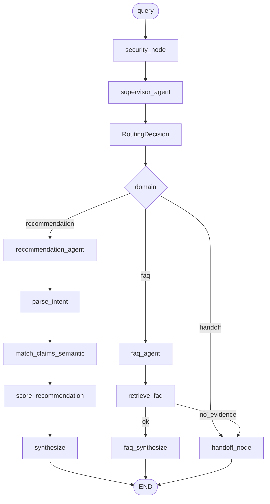

# ADR 0003: Supervisor multiagente RecFair

- Status: aceito
- Data: 2026-09-19
- Arquitetura: `multiagent` (baseline permanece `baseline`; workflow permanece `workflow`)
- Autores: RecFair E3

## Contexto

O E2 (`workflow`, ADR 0002) mede 76,3% em T01–T38 (`eval/runs/d79563e06651.json`) com ranking determinístico. Limitações medidas que este incremento fecha:

| Limitação | Casos | Causa no E2 |
| :--- | :--- | :--- |
| Claims por substring | T18, T21, T22 | `_claim_match` literal |
| Guardrail ausente | T26–T30 | Passam sem sanitização real |
| Domínio único | — | Sem FAQ, revenda ou transbordo |

O enunciado E3 exige ≥2 agentes, padrão de organização, contrato, skills/planejamento justificados e observabilidade por etapa. Empate ou piora no Painel A (T01–T38) é resultado válido e **não** remove `multiagent` do CLI.

Numeração: o plano de métricas também pedia ADR 0003. São duas decisões distintas; 0003 promove o runtime (`CURRENT_ARCH`) e 0004 muda só a régua no pacote `eval/`.

## Opções

### A — Permanecer no workflow E2

Prós: menor latência (1× LLM); ranking já auditável. Contras: não cobre FAQ/handoff; T26–T30 sem guardrail; claims frágeis; não cumpre o entregável E3.

### B — Supervisor com 3 agentes + 2 nós determinísticos (escolhida)

Supervisor LLM roteia FAQ vs recomendação vs transbordo. Segurança e handoff são nós (regex/template). Recomendação reusa o engine E2 com matcher semântico injetado. FAQ = RAG MiniLM + síntese ground-only.

Prós: fecha as três limitações; skills inline (sem pacote extra); um replanejamento FAQ→handoff. Contras: +1 chamada LLM no supervisor; risco de rota errada (−0 a −2 pp no Painel A).

### C — ReAct / peer-to-peer / agente LLM de segurança e de claims

Prós: flexível. Contras: over-engineering; segurança LLM é cara e não determinística; agente de claims duplica uma tool; MCP sem reuso medido. Recusado pelo architecture-guardian.

## Decisão

Escolhemos **B**. Entra agora: `architecture_id=multiagent`, `CURRENT_ARCH=multiagent`, grafo em `recfair/graphs/multiagent/`, tools `guardrails` + `match_claims_semantic`, RAG FAQ, schemas `RoutingDecision`/`AgentResult`, `AgentTrace`, golden T39–T43.

Fica fora: MCP, fairness auditor, agente LLM de claims/segurança, pacote `recfair/skills/`, replanejamento multi-loop, T44–T46, segundo modelo de embedding, nDCG no runtime, mutação do `workflow/` e do matcher default usado por `eval/gold.py`.

Hard-stops: `recursion_limit=16`; um único replan FAQ→handoff; estouro → `halt_reason=recursion_limit`. Checkpointer: `MemorySaver` + `thread_id` (sem disco).

Se o eval empatar ou piorar no Painel A, a hipótese é roteamento indevido (FAQ vs rec). O incremento **permanece** `CURRENT_ARCH`. Sem peças extras até nova evidência.

## Consequências

- `RecFairOutput.status` ganha `faq` | `handoff` (aditivo; T01–T38 seguem `recommendation`/`abstention`).
- Especialistas emitem `last_result: AgentResult` (`ok` / `no_evidence` / `error`). FAQ sem evidência ou erro de tool → um replan para `handoff_node`; recomendação com erro de tool também.
- Claims semânticos só no caminho multiagent (port `claim_matcher`); E2 e gold inalterados.
- Eval passa a cobrir T39–T43 (`G_faq_*`, `G_routing`, `G_handoff`) e trace por `agent_id`.
- Dependências novas: `sentence-transformers`, `faiss-cpu` (índices via `make data`).
- Risco: latência/custo sobem; Colab precisa dos índices ou baixa o MiniLM na primeira carga.

### Ganhos esperados vs resultados

| Expectativa | Resultado | Evidência |
| :--- | :--- | :--- |
| T01–T38 ~74–78% (risco de rota) | pendente de `run_eval` com API | notebook `eval/notebooks/E3_evaluation.ipynb` |
| T26–T30 com guardrail real | sanitização coberta por teste unitário | `tests/test_guardrails.py` |
| T39–T43 >0% no multiagent | caminho pronto; run LLM pendente | golden T39–T43 |
| T18/T21/T22 parcial via embed | matcher injetado; não muta gold | `tools/claims_semantic.py` |

## Evidência / reavaliação

- Hipótese: supervisor + guardrail + claims embed fecham gaps de domínio e segurança sem reescrever o ranking E2.
- Experimento: mesma sessão, `gemini-3.5-flash-lite`, `run_eval(arch="workflow")` + `run_eval(arch="multiagent")` (e baseline na régua 0004).
- Reavaliar até: 2026-10-03 (Entregável 4).
