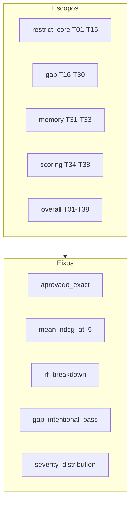

# ADR 0004: Régua em camadas (nDCG@5 + RF + anti-inflação)

- Status: aceito
- Data: 2026-09-19
- Arquitetura: avaliação (`eval/`) — não muda o runtime `multiagent`
- Autores: RecFair E3

## Contexto

Feedback do professor sobre `eval/verify.py` no E2:

1. **Binário sem nuance** — T12 (5/5 SKUs, ordem trocada) pesa igual a T14 (categoria errada).
2. **Sem breakdown por RF** — RF-01–RF-07 só aparecem em strings de `motivo_erro`.
3. **Gaps inflam a nota** — `G_*` pode “passar” com lista ingênua de popularidade; `G_need` com `target_sku` passa só com o SKU-alvo na lista.

Isso é **defeito real na medida** (skill `agent-evaluation`): entradas T01–T30 permanecem imutáveis; `verify` e o agregado mudam; `golden_revision` muda porque o conjunto cresce (T39–T43) e o verify passa a persistir campos novos no manifest. Baseline e workflow devem ser reexecutados na mesma sessão.

Justificativa teórica da métrica única de proximidade: nDCG@5 com relevância binária (Valcarce et al. 2020; Bauer et al. TORS 2024; sínteses Evidently AI / Weaviate). Precision/Recall/Hit@5 e overlap são redundantes com gabarito de 5 itens.

Os dois planos E3 pediam ADR 0003. 0003 ficou com a promoção de arquitetura; esta decisão é 0004.

## Opções

### A — Permanecer no exact-match legado

Prós: notebooks E1/E2 inalterados. Contras: T12=T14; RF invisível; G_* inflados.

### B — nDCG@5 + exact + severity + RF + gap_intentional_pass (escolhida)

Cinco eixos no pacote `eval/`. `aprovado` legado permanece para não quebrar manifests E1/E2. Painel E3 lê `e3_*`.

### C — Pacote com P@5, R@5, overlap e Kendall

Redundante com nDCG binário em top-5 fixo. Recusado pelo plano de métricas.

## Decisão

Escolhemos **B**. Entra no código agora: `eval/metrics.py`, `eval/requirements.py`, `gold_naive_for`, `verify_case` enriquecido, `summarize_records_v3`, painéis HTML, testes, notebook E3.

Fica fora: alterar o notebook E1 original; mutar `graphs/baseline.py`; Precision@5/Recall@5/overlap/Kendall; nDCG no runtime de recomendação; lógica de métrica em célula de notebook.

`golden_revision` muda (T39–T43 + hash do JSON). Critério legado `aprovado` para T01–T38 **não** é reescrito, salvo o acréscimo de campos paralelos. Tightening de `G_need` vive em `gap_intentional_pass`, não em `aprovado`.

## Consequências

- Notebooks E1/E2 continuam lendo `e1_rate_*` / `e2_rate_*`.
- E3 usa `resumo_v3` e os painéis `render_*_v3`.
- `e1_rate_overall` em runs novos inclui T39–T43 no denominador legado; o overall E3 é T01–T38.
- Risco: tightening pode derrubar a nota global histórica — esperado e documentado.

### Ganhos esperados vs resultados

| Expectativa | Resultado | Evidência |
| :--- | :--- | :--- |
| T12 `severity=minor`, nDCG≈1 | coberto por teste | `tests/test_eval_metrics.py` |
| T14 simulado `severity=grave` | coberto por teste | idem |
| `false_positive_gap` quando output=naive ≠ filtered | coberto por teste em T25 | idem |
| RF-04 só em abstenção | coberto por teste | idem |
| Comparação 3-arch na mesma sessão | pendente de API key | `E3_evaluation.ipynb` |

## Evidência / reavaliação

- Hipótese: nDCG discrimina near-miss vs erro grave; `gap_intentional_pass` impede regressão futura quando o engine filtrar de verdade.
- Experimento: `run_eval` baseline + workflow + multiagent no notebook E3.
- Reavaliar até: 2026-10-03.
