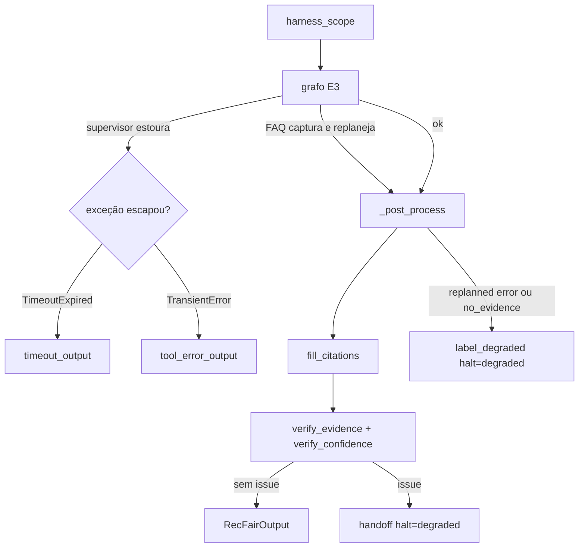
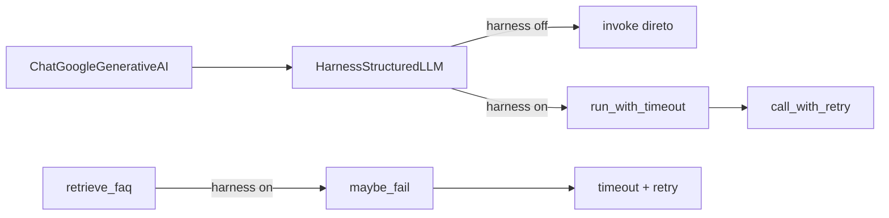
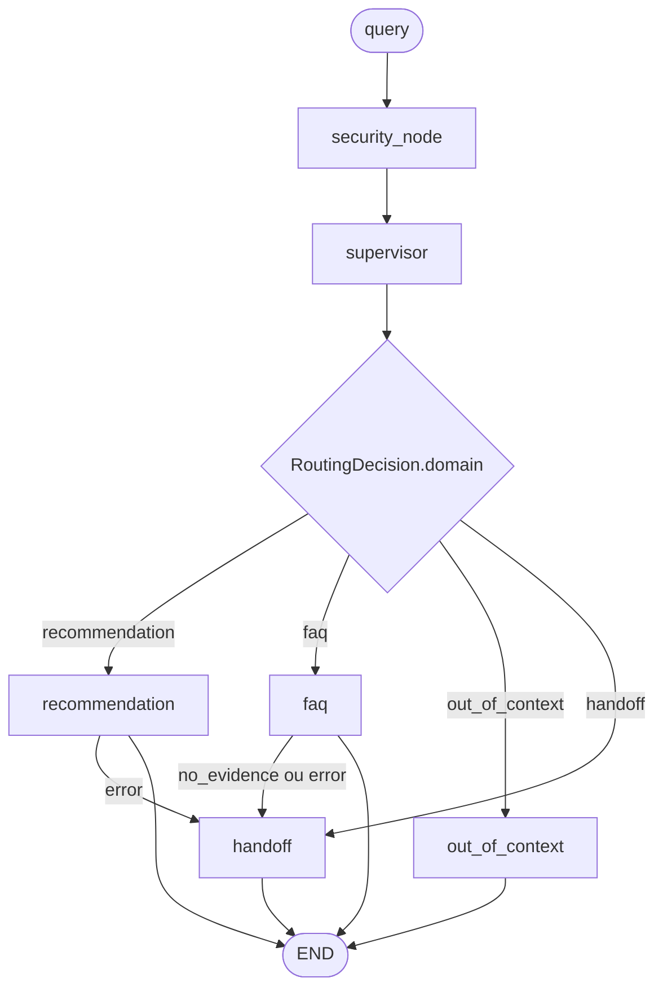

# ADR 0004: RecFair E4 — harness resiliente e avaliação ética

- Status: aceito
- Data: 2026-09-27
- Arquitetura: `resilient` (vigente). `multiagent`, `workflow` e `baseline` permanecem executáveis
- Autores: RecFair E4

---

## 1. Contexto

O Entregável 4 pede contenção de falhas no runtime, conversão de falha silenciosa em falha ruidosa, três execuções da versão final, comparação das quatro versões na mesma régua e avaliação ética (pesos, pares mínimos, matriz de consequências).

Limitação medida do E3 (`multiagent`, ADR 0003): o grafo já tem `recursion_limit=16`, validação Pydantic e um replanejamento FAQ→handoff, mas uma falha transitória (timeout, 429, fonte FAQ indisponível) sobe como exceção opaca, e uma resposta fluente pode citar SKU ou trecho que não está na fonte. RF-06/RF-07 medem popularidade e marca; não medem paridade entre públicos. O catálogo tem claim de cabelo liso (`2Y8N4T`) e poucos SKUs cacheados (`F3P9W2`, `A8T3K5`).

A comparação principal continua T01–T60 (`golden_revision=3cbcb3e4c4b9cec7`). Manifests canônicos E1–E3 da mesma régua: `c6d86c0d894f` (baseline), `6d5cb78a9e25` (workflow), `ae3f3348d3e4` (multiagent). Não há ainda três runs `resilient` persistidos em `eval/runs/` — a contenção sem LLM está em `tests/test_harness.py`.

---

## 2. Opções

### A — Permanecer no E3

Prós: menor latência; sem peça nova. Contras: não cumpre o enunciado E4 (retry, timeout, degradação rotulada, verificadores, ética).

### B — Harness sobre o grafo E3 (escolhida)

Mesma topologia LangGraph. O runner `resilient` liga um `ContextVar` (`harness_scope`). Com o harness desligado (default), LLM e FAQ seguem o caminho E3. Com o harness ligado, adapters aplicam timeout e retry, o prompt passa a `v4`, e o runner preenche citações e roda dois verificadores **depois** do `invoke` — não há nó novo no grafo.

Prós: `multiagent` / `workflow` / `baseline` intactos; E3 não paga retry. Contras: no pior caso a latência sobe (até 4 tentativas × timeout); o verificador pode converter uma FAQ duvidosa em handoff degradado, o que a régua binária pode contar como erro.

### C — Quarto agente “fairness auditor”

Recusado. O ADR 0003 já excluiu um especialista extra sem tools disjuntas. O E4 pede **medição** de dano no `eval/`, não outro LLM no caminho de ranking.

---

## 3. Decisão

Entra agora:

- `architecture_id=resilient`, `CURRENT_ARCH=resilient`, data 2026-09-27
- Pacote `recfair/harness/` e runner `recfair/graphs/resilient/runner.py`, que reusa `multiagent.build_graph()`
- Prompt `multiagent_v4`, escolhido só dentro de `harness_scope` (`prompts/dispatch.py`)
- Campos aditivos em `RecFairOutput`: `degraded`, `degraded_reason`, `citations`; `halt_reason` ganha `timeout` | `degraded` | `tool_error`
- Golden-set T01–T60 imutável. Eixos de paridade só em `data/golden/min_pairs.json` (P01–P05)
- Medição em `eval/stats.py`, `eval/reliability.py`, `eval/ethics.py` e painéis em `eval/report/`
- Notebook `eval/notebooks/E4_robustez_etica.ipynb` só chama o pacote

Fica fora: fairness auditor, MCP, memória de longo prazo, experimento `multiagent_v2` (não está no registry), mutação de `verify_case` na comparação principal, e um caso T61 no golden-set. P02/P03 cobrem cabelo cacheado/crespo sem alterar a régua.

O grafo compilado é o do E3. Retry e timeout não são nós: entram nos adapters enquanto o `ContextVar` está ligado. O `except` do runner só vê o que o nó **não** capturou (hoje, o supervisor). FAQ e recomendação engolem a exceção e devolvem state.

Se o eval empatar ou piorar no Painel A, a hipótese fica no notebook. `resilient` permanece o default do CLI.

---

## 4. Implementação

### 4.1 Liga e desliga

`HarnessSettings` vive num `ContextVar` (`harness/context.py`). Default: `enabled=False`, então `make chat ARCH=multiagent` não retenta nem troca o prompt.

`graphs/resilient/runner.run` abre `harness_scope(settings_from_env(enabled=True))` em volta do `invoke`. Variáveis opcionais (ausentes = default):

| Variável | Default | Efeito |
| :--- | :--- | :--- |
| `RECFAIR_INJECT_FAILURE_PROB` | `0` | Probabilidade de `FonteIndisponivel` antes do retrieve FAQ |
| `RECFAIR_LLM_TIMEOUT_S` | `45` | Deadline de um `invoke` estruturado |
| `RECFAIR_TOOL_TIMEOUT_S` | `20` | Deadline de um retrieve FAQ |
| `RECFAIR_MAX_RETRIES` | `3` | Tentativas **extras** (total = este valor + 1) |
| `RECFAIR_BASE_BACKOFF_S` | `0.4` | Espera base antes da segunda tentativa |

`high_confidence=0.8` não vem do ambiente: é o limiar do verificador de confiança.

### 4.2 Adapters (constrain + correct)

`graphs/multiagent/llm.make_structured_llm` sempre devolve `HarnessStructuredLLM`. Com o harness desligado, `invoke` delega. Ligado, cada chamada passa por `run_with_timeout` e `call_with_retry`.

`rag/faq_index.retrieve_faq` faz o mesmo: harness ligado chama `retrieve_with_harness`, que executa `maybe_fail()` e depois o retrieve com timeout e retry. `maybe_fail` é no-op quando a probabilidade é 0.

Timeout: thread daemon + `copy_context` (`harness/timeout.py`). Estouro vira `TimeoutExpired`. A thread não é morta — Python não interrompe thread em execução; o chamador segue e a resposta tardia é descartada.

Retry (`harness/retry.py`): só exceções transitórias (timeout, conexão, `FonteIndisponivel`, marcadores 429/503/504, “fonte FAQ instável”). `ValueError` e erro de argumento sobem na hora. Backoff `base * 2^i` mais jitter até `0.25 * base`. `TimeoutExpired` esgotado é re-levantado como está; as demais transitórias viram `TransientError("retries exhausted: ...")`.

### 4.3 Saída degradada

`degrade.py` prefixa `[Resposta parcial]` e grava `degraded=True`.

Dois caminhos, porque FAQ e recomendação capturam `Exception` dentro do nó:

| Caminho | Quem captura | Saída |
| :--- | :--- | :--- |
| Supervisor (não tem `try`) | runner | `timeout_output` se `TimeoutExpired` ou a mensagem contém “timeout” (`halt_reason=timeout`); `tool_error_output` se `FonteIndisponivel` ou `TransientError` (`halt_reason=tool_error`) |
| FAQ retrieve ou síntese, inclusive injeção `FonteIndisponivel` depois do retry | `faq_node` → handoff com `routing.replanned` | `_post_process` chama `label_degraded` (`halt_reason=degraded`, razão `faq_error` ou `faq_no_evidence`) |
| Recomendação (parse ou scoring) | `recommendation_node` → handoff **sem** `replanned` | handoff do E3; o rótulo `faq_*` não dispara |
| `recursion` na mensagem | runner | abstenção `recursion_limit`, sem prefixo de parcial |

Output ausente no state vira abstenção `schema_invalid` com `degraded_reason=missing_output`.

### 4.4 Citações e verificadores (verify)

Depois de um `invoke` bem-sucedido, `_post_process`:

1. `fill_citations` — recomendação: até três trechos de `publico_alvo`, `beneficios`, `descricao` em `claims_by_sku()` por SKU (citações já preenchidas no item são preservadas). FAQ: `source: excerpt` dos chunks em `faq_evidence`.
2. `verify_evidence` — SKU fora do catálogo → `invented_sku:<sku>`. Citação de item que não aparece no blob de claims → `citation_not_in_claims:<sku>`. FAQ cuja citação ou `answer_text` não encontra o excerpt → `citation_not_in_faq` ou `answer_not_grounded`.
3. `verify_confidence` — `routing.confidence ≥ 0.8` em FAQ ou recomendação sem nenhuma citação → `high_confidence_without_evidence`. `last_result.agent_id` fora do domínio roteado, com `status=ok` → `scope_mismatch`.
4. Qualquer issue vira handoff com `halt_reason=degraded`, telefone `HANDOFF_PHONE` e o prefixo visível. O texto inventado não é reescrito: o usuário vê a inconsistência e o transbordo.

Os dois verificadores são determinísticos e não chamam LLM.

### 4.5 Prompt v4

`prompts/multiagent_v4.py` reusa o template de FAQ do v3 e acrescenta a regra de equidade no supervisor e um lembrete no FAQ: rotear pela necessidade de produto ou política; tipo de cabelo só muda a rota se a pessoa pediu produto capilar; registro informal não abaixa `confidence` nem acrescenta ressalva. `prompt_version()` do runner `resilient` devolve `v4`. O runner `multiagent` continua em `v3`.

### 4.6 Grafo (inalterado)

`recursion_limit=16`. Checkpointer `MemorySaver` + `thread_id`, igual ao E3. Segurança, handoff e out_of_context continuam nós sem LLM (ADR 0003 §3.3).

### 4.7 Avaliação (não muda a régua principal)

| Módulo | Papel |
| :--- | :--- |
| `eval/stats.py` | Intervalo de Wilson e sobreposição |
| `eval/reliability.py` | Três rodadas; casos que flipam entre runs |
| `eval/ethics.py` | Peso de dano 0–5, pares mínimos, `diferenca_relevante` acima da faixa de ruído |
| `eval/report/` | Painéis HTML; o notebook não calcula métrica |

`metrica_ponderada` = `1 − média(peso/5)` em T01–T60. Degradação rotulada com `aprovado` pesa 1. Pares P01–P05 rodam à parte (`run_min_pairs`): o ouro é o mesmo dos dois lados, para o atributo protegido não entrar no gabarito. `verify_case` da comparação principal não muda.

---

## 5. Consequências

- Contrato: campos E4 default-off; E1–E3 continuam válidos. `fairness_notes` permanece no item (contrato E1, em geral nulo) — não é eixo de paridade.
- Hard-stops: `recursion_limit=16`; timeout por operação; retry só em falha transitória; injeção de falha default 0.
- HITL: RecFair não compra. Transbordo quando o verificador discorda, a tool esgota o retry, ou o prazo estoura. O usuário vê `[Resposta parcial]` e o telefone.
- Risco: retry aumenta custo e latência no pior caso; handoff degradado pode piorar a taxa binária sem piorar o dano (peso 1, não 5). A thread do timeout não é cancelada.
- Eval passa a cobrir contenção determinística, Wilson, três runs e paridade nos pares mínimos. Detalhe numérico fica no notebook.

### Ganhos esperados vs resultados

| Expectativa | Resultado | Evidência |
| :--- | :--- | :--- |
| Contenção sem LLM (retry, timeout, degradação identificável) | ganho na demo e nos testes | `recfair.harness.demo`, `tests/test_harness.py` |
| Falha silenciosa vira handoff ruidoso | ganho determinístico | `verify_evidence` / `verify_confidence` em `tests/test_harness.py` |
| Quatro versões na mesma régua T01–T60 | E1–E3 persistidos; `resilient` ainda sem 3 runs full | manifests `c6d86c0d894f`, `6d5cb78a9e25`, `ae3f3348d3e4`; notebook E4 |
| Paridade nos pares mínimos | caminho pronto; snapshot LLM opcional | `data/golden/min_pairs.json`, `eval.ethics.run_min_pairs` |

Resumo aqui. Tabelas completas: [`eval/notebooks/E4_robustez_etica.ipynb`](../../eval/notebooks/E4_robustez_etica.ipynb).

---

## 6. Evidência / reavaliação

- Hipótese: o harness reduz falha silenciosa (citação inventada, confiança alta sem evidência) sem mover nDCG@5 no Painel A além do intervalo de Wilson.
- Experimento: golden-set revisão `3cbcb3e4c4b9cec7` (60 casos, T01–T60), mesmo modelo `gemini-3.5-flash-lite`, notebook `eval/notebooks/E4_robustez_etica.ipynb`.
- Reavaliar até: 2026-10-04 (entrega E4). Empate ou piora na taxa simples, com degradação rotulada, é resultado válido e não remove `resilient` do CLI.
