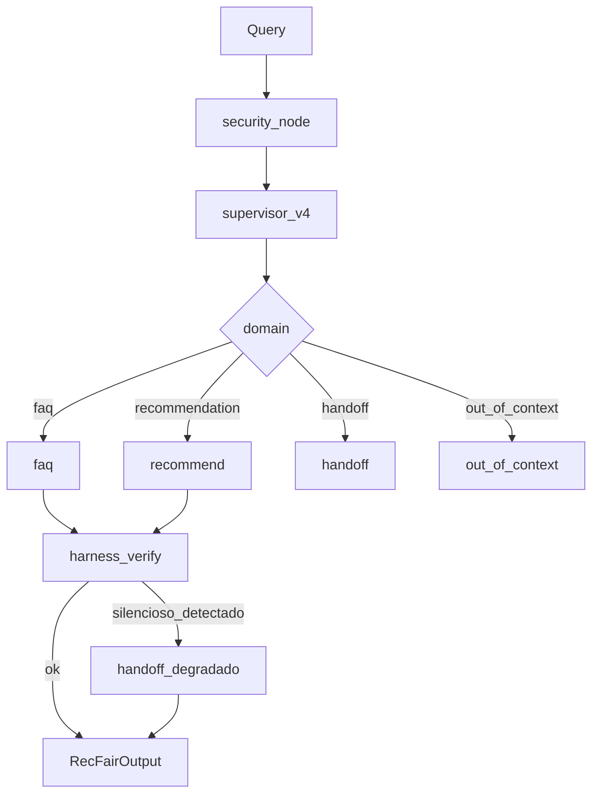

# ADR 0004: RecFair E4 — harness resiliente e avaliação ética

- Status: aceito
- Data: 2026-09-27
- Arquitetura: `resilient` (vigente). `multiagent`, `workflow` e `baseline` permanecem executáveis
- Autores: RecFair E4

## Contexto

O Entregável 4 exige (i) contenção de falhas no runtime, (ii) conversão de falhas silenciosas em ruidosas, (iii) três execuções da versão final, (iv) comparação honesta das quatro versões e (v) avaliação ética com pesos, pares mínimos e matriz de consequências.

Limitação medida do E3 (`multiagent`, ADR 0003): `recursion_limit` e validação Pydantic existem, mas não há retry/backoff, timeout por operação, resposta degradada rotulada ao usuário, nem verificação de que a citação existe na fonte. RF-06/07 medem popularidade/marca, não paridade entre públicos. O catálogo tem claims de cabelo liso (`2Y8N4T`) e poucos SKUs cacheados (`F3P9W2`, `A8T3K5`).

## Opções

### A — Permanecer no E3

Prós: menor latência; sem peça nova. Contras: não cumpre o enunciado E4.

### B — Harness sobre o grafo E3 (escolhida)

Mesma topologia LangGraph; `ContextVar` liga retry, timeout, injeção AP7, preenchimento de `citations` e dois verificadores anti-silêncio. Prompt `v4` com regra de equidade. Eval à parte (`stats`, `reliability`, `ethics`).

Prós: não muta o comportamento default do E3; baseline/workflow intactos. Contras: retry aumenta latência no pior caso; verificador pode converter FAQ duvidosa em handoff degradado.

### C — Quarto agente “fairness auditor”

Recusado: ADR 0003 já excluiu; E4 pede *medição* de dano, não um especialista extra sem limitação nova no ranking.

## Decisão

Entra agora:

- `architecture_id=resilient`, `CURRENT_ARCH=resilient`, data 2026-09-27
- Pacote `recfair/harness/` (retry, timeout, degrade, verify, injeção `RECFAIR_INJECT_FAILURE_PROB`)
- `recfair/graphs/resilient/runner.py` reusa `multiagent.build_graph()`
- Prompt `multiagent_v4` (equidade: não inferir gênero/idade/registro/tipo de cabelo para piorar a rota)
- Campos aditivos em `RecFairOutput`: `degraded`, `degraded_reason`, `citations`; `halt_reason` ganha `timeout` | `degraded` | `tool_error`
- Golden-set: T01–T60 imutáveis (sem T61). Perfil cacheado/crespo, gênero, idade e registro linguístico entram só em `data/golden/min_pairs.json` (P01–P05)
- Pacote `eval/`: `stats.py`, `reliability.py`, `ethics.py`, `report/e4_panels.py`
- Notebook `eval/notebooks/E4_robustez_etica.ipynb`

Fica fora: fairness auditor, MCP, memória de longo prazo, WIP E3B (`multiagent_v2`), mutação de `verify_case` na comparação principal, e um caso extra T61 no golden-set — P02/P03 já cobrem cabelo cacheado/crespo sem alterar a régua T01–T60.

Se o eval empatar ou piorar, a hipótese fica no notebook. O incremento `resilient` permanece o default do CLI.

## Consequências

- Contrato: campos E4 default-off; E1–E3 continuam válidos
- Hard-stops: `recursion_limit=16`, timeout LLM/FAQ, teto de retries só em falha transitória
- Eval: T01–T60 na tabela multiobjetivo; pares mínimos (P01–P05) à parte
- HITL: RecFair não compra; transbordo quando a verificação discorda ou a tool falha

### Ganhos esperados vs resultados

| Expectativa | Resultado | Evidência |
| :--- | :--- | :--- |
| Contenção demonstrável sem LLM | ganho (demo AP7) | `recfair.harness.demo`, testes `test_harness.py` |
| Quatro versões na mesma régua | a preencher no notebook | `eval/notebooks/E4_robustez_etica.ipynb`, `eval/runs/` |
| Paridade de qualidade nos pares mínimos | a preencher | `data/golden/min_pairs.json` + `eval.ethics.run_min_pairs` |

## Evidência / reavaliação

- Hipótese: o harness reduz falha silenciosa (citação inventada, confiança alta sem evidência) sem piorar nDCG@5 no Painel A além do ruído de Wilson
- Experimento: golden-set revisão `3cbcb3e4c4b9cec7` (60 casos, T01–T60), notebook `eval/notebooks/E4_robustez_etica.ipynb`
- Reavaliar até: 2026-10-04 (entrega E4)
