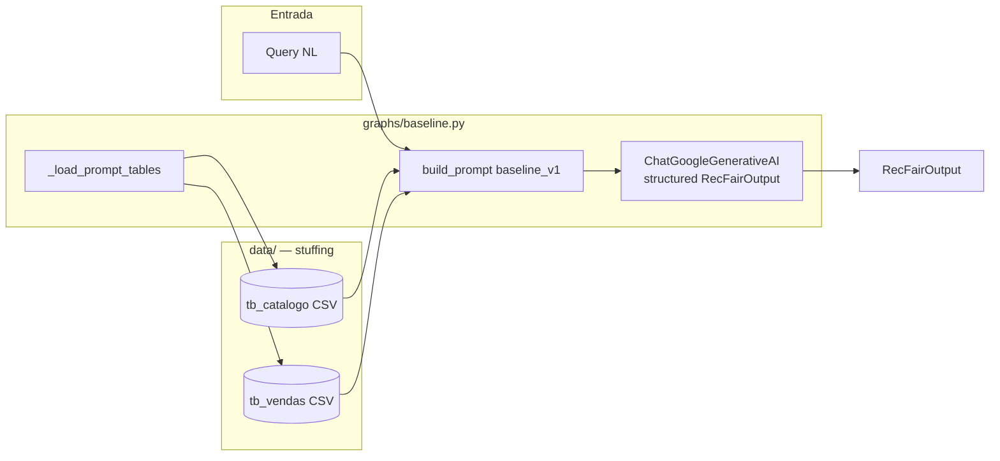
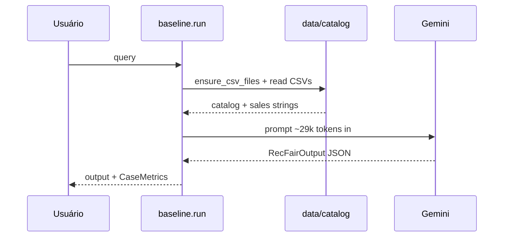
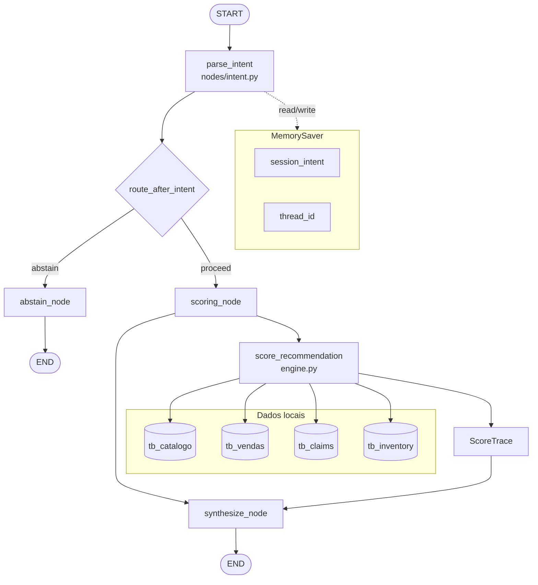
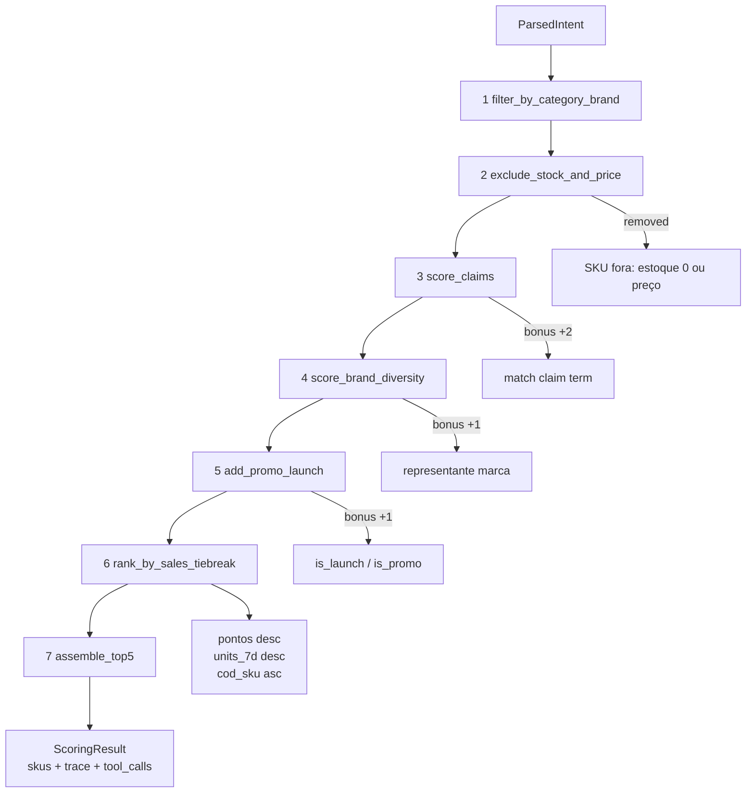
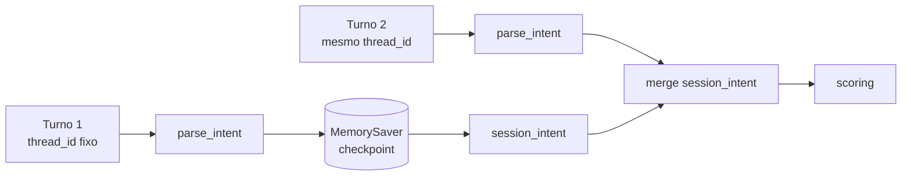

# Arquitetura RecFair

**Última atualização:** 2026-09-13  
**Arquitetura vigente (`CURRENT_ARCH`):** `workflow` · data 2026-09-13 · ADR [0002](adr/0002-workflow-scoring.md)  
**Baseline executável:** `baseline` · data 2026-09-07 · ADR [0001](adr/0001-baseline.md)

RecFair é um assistente de recomendação Top-5 para catálogo de beleza (Grupo Boticário, dados sintéticos). O contrato combina **utilidade** (popularidade na janela de 7 dias, filtros, claims) e **justiça** (diversidade de marca, abstenção, RF-*). Toda arquitetura expõe o mesmo schema de saída (`RecFairOutput`) e é medida pelo golden-set em `data/golden/cases.json`.

---

## Visão geral das arquiteturas

| | `baseline` (E1) | `workflow` (E2, vigente) |
| :--- | :--- | :--- |
| **Padrão** | Monolito — 1× LLM | LangGraph — LLM só em `parse_intent` |
| **Dados no prompt** | Catálogo + vendas inteiros (~29k tokens/caso) | Query NL (~425 tokens/caso) |
| **Ranking** | Modelo no prompt | `tools/scoring/engine.py` (determinístico) |
| **Tools** | 0 | 7 passos lógicos / ~5,8 calls por turno |
| **Memória** | Stateless | `MemorySaver` + `thread_id` |
| **Prompt** | `baseline_v1` | `workflow_v2` |
| **ADR** | [0001](adr/0001-baseline.md) | [0002](adr/0002-workflow-scoring.md) |
| **Relatório eval** | [E1_baseline.ipynb](../eval/notebooks/E1_baseline.ipynb) | [E2_workflow.ipynb](../eval/notebooks/E2_workflow.ipynb) |
| **Run de referência** | `eval/runs/00b767134d22.json` | `eval/runs/d79563e06651.json` |

Detalhes numéricos da comparação E1×E2 (mesmo modelo, mesma sessão, `golden_revision=15f3ed6986de9ce9`): ver **seção [Evidência](#evidência-de-eval)** — não duplicamos tabelas aqui.

---

## Mapa de módulos (código)

```
recfair/
├── cli.py                 # UI terminal; /trace, /reset, /arch
├── config.py              # CURRENT_ARCH, paths, modelo
├── graphs/
│   ├── registry.py        # architecture_id → run()
│   ├── baseline.py        # E1: stuffing + structured output
│   └── workflow/          # E2: LangGraph
│       ├── __init__.py    # build_graph(), run(), reset_checkpoint()
│       ├── state.py       # WorkflowState
│       └── nodes/         # intent, scoring, abstain, synthesize
├── tools/scoring/
│   ├── engine.py          # Fonte de verdade do ranking (7 passos)
│   └── trace.py           # ScoreTrace (observabilidade)
├── schemas/               # RecFairOutput, ParsedIntent
├── prompts/               # baseline_v1, workflow_v2
├── data/                  # catalog, claims, inventory → CSV/SQLite
└── observability/         # tokens, custo, run_record

eval/
├── runner.py              # run_eval(arch=...)
├── verify.py              # RF-* + gaps E2
├── gold.py                # gabarito → engine.py
├── report.py              # tabelas HTML para notebooks
├── notebooks/             # relatórios (Markdown + imports)
└── runs/                  # manifests JSON por execução
```

---

## Arquitetura `baseline` (E1)

**Objetivo:** baseline mínimo e honesto — uma chamada Gemini com catálogo e vendas no contexto, saída estruturada `RecFairOutput`.

**Ganho esperado:** simplicidade, zero infra de grafo/tools, exercita interpretação NL end-to-end.

**Limitação medida:** agregação `units_7d`, desempate, preço/estoque/claims e memória multi-turn ficam no LLM — não determinístico. Ver run `00b767134d22` e notebook E1.

### Fluxo (componentes)



### Sequência de execução



### Peças técnicas

| Peça | Arquivo | Notas |
| :--- | :--- | :--- |
| Runner | `recfair/graphs/baseline.py` | Cache de prompt tables; 1× `chamadas_llm` |
| Prompt | `recfair/prompts/baseline_v1.py` | Instruções + CSVs inline |
| Schema saída | `recfair/schemas/output.py` | `status`, `items[]`, `reason`, `halt_reason` |
| Instrumentação | `recfair/observability/tokens.py` | tokens in/out, custo estimado |

**Deliberadamente ausente:** LangGraph, tools, memória, MCP, `tb_claims`, `tb_inventory` no prompt E1.

---

## Arquitetura `workflow` (E2, vigente)

**Objetivo:** separar **interpretação NL** (`parse_intent`) de **execução determinística** (pipeline de scoring), com memória de sessão e observabilidade por SKU.

**Ganho esperado:** ranking reprodutível, prompts curtos, trace auditável, suporte a claims/inventory, multi-turn T31–T33.

**Resultado:** confirmado na comparação E2 — ver run `d79563e06651` e notebook E2 (interpretação na seção F.1 do notebook).

### Grafo LangGraph



**Controles:** `recursion_limit=12` (grafo acíclico, 4 nós); roteamento condicional `abstain | score`; término em `END` ou `halt_reason` em exceção.

### Pipeline de scoring (7 passos — `engine.py`)

Invocado **sem LLM** a partir do `ParsedIntent` mergeado com `session_intent`.



| Passo | Efeito | Trace `action` |
| :---: | :--- | :--- |
| 1 | Pool por `category` / `brand` | `pool` |
| 2 | Remove sem estoque ou `price > max_price_brl` | `removed` / `pool` |
| 3 | +2 se termo ∈ texto `tb_claims` | `bonus` |
| 4 | +1 melhor SKU por marca (se `require_diversity`) | `bonus` |
| 5 | +1 launch; +1 promo | `bonus` |
| 6 | Ordenação determinística | `ranked` |
| 7 | Top `N_RECOMMEND` (5) | `pool` |

`eval/gold.py` delega ao mesmo `score_recommendation` — **gabarito offline = runtime**.

### Memória de sessão



Isolamento: um bucket por `thread_id`. CLI: UUID por sessão; eval: `thread_id=case_id`; `/reset` apaga checkpoint.

### Tools locais vs MCP

Integração via **funções Python in-process** sobre CSV/SQLite (`recfair/data/`). MCP não adotado no E2: dados empacotados, consumidor único, latência mínima — ver ADR 0002.

### Peças técnicas

| Peça | Arquivo |
| :--- | :--- |
| Montagem grafo | `recfair/graphs/workflow/__init__.py` |
| Estado | `recfair/graphs/workflow/state.py` |
| Intent LLM | `recfair/graphs/workflow/nodes/intent.py` |
| Scoring + synth | `recfair/graphs/workflow/nodes/scoring.py` |
| Engine | `recfair/tools/scoring/engine.py` |
| Trace | `recfair/tools/scoring/trace.py` |
| Prompt intent | `recfair/prompts/workflow_v2.py` |

---

## Contrato de saída (estável)

`RecFairOutput` (`recfair/schemas/output.py`):

- `status`: `recommendation` | `abstention`
- `items[]`: SKU, nome, marca, `units_7d`, metadados opcionais
- `reason` / `halt_reason`: abstenção ou limite

Entrada NL → `ParsedIntent` (`recfair/schemas/intent.py`) **apenas no workflow**.

---

## Dados

| Tabela | Origem | Usado em |
| :--- | :--- | :--- |
| `tb_catalogo`, `tb_vendas` | Sintéticos E1 | baseline (prompt), workflow (engine) |
| `tb_claims` | PDPs curadas; manifest `data/claims_manifest.json` | workflow passo 3 |
| `tb_inventory` | Snapshot 2026-09-01 | workflow passo 2, 5 |

Regenerar: `make data`.

Golden-set: `data/golden/cases.json` — T01–T30 imutáveis; T31–T38 acrescentados no E2. Hash: `golden_revision` em cada run.

---

## Evidência de eval

Comparação principal E2 (baseline reexecutado vs workflow, mesmo `gemini-3.5-flash-lite`, mesma sessão 2026-09-13):

| Artefato | Conteúdo |
| :--- | :--- |
| [eval/notebooks/E2_workflow.ipynb](../eval/notebooks/E2_workflow.ipynb) | Relatório completo: hipótese, comparação, interpretação F.1, modos de falha |
| [eval/runs/00b767134d22.json](../eval/runs/00b767134d22.json) | Manifest **baseline** — campo `resumo` |
| [eval/runs/d79563e06651.json](../eval/runs/d79563e06651.json) | Manifest **workflow** — campo `resumo` |
| [eval/notebooks/E1_baseline.ipynb](../eval/notebooks/E1_baseline.ipynb) | Relatório E1 (30 casos, régua original) |

Cada manifest registra: `run_id`, `architecture_id`, `golden_revision`, `git_sha`, latência, tokens, `tool_calls`, `scoring_trace` por caso.

**Resumo executivo (não substitui os JSONs):** workflow supera baseline na mesma régua E2 (+22 acertos gerais, −97% custo estimado, −58% latência mediana); detalhes e ressalvas (n=38, gabarito recalculado) estão no notebook E2 seção F.1.

---

## Observabilidade

| Canal | O quê |
| :--- | :--- |
| `ScoreTrace` | Cada inclusão/exclusão/bônus por SKU e passo |
| Manifest `eval/runs/*.json` | Métricas agregadas + trace por caso |
| CLI `/trace` | JSON do último scoring na sessão |
| CLI `/reset` | Limpa checkpoint do `thread_id` |

---

## Executar

```bash
make chat ARCH=current    # vigente → workflow (via config.CURRENT_ARCH)
make chat ARCH=workflow
make chat ARCH=baseline   # Makefile default se omitir ARCH
make data
```

Golden-set: notebooks em `eval/notebooks/` chamam `eval.runner.run_eval` — não há alvo `make eval`.

---

## Deliberadamente fora do E2

| Peça | Motivo | Roadmap |
| :--- | :--- | :--- |
| `sanitize_pii` / guardrails | T26–T30 = gaps documentados | E3 — agente segurança |
| Match claims semântico | Substring `_claim_match` frágil | E3 — agente claims |
| MCP | Sem reuso multi-agente medido | E3+ se fonte externa compartilhada |
| RAG vetorial | Não necessário ao catálogo tabular | — |
| ReAct | Custo + não-determinismo no scoring | Rejeitado ADR 0002 |

---

## Histórico de arquiteturas

| id | data | ADR | Status |
| :--- | :--- | :--- | :--- |
| `baseline` | 2026-09-07 | [0001](adr/0001-baseline.md) | executável (`ARCH=baseline`) |
| `workflow` | 2026-09-13 | [0002](adr/0002-workflow-scoring.md) | **vigente** (`CURRENT_ARCH`) |
