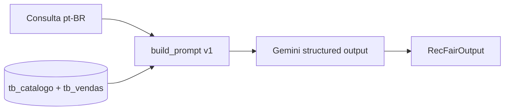

# Arquitetura RecFair (vigente)

**Última atualização:** 2026-09-07  
**Arquitetura vigente:** `baseline` (default do CLI)

## Fluxo E1



## Executar

```bash
make chat ARCH=baseline
```

Golden-set: notebook `eval/notebooks/E1_baseline_report.ipynb` (`eval.runner.run_eval`).

## Contrato de saída

`RecFairOutput` em `recfair/schemas/output.py` — estável entre versões. Campos reservados (`price_brl`, `explanation`, …) nascem `null` no E1.

## O que não está no E1

- Tools / MCP / SQL no agente
- RAG de fichas de claim
- Memória de sessão / LangGraph
- Guardrails de PII/injection dedicados

## Histórico

| id | data | ADR |
| :--- | :--- | :--- |
| baseline | 2026-09-07 | [0001-baseline.md](adr/0001-baseline.md) |
