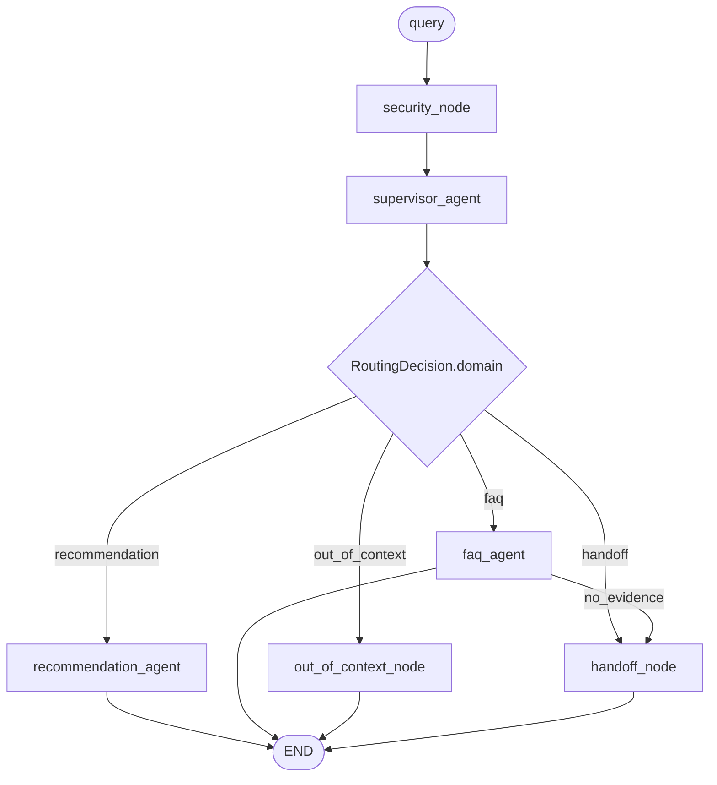
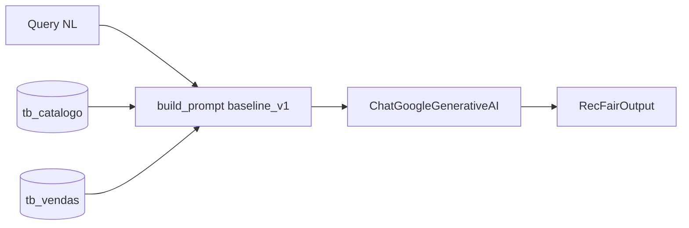
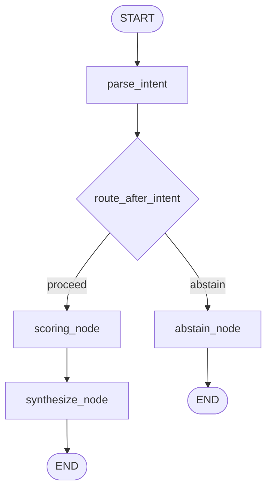

# Arquitetura RecFair

**Última atualização:** 2026-09-19  
**Arquitetura vigente (`CURRENT_ARCH`):** `multiagent` · data 2026-09-19 · ADR [0003](adr/0003-multiagent-supervisor.md)  
**Ainda executáveis:** `workflow` · 2026-09-13 · ADR [0002](adr/0002-workflow-scoring.md) · `baseline` · 2026-09-07 · ADR [0001](adr/0001-baseline.md)  
**Régua E3:** ADR [0004](adr/0004-layered-evaluation-metrics.md) (nDCG@5 no pacote `eval/`, não no runtime)

RecFair é um assistente de recomendação Top-5 para catálogo de beleza (Grupo Boticário, dados sintéticos), agora também com FAQ de e-commerce/revenda e transbordo humano. Toda arquitetura expõe `RecFairOutput` e é medida pelo golden-set em `data/golden/cases.json`.

---

## Visão geral das arquiteturas

| | `baseline` (E1) | `workflow` (E2) | `multiagent` (E3, vigente) |
| :--- | :--- | :--- | :--- |
| **Padrão** | Monolito — 1× LLM | LangGraph — LLM só em `parse_intent` | Supervisor — 3 agentes + 2 nós |
| **Dados no prompt** | Catálogo + vendas (~29k tokens) | Query NL | Query sanitizada + skills index / FAQ chunks |
| **Ranking** | Modelo no prompt | `engine.py` (substring claims) | Mesmo engine + `match_claims_semantic` |
| **Guardrail** | Não | Não | `security_node` regex/redact |
| **FAQ / handoff** | Não | Não | Agente FAQ + nó template `0800-000-0000` |
| **Memória** | Stateless | `MemorySaver` | `MemorySaver` (mesmo recorte) |
| **Prompt** | `baseline_v1` | `workflow_v2` | `multiagent_v3` + intent v2 |
| **ADR** | [0001](adr/0001-baseline.md) | [0002](adr/0002-workflow-scoring.md) | [0003](adr/0003-multiagent-supervisor.md) |
| **Relatório eval** | [E1_baseline.ipynb](../eval/notebooks/E1_baseline.ipynb) | [E2_workflow.ipynb](../eval/notebooks/E2_workflow.ipynb) | [E3_evaluation.ipynb](../eval/notebooks/E3_evaluation.ipynb) |

---

## Mapa de módulos (código)

```
recfair/
├── cli.py                      # default = vigente (multiagent)
├── config.py                   # CURRENT_ARCH=multiagent
├── graphs/
│   ├── registry.py
│   ├── baseline.py
│   ├── workflow/               # E2 — intocado no incremento
│   └── multiagent/             # E3
│       ├── skills.py           # dict SKILLS inline
│       └── nodes/              # security, supervisor, recommend, faq, handoff
├── tools/
│   ├── scoring/engine.py       # claim_matcher opcional (default = E2)
│   ├── guardrails.py
│   └── claims_semantic.py
├── rag/                        # FAISS FAQ + build_indexes
├── schemas/                    # RecFairOutput, ParsedIntent, RoutingDecision
├── prompts/                    # baseline_v1, workflow_v2, multiagent_v3
└── observability/agent_trace.py

eval/
├── runner.py                   # run_eval + resumo_v3
├── verify.py                   # legado + famílias E3 + campos v3
├── metrics.py                  # ndcg_at_5, classify_severity
├── requirements.py             # RF-01–RF-07
├── gold.py                     # gold_for + gold_naive_for
└── notebooks/E3_evaluation.ipynb
```

---

## Arquitetura `multiagent` (E3, vigente)

**Objetivo:** atacar domínio único, claims substring e ausência de guardrail **sem** reescrever o ranking E2.

**Ganho esperado:** T26–T30 com sanitização real; T39–T43 (FAQ/rota/handoff) >0%; T18/T21/T22 parciais. Painel A (T01–T38) pode empatar ou cair 0–2 pp por roteamento — resultado válido.

**Resultado de eval ponta a ponta:** pendente de `GOOGLE_API_KEY` na sessão de correção. Testes unitários da régua e dos guardrails não usam LLM.

### Grafo LangGraph



**Controles:** `recursion_limit=16`; um replanejamento FAQ→handoff (`replanned=True` no contrato); skills carregadas só depois do roteamento (`load_skill`); especialistas gravam `last_result: AgentResult`.

### Por que segurança, out_of_context e handoff não são agentes

Não passam no teste de 4 colunas (escopo / tools / instrução / avaliação isolada): são regex+redact e templates fixos, sem raciocínio LLM. `out_of_context` redireciona perguntas externas; `handoff` transborda in-contexto com telefone (ADR 0005).

### Pipeline de recomendação (interno ao especialista)

Reusa `parse_intent` E2 + `score_recommendation(..., claim_matcher=match_claims_semantic)` + synthesize. O default do engine (substring) permanece para `workflow` e `eval/gold.py`.

### Memória

Mesmo recorte E2: `MemorySaver` + `thread_id` → `session_intent`. T09/T31 **não** são alvo deste incremento.

### Tools locais vs MCP

Guardrail, claims embed, retrieve_faq e scoring são funções in-process. MCP recusado: um consumidor, dados empacotados, sem fronteira de permissão (ADR 0003).

---

## Arquitetura `baseline` (E1)

**Objetivo:** baseline mínimo — uma chamada Gemini com catálogo e vendas no contexto, saída `RecFairOutput`.



**Deliberadamente ausente no E1:** LangGraph, tools, memória, claims, inventory, FAQ.

---

## Arquitetura `workflow` (E2)

**Objetivo:** separar interpretação NL de ranking determinístico.



Pipeline de 7 passos em `engine.py` (ADR 0002). `eval/gold.py` delega ao mesmo engine **sem** matcher semântico.

---

## Contrato de saída

`RecFairOutput` (`recfair/schemas/output.py`):

- `status`: `recommendation` | `abstention` | `faq` | `handoff` | `out_of_context`
- `items[]`: Top-5 ou vazio
- `answer_text` / `handoff_phone` / `agents_route`: campos E3 opcionais (default vazio)
- T01–T38 continuam usando só `recommendation`/`abstention`

Contrato entre agentes: `RoutingDecision` e `AgentResult` em `schemas/routing.py`. O grafo persiste `last_result` em cada especialista; FAQ `no_evidence`/`error` e recomendação `error` roteiam para `handoff_node`. Perguntas totalmente fora de O Boticário vão para `out_of_context_node` (template fixo, sem telefone).

---

## Avaliação (ADR 0004)

Régua principal E3: **nDCG@5** (média por escopo) + `aprovado_exact` + `severity` + breakdown RF-01–RF-07 + `gap_intentional_pass` em T16–T30.

Escopos: `restrict_core` T01–T15 · `gap` T16–T30 · `memory` T31–T33 · `scoring` T34–T38 · `overall` T01–T38.

Painéis experimentais do notebook E3:

- **A — congelado:** T01–T38 (comparável ao E2)
- **B — expandido:** T01–T43 (FAQ/routing/handoff)

`e1_rate_*` / `e2_rate_*` permanecem no manifest. Métricas **não** vivem no notebook.

Golden-set: T01–T38 imutáveis; T39–T43 acrescentados. Hash `golden_revision` em cada run.

---

## Dados

| Artefato | Uso |
| :--- | :--- |
| `tb_catalogo`, `tb_vendas` | baseline + engine |
| `tb_claims`, `tb_inventory` | engine passos 2–5 |
| `data/kb/faq.pdf`, `revenda.md` | RAG FAQ (LangChain: `PyPDFLoader` + `RecursiveCharacterTextSplitter`; PDF 1024/120, revenda 512/60; MiniLM + FAISS COSINE; k=5) |
| `data/indexes/` | FAISS claims+FAQ (gitignored; `make data`) |

Regenerar: `make data` (CSVs **e** índices). O MiniLM autentica no Hugging Face Hub com `HF_TOKEN` (exportado do `.env` pelo Makefile e por `export_hf_token()`).

---

## Evidência de eval

| Artefato | Conteúdo |
| :--- | :--- |
| [E2_workflow.ipynb](../eval/notebooks/E2_workflow.ipynb) | Comparação E1×E2 (régua então vigente) |
| [E3_evaluation.ipynb](../eval/notebooks/E3_evaluation.ipynb) | Seções A–J + régua `e3_*`; `run_eval` das três arches |
| [E1_baseline.ipynb](../eval/notebooks/E1_baseline.ipynb) | Relatório E1 (intacto) |

Runs JSON em `eval/runs/` (gitignore). Sem API key, o notebook documenta o caminho e os testes unitários substituem o smoke da régua.

---

## Observabilidade

| Canal | O quê |
| :--- | :--- |
| `AgentTrace` | latência, LLM, tools, tokens por `agent_id` |
| `ScoreTrace` | bônus/exclusões do engine |
| CLI `/trace` | output + traces de agente e scoring |
| Manifest | `resumo` legado + `resumo_v3` |

---

## Executar

```bash
make chat                 # vigente → multiagent (ARCH=current)
make chat ARCH=workflow
make chat ARCH=baseline
make data                 # CSVs + FAISS
```

Golden-set: `eval/notebooks/E3_evaluation.ipynb` chama `eval.runner.run_eval` — não há `make eval`.

---

## Deliberadamente fora do E3

| Peça | Motivo |
| :--- | :--- |
| MCP | Sem reuso nem fronteira |
| Agente LLM de segurança / claims | Nós/tools determinísticos bastam |
| Pacote `recfair/skills/` | Dict inline atende o enunciado |
| Correção de intent/memória T09/T31 | Fora de escopo medido |
| nDCG no runtime | Só no pacote `eval/` |
| T44–T46 | Pós-MVP |

---

## Histórico de arquiteturas

| id | data | ADR | Status |
| :--- | :--- | :--- | :--- |
| `baseline` | 2026-09-07 | [0001](adr/0001-baseline.md) | executável (`ARCH=baseline`) |
| `workflow` | 2026-09-13 | [0002](adr/0002-workflow-scoring.md) | executável (`ARCH=workflow`) |
| `multiagent` | 2026-09-19 | [0003](adr/0003-multiagent-supervisor.md) | **vigente** (`CURRENT_ARCH`) |
