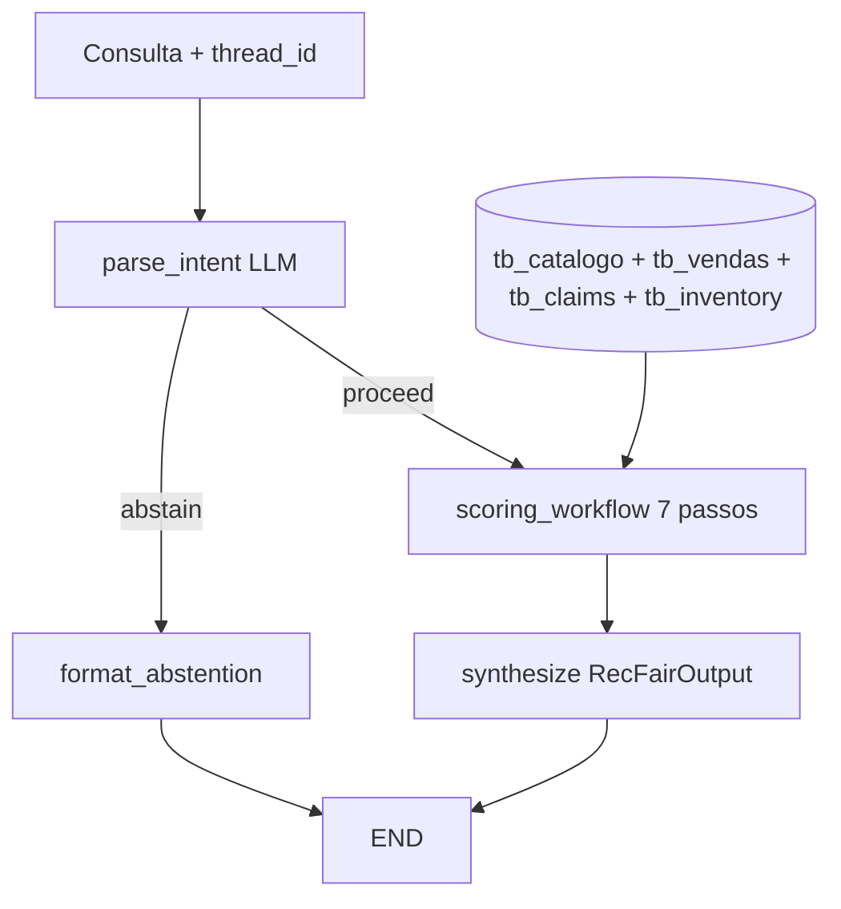

# Arquitetura RecFair (vigente)

**Última atualização:** 2026-09-13  
**Arquitetura vigente:** `workflow` (default do CLI)

## Fluxo E2 (`workflow`)



O motor `recfair/tools/scoring/engine.py` é a **fonte de verdade** do gabarito (`eval/gold.py` delega ao engine). Baseline E1 permanece executável e é **reexecutado** na mesma régua para comparação.

## Layout do pacote

| Camada | Caminho | Papel |
| :--- | :--- | :--- |
| Contratos | `schemas/` | `RecFairOutput`, `ParsedIntent` |
| Tools | `tools/scoring/` | Pipeline determinístico invocado pelos nós |
| Arquitetura simples | `graphs/baseline.py` | Runner monolítico (E1) |
| Arquitetura com grafo | `graphs/workflow/` | `state.py`, `nodes/`, montagem LangGraph |
| Entrada | `graphs/registry.py` | `architecture_id` → `run()` |

### Pipeline de scoring (determinístico)

| Passo | Efeito |
| :---: | :--- |
| 1 `filter_by_category_brand` | Pool por categoria/marca |
| 2 `exclude_stock_and_price` | Exclui estoque 0 e preço > teto |
| 3 `score_claims` | +2 por match em `tb_claims` |
| 4 `score_brand_diversity` | +1 representante de marca |
| 5 `add_promo_launch` | +1 launch; +1 promo |
| 6 `rank_by_sales_tiebreak` | pontos → `units_7d` → `cod_sku` |
| 7 `assemble_top5` | Top 5 |

## Executar

```bash
make chat              # workflow (vigente)
make chat ARCH=baseline
make chat ARCH=workflow
make data              # regenera CSV/SQLite incluindo tb_claims e tb_inventory
```

Golden-set: notebook `eval/notebooks/E2_Souza_report.ipynb` (`eval.runner.run_eval`).

## Contrato de saída

`RecFairOutput` em `recfair/schemas/output.py` — estável entre versões.

## Observabilidade

- `ScoreTrace` por passo do scoring → `CaseMetrics.scoring_trace` → manifest de run.
- CLI: `/trace` (JSON com trace), `/reset` (limpa checkpoint `thread_id`).

## Dados

| Tabela | Origem |
| :--- | :--- |
| `tb_catalogo`, `tb_vendas` | Sintéticos (E1) |
| `tb_claims` | Texto curado de PDPs boticario.com.br; manifest em `data/claims_manifest.json` |
| `tb_inventory` | Snapshot `2026-09-01` sintético alinhado ao catálogo |

## O que não está no E2

- `sanitize_pii` / guardrails dedicados (T26–T30 = gaps)
- MCP
- RAG vetorial

## Histórico

| id | data | ADR |
| :--- | :--- | :--- |
| baseline | 2026-09-07 | [0001-baseline.md](adr/0001-baseline.md) |
| workflow | 2026-09-13 | [0002-workflow-scoring.md](adr/0002-workflow-scoring.md) |
