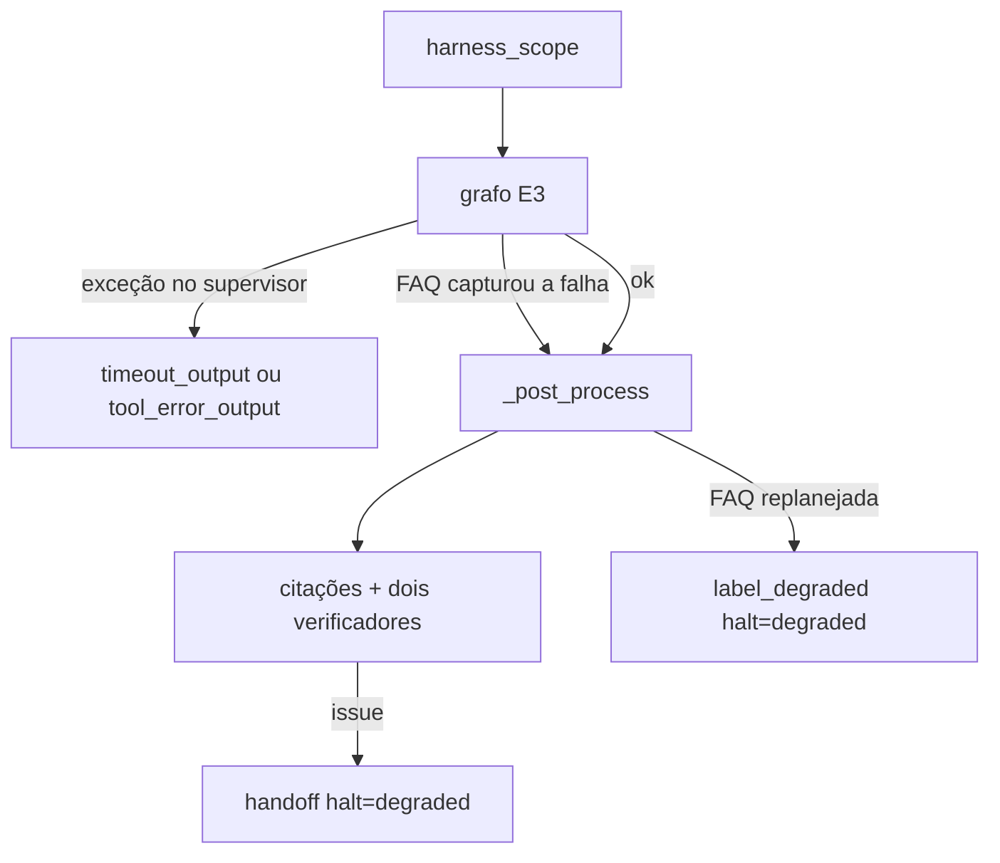
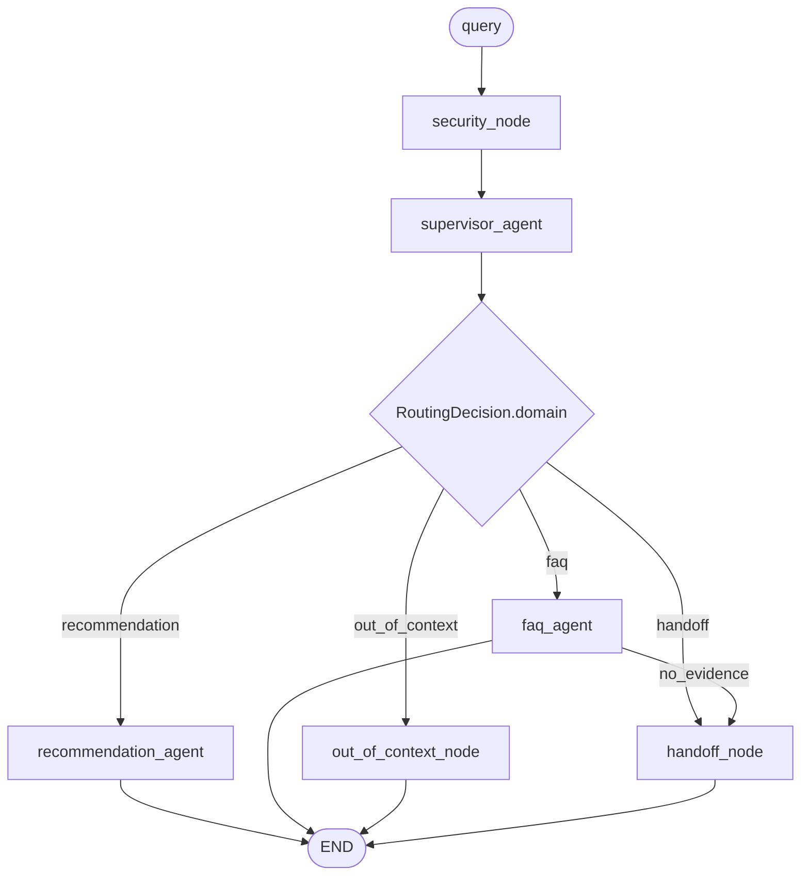
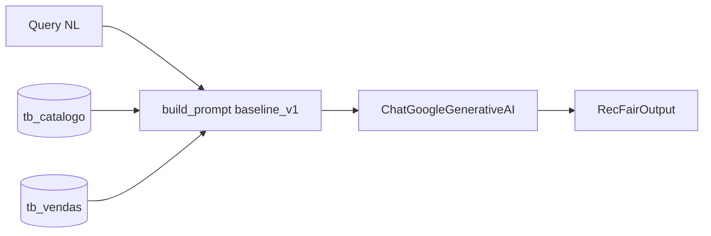
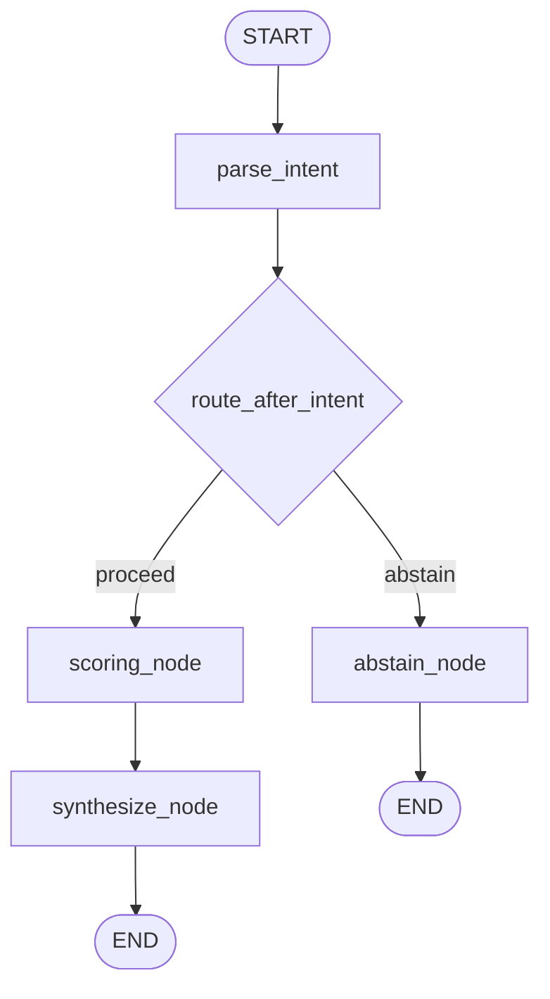
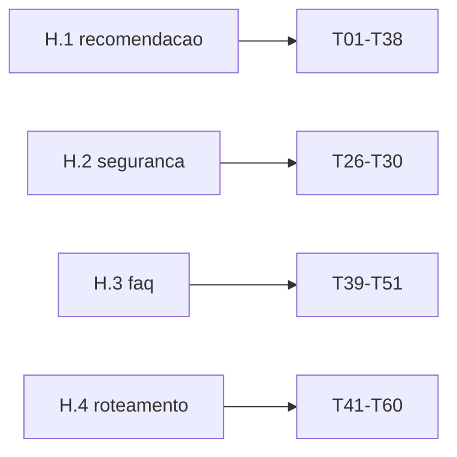

# Arquitetura RecFair

**Última atualização:** 2026-09-27  
**Arquitetura vigente (`CURRENT_ARCH`):** `resilient` · data 2026-09-27 · ADR [0004](adr/0004-resilient-harness.md) (E4: harness + ética)  
**Ainda executáveis:** `multiagent` · 2026-09-19 · ADR [0003](adr/0003-multiagent-supervisor.md) · `workflow` · 2026-09-13 · ADR [0002](adr/0002-workflow-scoring.md) · `baseline` · 2026-09-07 · ADR [0001](adr/0001-baseline.md)

RecFair é um assistente de recomendação Top-5 para catálogo de beleza (Grupo Boticário, dados sintéticos), com FAQ de e-commerce/revenda, transbordo humano, redirecionamento fora de contexto e, no E4, contenção de falhas com resposta degradada rotulada. Toda arquitetura expõe `RecFairOutput` e é medida pelo golden-set em `data/golden/cases.json` (**60 casos**, T01–T60). Perfil capilar e demais eixos de paridade estão em `data/golden/min_pairs.json` (P01–P05), fora da taxa agregada.

---

## Visão geral das arquiteturas

| | `baseline` (E1) | `workflow` (E2) | `multiagent` (E3) | `resilient` (E4, vigente) |
| :--- | :--- | :--- | :--- | :--- |
| **Padrão** | Monolito — 1× LLM | LangGraph — LLM só em `parse_intent` | Supervisor — 3 agentes + 3 nós | Mesmo grafo E3 + harness |
| **Dados no prompt** | Catálogo + vendas (~29k tokens) | Query NL | Query sanitizada + skills / FAQ | Idem E3; prompt `v4` (equidade) |
| **Ranking** | Modelo no prompt | `engine.py` (substring claims) | Engine E2 + `semantic_fallback` | Idem E3 |
| **Guardrail** | Não | Não | `security_node` regex/redact | Idem + verify pós-grafo |
| **FAQ / handoff / out_of_context** | Não | Não | Agente FAQ + nós template | Idem; FAQ instável → degradado |
| **Contenção** | Schema inválido → abstenção | `recursion_limit=12` | `recursion_limit=16` | Retry + timeout nos adapters; verify pós-`invoke` |
| **Memória** | Stateless | `MemorySaver` | `MemorySaver` | Mesmo checkpointer E3 |
| **Prompt** | `baseline_v1` | `workflow_v2` | `multiagent_v3` | `multiagent_v4` |
| **ADR** | [0001](adr/0001-baseline.md) | [0002](adr/0002-workflow-scoring.md) | [0003](adr/0003-multiagent-supervisor.md) | [0004](adr/0004-resilient-harness.md) |
| **Relatório eval** | [E1_baseline.ipynb](../eval/notebooks/E1_baseline.ipynb) | [E2_workflow.ipynb](../eval/notebooks/E2_workflow.ipynb) | [E3_multiagents.ipynb](../eval/notebooks/E3_multiagents.ipynb) | [E4_robustez_etica.ipynb](../eval/notebooks/E4_robustez_etica.ipynb) |

---

## Mapa de módulos (código)

```
recfair/
├── cli.py                      # default = vigente (resilient)
├── config.py                   # CURRENT_ARCH=resilient
├── graphs/
│   ├── registry.py
│   ├── baseline.py
│   ├── workflow/
│   ├── multiagent/             # E3
│   └── resilient/              # E4 runner
├── harness/                    # retry, timeout, degrade, verify
├── tools/
│   ├── scoring/engine.py
│   ├── guardrails.py
│   └── claims_semantic.py
├── rag/
├── schemas/
├── prompts/                    # … + multiagent_v4
└── observability/agent_trace.py

eval/
├── runner.py
├── stats.py / reliability.py / ethics.py
├── report/e4_panels.py
└── notebooks/E4_robustez_etica.ipynb
```

---

## Arquitetura `resilient` (E4, vigente)

**Decisão:** ADR [0004](adr/0004-resilient-harness.md). Não há grafo novo. `graphs/resilient/runner.py` compila o LangGraph E3 e liga o pacote `recfair/harness/` só naquela chamada.

**Componentes:**

| Peça | Onde | Papel |
| :--- | :--- | :--- |
| Escopo | `harness/context.py` | `ContextVar`; default desligado, então `ARCH=multiagent` não retenta |
| Adapters | `harness/adapters.py` | Timeout + retry no LLM estruturado e no retrieve FAQ |
| Retry | `harness/retry.py` | Só falha transitória; backoff exponencial |
| Timeout | `harness/timeout.py` | Thread daemon; estouro → `TimeoutExpired` |
| Injeção | `harness/unstable.py` | `FonteIndisponivel` com `RECFAIR_INJECT_FAILURE_PROB` (default 0) |
| Degradação | `harness/degrade.py` | Prefixo `[Resposta parcial]`, `degraded=True` |
| Citações | `harness/citations.py` | Claims do SKU ou excerpts da FAQ |
| Verify | `harness/verify_output.py` | `verify_evidence` + `verify_confidence` após o `invoke` |
| Prompt | `prompts/multiagent_v4.py` | Equidade; `dispatch.py` só escolhe v4 com o harness ligado |

**Ganho esperado:** contenção demonstrável sem LLM; falha silenciosa vira handoff rotulado. Empate de nDCG@5 no Painel A, dentro do intervalo de Wilson, é resultado válido. Ponte: [`eval/notebooks/E4_robustez_etica.ipynb`](../eval/notebooks/E4_robustez_etica.ipynb) e `tests/test_harness.py`. Runs `resilient` full ainda não estão em `eval/runs/`.

### Fluxo do runner

O verify **não** é nó do LangGraph. Roda em `_post_process` quando o `invoke` devolve state.


```mermaid
flowchart TD
    scope[harness_scope] --> invoke[grafo E3]
    invoke -->|exceção no supervisor| esc[timeout_output ou tool_error_output]
    invoke -->|FAQ capturou a falha| post[_post_process]
    invoke -->|ok| post
    post --> checks[citações + dois verificadores]
    checks -->|issue| deg["handoff halt=degraded"]
    post -->|FAQ replanejada| lab["label_degraded halt=degraded"]
```

Injeção de FAQ (`FonteIndisponivel`) não chega ao `except` do runner: `faq_node` transforma em handoff e o pós-processo só acrescenta o rótulo `[Resposta parcial]`. `timeout_output` / `tool_error_output` cobrem exceção que escapa do grafo (supervisor).

### Grafo (o mesmo do E3)


```mermaid
flowchart TD
    START([query]) --> SEC[security_node]
    SEC --> SUP[supervisor]
    SUP --> ROUTE{domain}
    ROUTE -->|recommendation| REC[recommendation]
    ROUTE -->|faq| FAQ[faq]
    ROUTE -->|out_of_context| OOC[out_of_context]
    ROUTE -->|handoff| HO[handoff]
    FAQ -->|no_evidence ou error| HO
    REC -->|error| HO
    REC --> ENDN([END])
    FAQ --> ENDN
    OOC --> ENDN
    HO --> ENDN
```

**Controles:** `recursion_limit=16`; timeout LLM 45 s e FAQ 20 s; até 3 retries extras só em falha transitória; injeção de falha default 0. Checkpointer in-memory igual ao E3.

### Prompt e tools

Supervisor e FAQ leem `prompts/dispatch.py`. Harness ligado → `multiagent_v4` (não inferir gênero, idade, registro ou tipo de cabelo para piorar a rota). Harness desligado → `multiagent_v3`. Ranking, guardrail, RAG e scoring são os do E3; o harness só embrulha o `invoke` do LLM e o `retrieve_faq`.

---

## Arquitetura `multiagent` (E3)

**Objetivo:** atacar domínio único, claims substring e ausência de guardrail **sem** reescrever o ranking E2.

**Ganho esperado:** T26–T30 com sanitização real; T39–T60 (FAQ/roteamento/handoff/out_of_context) >0%; T18/T21/T22 parciais. Painel A (T01–T38) pode empatar ou cair 0–2 pp por roteamento — resultado válido.

**Resultado de eval ponta a ponta:** documentado em [`eval/notebooks/E3_multiagents.ipynb`](../eval/notebooks/E3_multiagents.ipynb) (seção H). Testes unitários da régua e dos guardrails não usam LLM.

### Grafo LangGraph


```mermaid
flowchart TD
    START([query]) --> SEC[security_node]
    SEC --> SUP[supervisor_agent]
    SUP --> ROUTE{RoutingDecision.domain}
    ROUTE -->|recommendation| REC[recommendation_agent]
    ROUTE -->|faq| FAQ[faq_agent]
    ROUTE -->|out_of_context| OOC[out_of_context_node]
    ROUTE -->|handoff| HO[handoff_node]
    FAQ -->|no_evidence| HO
    REC --> END([END])
    FAQ --> END
    OOC --> END
    HO --> END
```

**Controles:** `recursion_limit=16`; um replanejamento FAQ→handoff (`replanned=True` no contrato); skills carregadas só depois do roteamento (`load_skill`); especialistas gravam `last_result: AgentResult`.

### Por que segurança, out_of_context e handoff não são agentes

Não passam no teste de 4 colunas (escopo / tools / instrução / avaliação isolada): são regex+redact e templates fixos, sem raciocínio LLM. `out_of_context` redireciona perguntas externas; `handoff` transborda in-contexto com telefone (ADR 0003 §3.3).

### Pipeline de recomendação (interno ao especialista)

Reusa `parse_intent` E2 + `score_recommendation(..., semantic_fallback=True)` + synthesize. Substring é a régua (igual E2/gold); fallback semântico via `match_substring_or_semantic` por SKU só quando nenhum item do pool acerta substring. Oráculos de paráfrase ficam em `tests/test_claims_semantic.py`, fora do H.1.

### Memória

Mesmo recorte E2: `MemorySaver` + `thread_id` → `session_intent`. T09/T31 **não** são alvo deste incremento.

### Tools locais vs MCP

Guardrail (`sanitize_query`), claims embed, retrieve_faq e scoring são funções in-process. MCP recusado: um consumidor, dados empacotados, sem fronteira de permissão (ADR 0003).

---

## Arquitetura `baseline` (E1)

**Objetivo:** baseline mínimo — uma chamada Gemini com catálogo e vendas no contexto, saída `RecFairOutput`.


```mermaid
flowchart LR
    Q[Query NL] --> PROMPT[build_prompt baseline_v1]
    CAT[(tb_catalogo)] --> PROMPT
    SAL[(tb_vendas)] --> PROMPT
    PROMPT --> LLM[ChatGoogleGenerativeAI]
    LLM --> OUT[RecFairOutput]
```

**Deliberadamente ausente no E1:** LangGraph, tools, memória, claims, inventory, FAQ.

---

## Arquitetura `workflow` (E2)

**Objetivo:** separar interpretação NL de ranking determinístico.


```mermaid
flowchart TD
    START([START]) --> PI[parse_intent]
    PI --> ROUTE{route_after_intent}
    ROUTE -->|abstain| AB[abstain_node]
    ROUTE -->|proceed| SC[scoring_node]
    SC --> SY[synthesize_node]
    AB --> END1([END])
    SY --> END2([END])
```

Pipeline de 7 passos em `engine.py` (ADR 0002). `eval/gold.py` delega ao mesmo engine **sem** matcher semântico.

---

## Contrato de saída

`RecFairOutput` (`recfair/schemas/output.py`):

- `status`: `recommendation` | `abstention` | `faq` | `handoff` | `out_of_context`
- `items[]`: Top-5 ou vazio
- `answer_text` / `handoff_phone` / `agents_route`: campos E3 opcionais (default vazio)
- `degraded` / `degraded_reason` / `citations`: campos E4 (default off). `halt_reason` aceita também `timeout`, `degraded`, `tool_error`
- T01–T38 continuam usando só `recommendation`/`abstention`

Contrato entre agentes: `RoutingDecision` e `AgentResult` em `schemas/routing.py`. O grafo persiste `last_result` em cada especialista; FAQ `no_evidence`/`error` e recomendação `error` roteiam para `handoff_node`. Perguntas totalmente fora de O Boticário vão para `out_of_context_node` (template fixo, sem telefone).

---

## Avaliação (ADR 0003 §3.2)

Régua principal E3: **nDCG@5** (média por escopo) + `aprovado_exact` + `severity` + breakdown RF-01–RF-07 + `gap_intentional_pass` em T16–T30.

Escopos legado (T01–T38): `restrict_core` T01–T15 · `gap` T16–T30 · `memory` T31–T33 · `scoring` T34–T38 · `overall` T01–T38.

### Contextos de avaliação E3 (H.1–H.4)

Definidos em `eval/contexts.py`:


```mermaid
flowchart LR
    H1[H.1 recomendacao] --> T01_T38[T01-T38]
    H2[H.2 seguranca] --> T26_T30[T26-T30]
    H3[H.3 faq] --> T39_T51[T39-T51]
    H4[H.4 roteamento] --> T41_T60[T41-T60]
```

| Contexto | Casos | Arquiteturas medidas |
| :--- | :--- | :--- |
| `recomendacao` | T01–T38 | baseline, workflow, multiagent |
| `seguranca` | T26–T30 | baseline, workflow, multiagent |
| `faq` | T39–T51 | multiagent |
| `roteamento` | T41–T60 | multiagent |

Painel A (T01–T38) permanece congelado para comparação com E2. Painéis H.1–H.4 organizam o notebook E3 por contexto.

`e1_rate_*` / `e2_rate_*` permanecem no manifest. Métricas **não** vivem no notebook.

Golden-set: T01–T38 imutáveis; T39–T60 acrescentados em fases (ver ADR 0003 §4.4). Hash `golden_revision` em cada run.

### Avaliação E4 (ADR 0004 §4.7)

A régua T01–T60 e `verify_case` não mudam. O que entra é leitura extra, fora da taxa agregada quando o eixo não é a régua:

| Módulo | O que mede |
| :--- | :--- |
| `eval/stats.py` | Intervalo de Wilson e se dois intervalos se sobrepõem |
| `eval/reliability.py` | Três rodadas da mesma arch; casos que mudam de aprovado |
| `eval/ethics.py` | Peso de dano 0–5, score ponderado, pares P01–P05 |
| `data/golden/min_pairs.json` | Paridade (cabelo, gênero, idade, registro); ouro compartilhado |

Manifests canônicos E1–E3 na régua de 60 casos: `c6d86c0d894f`, `6d5cb78a9e25`, `ae3f3348d3e4` (`golden_revision=3cbcb3e4c4b9cec7`).

---

## Dados

| Artefato | Uso |
| :--- | :--- |
| `tb_catalogo`, `tb_vendas` | baseline + engine |
| `tb_claims`, `tb_inventory` | engine passos 2–5 |
| `data/kb/faq.pdf`, `revenda.md` | RAG FAQ (LangChain: `PyPDFLoader` + `RecursiveCharacterTextSplitter`; PDF 1024/120, revenda 512/60; MiniLM + FAISS COSINE; k=5) |
| `data/indexes/` | FAISS claims+FAQ (gitignored; `make data`) |

Regenerar: `make data` (CSVs **e** índices). O MiniLM autentica no Hugging Face Hub com `HF_TOKEN` (exportado do `.env` pelo Makefile e por `export_hf_token()`).

---

## Evidência de eval

| Artefato | Conteúdo |
| :--- | :--- |
| [E2_workflow.ipynb](../eval/notebooks/E2_workflow.ipynb) | Comparação E1×E2 (régua então vigente) |
| [E4_robustez_etica.ipynb](../eval/notebooks/E4_robustez_etica.ipynb) | Seções A–K: contenção, 3 runs, Wilson, ética, quatro versões |
| [E3_multiagents.ipynb](../eval/notebooks/E3_multiagents.ipynb) | Seções A–J + contextos H.1–H.4 + régua `e3_*`; `run_eval` das três arches |
| [E1_baseline.ipynb](../eval/notebooks/E1_baseline.ipynb) | Relatório E1 (intacto) |

Runs JSON em `eval/runs/` (gitignore). Sem API key, o notebook documenta o caminho e os testes unitários substituem o smoke da régua.

---

## Observabilidade

| Canal | O quê |
| :--- | :--- |
| `AgentTrace` | latência, LLM, tools, tokens por `agent_id` |
| `ScoreTrace` | bônus/exclusões do engine |
| CLI `/trace` | output + traces; linha de status mostra `degradado` |
| Manifest | `resumo` legado + `resumo_v3` |

---

## Executar

```bash
make chat                 # vigente → resilient (ARCH=current)
make chat ARCH=multiagent
make chat ARCH=workflow
make chat ARCH=baseline
make data                 # CSVs + FAISS
```

Golden-set: [`eval/notebooks/E4_robustez_etica.ipynb`](../eval/notebooks/E4_robustez_etica.ipynb) chama `eval.runner.run_eval` — não há `make eval`.

---

## Deliberadamente fora do E4

| Peça | Motivo |
| :--- | :--- |
| Fairness auditor (agente) | E4 mede dano no eval; ADR 0003 já recusou |
| MCP | Sem reuso nem fronteira |
| Memória de longo prazo | Checkpointer in-memory; accountability via `eval/runs/` |
| `multiagent_v2` | Experimento de retrieval; não está no registry |
| Mutar `verify_case` na régua T01–T60 | Skill: comparação principal herdada |

---

## Histórico de arquiteturas

| id | data | ADR | Status |
| :--- | :--- | :--- | :--- |
| `baseline` | 2026-09-07 | [0001](adr/0001-baseline.md) | executável (`ARCH=baseline`) |
| `workflow` | 2026-09-13 | [0002](adr/0002-workflow-scoring.md) | executável (`ARCH=workflow`) |
| `multiagent` | 2026-09-19 | [0003](adr/0003-multiagent-supervisor.md) | executável (`ARCH=multiagent`) |
| `resilient` | 2026-09-27 | [0004](adr/0004-resilient-harness.md) | **vigente** (`CURRENT_ARCH`) |
